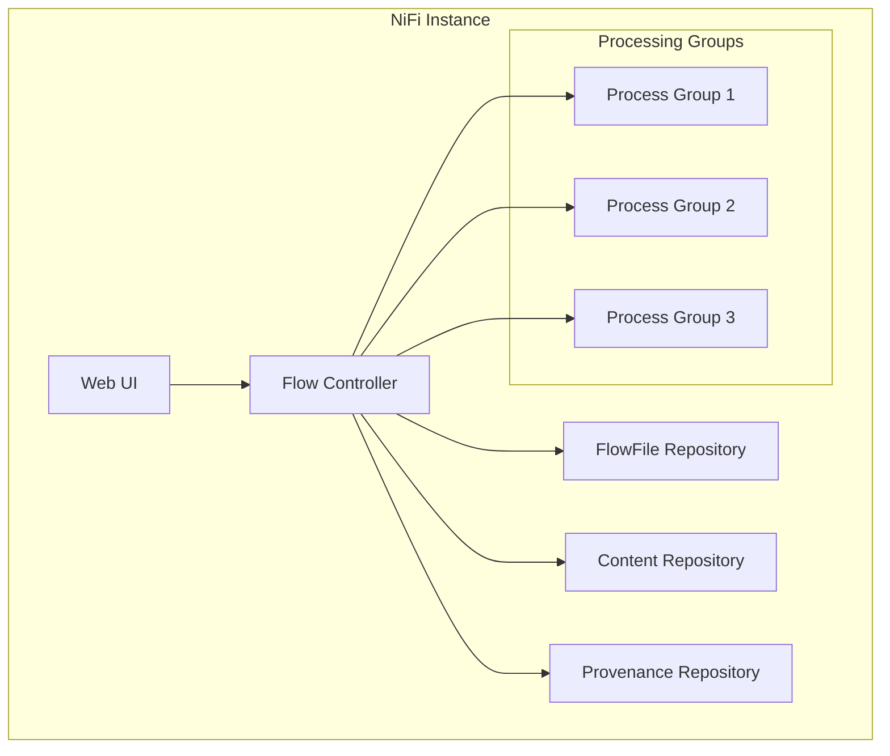
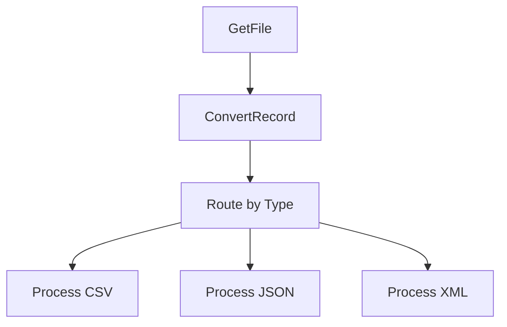
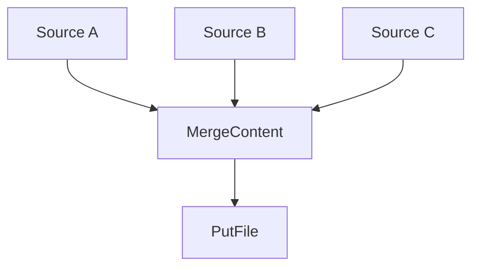
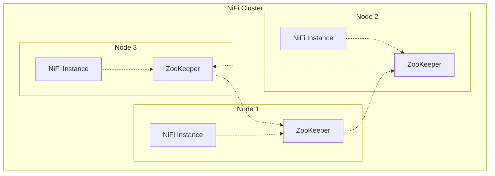
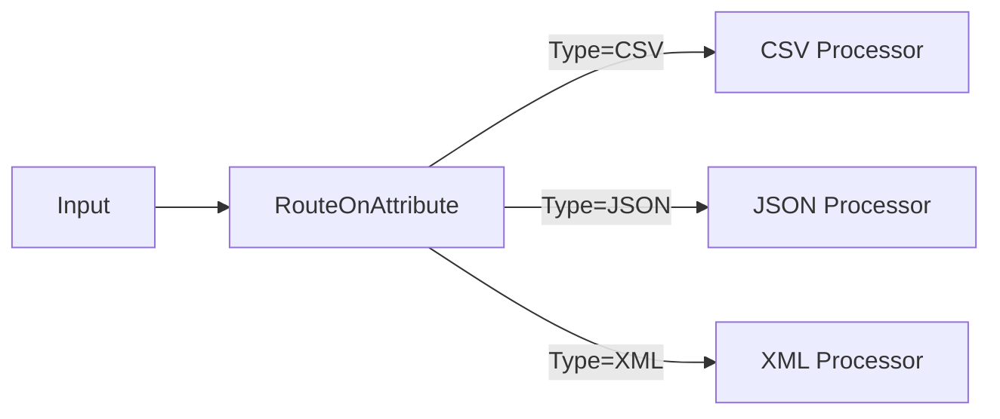
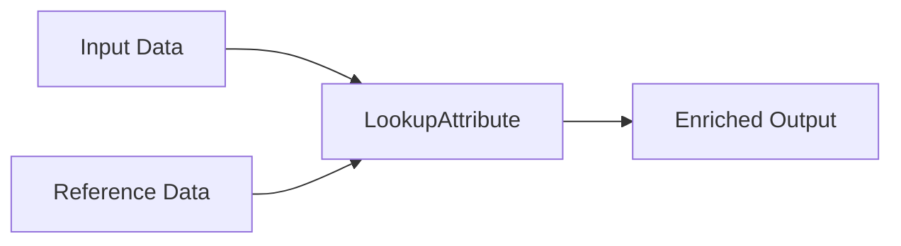
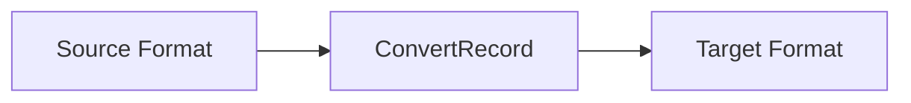

# Apache NiFi Technical Concept Document

## Table of Contents
1. [Introduction](#introduction)
2. [Core Architecture](#core-architecture)
3. [Key Components](#key-components)
4. [Data Flow Concepts](#data-flow-concepts)
5. [Processing Model](#processing-model)
6. [Security Architecture](#security-architecture)
7. [Clustering and Scalability](#clustering-and-scalability)
8. [Performance Considerations](#performance-considerations)
9. [Integration Patterns](#integration-patterns)
10. [Best Practices](#best-practices)

## Introduction

Apache NiFi is a powerful, scalable, and user-friendly system designed to process and distribute data between disparate systems. Originally developed by the NSA and later open-sourced, NiFi provides a web-based interface for designing, controlling, and monitoring data flows in real-time.

### Key Features
- **Flow-based programming**: Visual drag-and-drop interface for building data pipelines
- **Data provenance**: Complete tracking of data lineage and transformation history
- **Real-time processing**: Stream processing with low-latency data handling
- **Secure**: Built-in security features including SSL, user authentication, and authorization
- **Highly configurable**: Extensive configuration options for processors and system settings
- **Scalable**: Clustering support for horizontal scaling and high availability

## Core Architecture



### Architecture Components

#### Flow Controller
- Central component that manages the allocation of threads to processors
- Maintains the schedule of when processors run
- Manages the flow of FlowFiles through the system

#### Repositories
- **FlowFile Repository**: Stores metadata about FlowFiles and their current state
- **Content Repository**: Stores the actual content payload of FlowFiles
- **Provenance Repository**: Stores historical information about FlowFiles

#### Web Server
- Provides the web-based user interface
- Hosts the REST API for programmatic access
- Handles authentication and authorization

## Key Components

### FlowFile
The fundamental unit of data in NiFi, consisting of:
- **Attributes**: Key-value pairs containing metadata
- **Content**: The actual data payload (optional)
- **Unique identifier**: UUID for tracking and provenance

```json
{
  "uuid": "12345678-1234-1234-1234-123456789abc",
  "attributes": {
    "filename": "data.csv",
    "path": "/incoming/",
    "mime.type": "text/csv",
    "file.size": "1024"
  },
  "content": "actual file content..."
}
```

### Processors
Reusable components that perform specific data processing tasks:

#### Core Processor Categories
- **Data Ingestion**: GetFile, GetFTP, GetHTTP, ListenTCP
- **Data Routing**: RouteOnAttribute, RouteOnContent, DistributeLoad
- **Data Transformation**: ConvertRecord, TransformXml, ReplaceText
- **Data Egress**: PutFile, PutFTP, PutHTTP, PutDatabaseRecord
- **System Integration**: ExecuteScript, ExecuteSQL, InvokeHTTP

### Connections
Queues that connect processors and provide:
- **Buffering**: Temporary storage between processors
- **Prioritization**: Custom ordering of FlowFiles
- **Back pressure**: Flow control when queues become full
- **Load balancing**: Distribution strategies for clustered environments

### Process Groups
Logical containers that:
- Organize related processors and connections
- Provide scope isolation
- Enable reusable templates
- Support hierarchical data flow design

## Data Flow Concepts

### Flow Design Patterns

#### Linear Pipeline


#### Fan-Out Pattern


#### Fan-In Pattern


### Connection Configuration
- **FlowFile Expiration**: Automatic cleanup of old data
- **Back Pressure**: Threshold-based flow control
- **Load Balance Strategy**: Round-robin, partition by attribute, etc.
- **Prioritizers**: First In First Out, Priority Attribute, etc.

## Processing Model

### Threading Model
- **Timer Driven**: Processors run on a configurable schedule
- **Event Driven**: Processors triggered by incoming data
- **CRON Driven**: Processors run based on CRON expressions

### Scheduling Configuration
```yaml
Processor Configuration:
  - Scheduling Strategy: Timer Driven
  - Run Duration: 0 sec
  - Run Schedule: 1 sec
  - Concurrent Tasks: 1
  - Execution: All Nodes (in cluster)
```

### Session Management
Each processor execution creates a session that:
- Provides transactional boundaries
- Enables rollback on failures
- Manages FlowFile lifecycle
- Handles provenance events

## Security Architecture

### Authentication Methods
- **Username/Password**: Local user database
- **LDAP**: Integration with enterprise directories
- **Kerberos**: Single sign-on support
- **OIDC**: OpenID Connect integration
- **X.509 Certificates**: PKI-based authentication

### Authorization Model
- **Role-Based Access Control (RBAC)**
- **Fine-grained permissions** on components
- **Data-level security** through attribute-based routing
- **Audit logging** for compliance requirements

### Encryption
- **Data in Transit**: SSL/TLS encryption
- **Data at Rest**: Repository encryption options
- **Secure Communication**: Inter-node cluster communication

## Clustering and Scalability

### Cluster Architecture


### Cluster Coordination
- **Apache ZooKeeper**: Distributed coordination service
- **Cluster Coordinator**: Primary node for cluster management
- **Primary Node**: Handles isolated processors and reporting tasks
- **Flow Election**: Ensures consistent flow configuration across nodes

### Load Distribution Strategies
- **Round Robin**: Even distribution across nodes
- **Partition by Attribute**: Route based on FlowFile attributes
- **Do Not Load Balance**: Keep data on originating node
- **Single Node**: Process on one node only

## Performance Considerations

### Resource Management
- **Memory Usage**: Configure JVM heap and repository sizes
- **Disk I/O**: Optimize repository storage and disk allocation
- **Network Bandwidth**: Manage data transfer between nodes
- **CPU Utilization**: Balance concurrent tasks and scheduling

### Optimization Strategies
- **Repository Configuration**: Tune write-ahead logs and checkpointing
- **Queue Prioritization**: Optimize data flow ordering
- **Processor Grouping**: Minimize inter-process communication
- **Data Locality**: Keep related processing on the same node

### Monitoring Metrics
- **System Diagnostics**: CPU, memory, disk usage
- **Flow Metrics**: Throughput, queue sizes, processing times
- **Repository Metrics**: Size, I/O rates, cleanup frequency
- **Cluster Health**: Node status, coordination lag

## Integration Patterns

### Enterprise Integration Patterns

#### Message Router


#### Content Enricher


#### Message Translator


### Common Integration Scenarios
- **Database Integration**: JDBC-based data movement
- **File System Integration**: Local and remote file operations
- **Web Services**: REST/SOAP API interactions
- **Message Queues**: JMS, Kafka, MQTT integration
- **Cloud Services**: AWS, Azure, GCP connectors

## Best Practices

### Flow Design
1. **Use descriptive names** for processors and connections
2. **Group related processors** into process groups
3. **Implement error handling** with failure relationships
4. **Use templates** for reusable flow components
5. **Document flows** with processor comments and labels

### Performance Optimization
1. **Size repositories appropriately** based on data volume
2. **Configure back pressure** to prevent memory issues
3. **Use connection load balancing** in clustered environments
4. **Monitor queue depths** and processing times
5. **Optimize concurrent tasks** based on system resources

### Security Best Practices
1. **Enable SSL/TLS** for all communications
2. **Implement proper authentication** and authorization
3. **Use secure credential management** for external systems
4. **Regular security audits** and access reviews
5. **Encrypt sensitive data** in attributes and content

### Operational Guidelines
1. **Regular backups** of flow configurations and templates
2. **Monitor system metrics** and set up alerting
3. **Plan for capacity growth** and scaling requirements
4. **Test flows thoroughly** before production deployment
5. **Maintain documentation** for operational procedures

### Troubleshooting
1. **Check processor logs** for error messages
2. **Monitor queue sizes** for bottlenecks
3. **Review data provenance** for debugging flows
4. **Use bulletin board** for system notifications
5. **Analyze cluster coordination** in distributed environments

## Conclusion

Apache NiFi provides a robust, scalable platform for data integration and processing. Its visual interface, comprehensive security model, and extensive processor library make it suitable for a wide range of data flow scenarios. Understanding these core concepts and following best practices ensures successful implementation and operation of NiFi-based data pipelines.

For detailed implementation guidance and advanced configuration options, refer to the official Apache NiFi documentation and community resources.