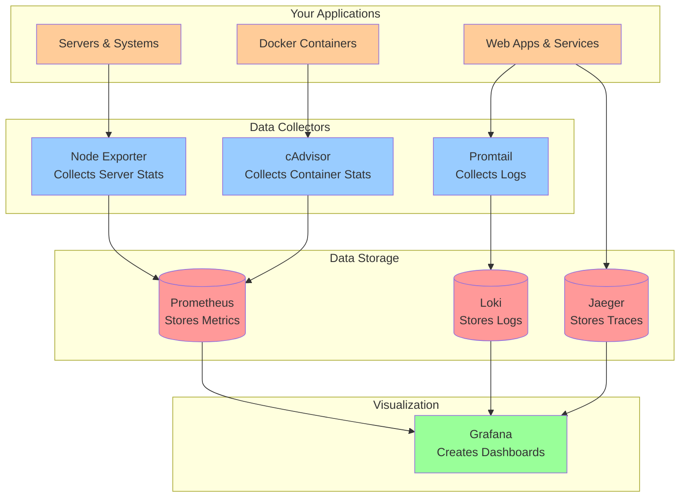
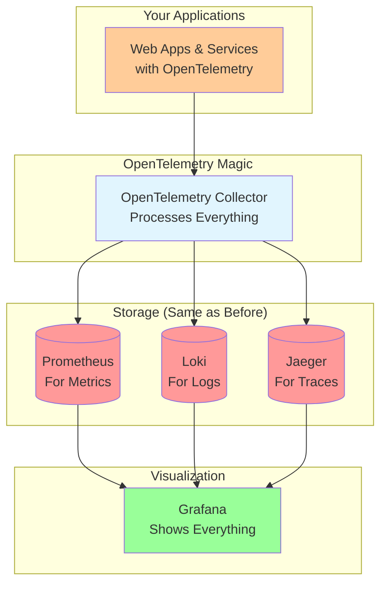

# Observability Stack Architecture for Beginners

## What is Observability?

Observability is like having a complete health monitoring system for your computer applications and data systems. Just like doctors use different tools (stethoscope, blood tests, X-rays) to understand what's happening inside your body, observability uses different tools to understand what's happening inside your software systems.

## The Three Pillars of Observability

Think of observability as having three different "windows" to look into your system:

### 1. Metrics (The Numbers)
Metrics are like checking your car's dashboard - they show you numbers that tell you how things are performing:
- How fast is your application running?
- How much memory is being used?
- How many users are visiting your website?
- Are there any errors happening?

### 2. Logs (The Story)
Logs are like a diary that your application writes. Every time something important happens, it writes it down:
- "User John logged in at 2:30 PM"
- "Payment processed successfully"
- "Error: Database connection failed"

### 3. Traces (The Journey)
Traces are like following a package through the mail system. They show you the complete journey of a request through your system:
- Request starts at the website
- Goes to the user service
- Then to the database
- Finally returns the result to the user

## The Grafana Stack: Your Observability Toolkit

The Grafana stack is like a complete toolkit for monitoring your systems. Let's understand each tool and what it does:

## Understanding the Tools in Your Toolkit

### Prometheus: The Numbers Keeper
**What it does:** Prometheus is like a data collector that focuses on numbers (metrics)
- **Real-world analogy:** Think of it as a fitness tracker that continuously monitors your heart rate, steps, and calories
- **What it monitors:** CPU usage, memory consumption, response times, error rates
- **How it works:** It regularly "asks" your applications and servers for their current statistics
- **Why it's useful:** Helps you spot trends and problems before they become serious

### Grafana: The Dashboard Creator
**What it does:** Grafana turns all your monitoring data into beautiful, easy-to-understand dashboards
- **Real-world analogy:** Like the dashboard in your car that shows speed, fuel level, engine temperature in an easy-to-read format
- **What it creates:** Charts, graphs, alerts, and visual reports
- **Why it's useful:** Makes complex data simple to understand at a glance

### Loki: The Story Keeper
**What it does:** Loki stores and organizes all the log messages from your applications
- **Real-world analogy:** Like a smart filing system that organizes all your important documents
- **What it stores:** Error messages, user activities, system events
- **Why it's useful:** Helps you search through millions of log entries to find exactly what you need

### Promtail: The Log Collector
**What it does:** Promtail finds and collects log files from your system and sends them to Loki
- **Real-world analogy:** Like a mail carrier who goes around collecting letters from mailboxes
- **How it works:** Monitors log files and automatically sends new entries to Loki
- **Why it's needed:** Without it, your logs would stay scattered across different machines

### Jaeger: The Journey Tracker
**What it does:** Jaeger tracks the complete path of requests through your system
- **Real-world analogy:** Like a GPS tracker that shows you exactly where a delivery truck went and how long each stop took
- **What it tracks:** How long each step takes, where delays happen, which services were involved
- **Why it's useful:** Helps you find bottlenecks and understand complex system interactions

## Modern Approach: OpenTelemetry (The All-in-One Solution)

OpenTelemetry (often called "OTEL") is like having a universal translator for observability. Instead of using different tools that speak different languages, OpenTelemetry makes everything work together seamlessly.

### Why OpenTelemetry Matters

**Traditional Problem:**
- Each tool required its own setup
- Data formats were different
- Hard to connect information between tools
- Lots of configuration and maintenance

**OpenTelemetry Solution:**
- One standard way to collect all data (metrics, logs, traces)
- All tools can understand the same data format
- Automatic correlation between different types of data
- Much simpler to set up and maintain

### How OpenTelemetry Works

### OpenTelemetry vs Traditional: Simple Comparison

| What You Care About | Traditional Way | OpenTelemetry Way |
|-------------------|-----------------|-------------------|
| **Setup Complexity** | Need to configure many different tools | One configuration for everything |
| **Data Connection** | Hard to connect metrics with logs and traces | Automatically connected |
| **Learning Curve** | Learn multiple different systems | Learn one standard approach |
| **Maintenance** | Maintain many different collectors | Maintain one collector |
| **Vendor Choice** | Locked into specific tools | Easy to switch between tools |

## How This Applies to Microservices and Data Platforms

### For Microservices (Small, Independent Services)

**The Challenge:**
When you have many small services working together (like a pizza restaurant with separate stations for dough, sauce, toppings, and baking), it's hard to track what's happening across all of them.

**How Observability Helps:**
- **Metrics:** Monitor each service's health (CPU, memory, response time)
- **Logs:** Track what each service is doing and any problems it encounters
- **Traces:** Follow a customer request as it flows through all the services

**Example Journey:**
1. Customer places order (Web Service)
2. Order goes to Payment Service
3. Payment Service talks to Bank API
4. Kitchen Service gets the order
5. Inventory Service checks ingredients
6. Notification Service sends confirmation

With observability, you can see exactly where delays or errors happen in this chain.

### For Data Platforms (Big Data Processing)

**The Challenge:**
Data platforms process huge amounts of information through multiple steps (like a factory assembly line), and you need to know if everything is working correctly.

**How Observability Helps:**
- **Metrics:** Monitor data processing rates, storage usage, and pipeline health
- **Logs:** Track data transformations, errors, and processing status
- **Traces:** Follow data as it moves through different processing stages

**Example Data Journey:**
1. Raw data arrives from various sources
2. Data gets cleaned and validated
3. Data is transformed into useful formats
4. Data is stored in databases
5. Reports and analytics are generated
6. Results are delivered to users

With observability, you can monitor each step to ensure data quality and processing speed.

## Why This Matters for Your Career

### For Students Entering Tech
Understanding observability is crucial because:
- **Every company needs it:** From startups to big tech companies, everyone needs to monitor their systems
- **Growing field:** As systems become more complex, observability becomes more important
- **Good career path:** Observability engineers, Site Reliability Engineers (SRE), and DevOps engineers are in high demand
- **Transferable skills:** Knowledge applies to any technology stack

### Key Skills You'll Develop
1. **Problem-solving:** Learning to debug complex systems
2. **Data analysis:** Understanding patterns in metrics and logs
3. **System thinking:** Seeing how different parts of a system connect
4. **Tool mastery:** Gaining experience with industry-standard tools

## Real-World Benefits

### For Business Operations
- **Faster problem resolution:** Find and fix issues before customers notice
- **Better customer experience:** Ensure applications run smoothly
- **Cost optimization:** Identify and eliminate inefficient resource usage
- **Informed decisions:** Use data to make better technology choices

### For Development Teams
- **Confidence in deployments:** Know immediately if something goes wrong
- **Performance optimization:** Identify bottlenecks and slow components
- **Better collaboration:** Shared understanding of system behavior
- **Learning from incidents:** Use observability data to prevent future problems

## Common Questions for Beginners

### Q: Do I need to learn all these tools at once?
**A:** No! Start with the basics. Learn Prometheus and Grafana first, then gradually add Loki and Jaeger. OpenTelemetry can come later once you understand the fundamentals.

### Q: Is this only for large companies?
**A:** Not at all! Even small applications benefit from basic monitoring. Start simple and grow your observability as your systems grow.

### Q: What programming languages work with these tools?
**A:** All major languages! Prometheus, Grafana, and OpenTelemetry support Java, Python, JavaScript, Go, Rust, C#, and many others.

### Q: How much does this cost?
**A:** The open-source tools (Prometheus, Grafana, Loki, Jaeger) are free. You only pay for hosting/infrastructure. Cloud providers also offer managed versions for convenience.

### Q: Is this the same as application performance monitoring (APM)?
**A:** Observability is broader than APM. APM focuses mainly on application performance, while observability covers the entire system including infrastructure, databases, and business metrics.

## Key Concepts to Remember

### The Golden Signals
Focus on these four key metrics for any system:
1. **Latency:** How long do requests take?
2. **Traffic:** How much load is the system handling?
3. **Errors:** What percentage of requests are failing?
4. **Saturation:** How close to capacity is the system?

### The Data Flow
Remember this simple flow:
1. **Collect:** Gather metrics, logs, and traces from your systems
2. **Store:** Save the data in appropriate databases (Prometheus, Loki, Jaeger)
3. **Visualize:** Create dashboards and alerts in Grafana
4. **Act:** Use the insights to improve your systems

### Best Practices for Beginners
1. **Start small:** Begin with basic CPU and memory monitoring
2. **Be consistent:** Use standard naming conventions for metrics and logs
3. **Think like a user:** Monitor what matters to your users' experience
4. **Practice regularly:** Set up test environments to experiment with different scenarios
5. **Learn from others:** Study existing dashboards and monitoring setups

## Summary: Your Journey into Observability

Congratulations! You now understand the fundamentals of observability and the Grafana stack. Here's what you've learned:

### The Big Picture
- **Observability** helps you understand what's happening inside your computer systems
- **Three pillars** (Metrics, Logs, Traces) give you different views of your system
- **Grafana stack** provides industry-standard tools for implementing observability
- **OpenTelemetry** represents the modern, unified approach to observability

### The Tools in Your Toolkit
- **Prometheus:** Collects and stores numerical data (metrics)
- **Grafana:** Creates beautiful dashboards and visualizations
- **Loki:** Stores and organizes log messages
- **Promtail:** Collects logs from your systems
- **Jaeger:** Tracks requests through your system
- **OpenTelemetry:** Modern, unified data collection approach

### Why This Matters
- **Career opportunities:** High demand for observability skills
- **Problem solving:** Essential for debugging complex systems
- **Business impact:** Better user experience and system reliability
- **Future-proof:** Skills that apply across different technologies

### Next Steps
1. **Practice:** Set up a simple monitoring stack using Docker
2. **Experiment:** Try monitoring different types of applications
3. **Learn more:** Explore advanced features and best practices
4. **Build:** Create projects that showcase your observability skills

### Resources for Continued Learning
- **Official documentation:** Each tool has excellent getting-started guides
- **Community forums:** Join discussions on Reddit, Stack Overflow, and tool-specific communities
- **Online courses:** Many platforms offer hands-on observability courses
- **YouTube tutorials:** Visual learners can find step-by-step setup guides
- **GitHub examples:** Study real-world configurations and setups

Remember: Observability is about making the invisible visible. Start simple, practice regularly, and gradually build your expertise. The skills you develop will be valuable throughout your technology career!

## Final Thoughts

Observability isn't just about tools and technology—it's about developing a mindset of understanding and continuous improvement. As you work with these tools, you'll start thinking differently about how systems work and how to make them better.

The Grafana stack and OpenTelemetry represent the current best practices in observability, but the field continues to evolve. By understanding these fundamentals, you'll be well-prepared to adapt to new tools and approaches as they emerge.

Start your observability journey today, and you'll soon discover how empowering it is to truly understand what's happening in your systems!
