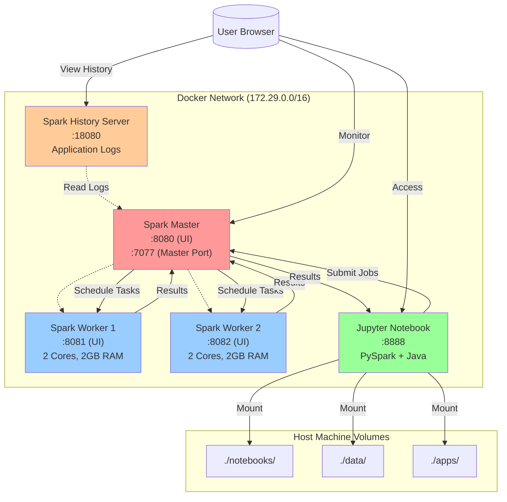
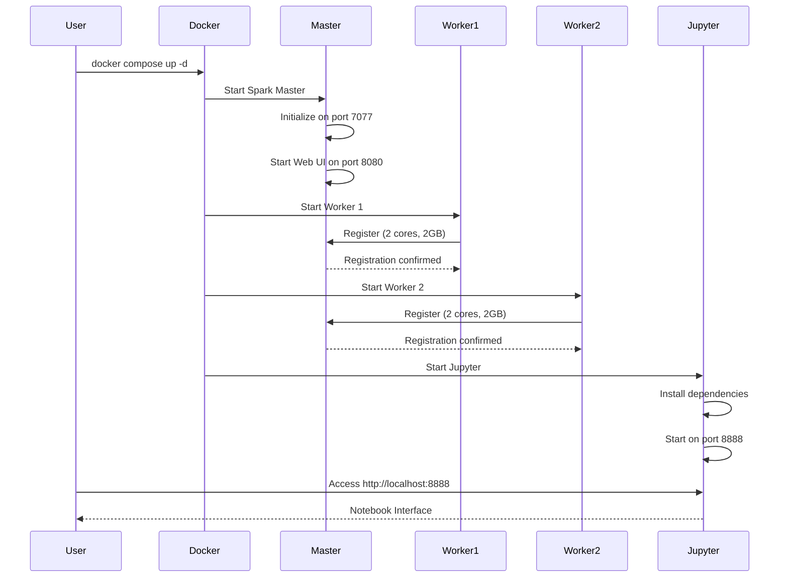
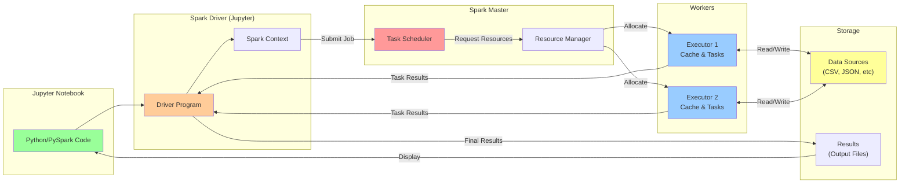
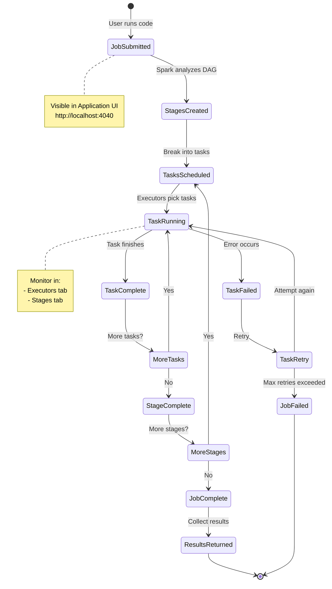

# PySpark with Docker Compose

Complete guide to running Apache Spark with PySpark in a distributed environment using Docker Compose.

## Table of Contents
- [Overview](#overview)
- [Architecture](#architecture)
- [Prerequisites](#prerequisites)
- [Installation](#installation)
- [Quick Start](#quick-start)
- [Using Jupyter Notebook](#using-jupyter-notebook)
- [PySpark Examples](#pyspark-examples)
- [Monitoring](#monitoring)
- [Troubleshooting](#troubleshooting)
- [Advanced Configuration](#advanced-configuration)

---

## Overview

### What is Apache Spark?

Apache Spark is a unified analytics engine for large-scale data processing. It provides:
- **Speed**: In-memory computing for fast processing
- **Ease of Use**: High-level APIs in Python, Java, Scala, and R
- **Generality**: Combines SQL, streaming, machine learning, and graph processing
- **Runs Everywhere**: On Hadoop, Apache Mesos, Kubernetes, standalone, or in the cloud

### What is PySpark?

PySpark is the Python API for Apache Spark. It allows you to:
- Write Spark applications in Python
- Leverage Python libraries (NumPy, Pandas, etc.)
- Process large datasets in parallel
- Perform distributed machine learning

### Why Docker Compose?

Docker Compose allows us to:
- Run a complete Spark cluster locally
- Isolate dependencies and environments
- Easily scale workers up or down
- Ensure consistent development environments

---

## Architecture

Our setup includes the following services running in Docker containers:



### Components

1. **Spark Master** (port 8080)
   - Manages the cluster
   - Schedules tasks across workers
   - Monitors worker health

2. **Spark Workers** (ports 8081, 8082)
   - Execute tasks assigned by the master
   - Each configured with 2 CPU cores and 2GB RAM
   - Can scale to more workers if needed

3. **Jupyter Notebook** (port 8888)
   - Interactive development environment
   - Pre-configured with PySpark
   - Connected to the Spark cluster

4. **Spark History Server** (port 18080)
   - Views completed application logs
   - Useful for debugging and performance analysis

---

## Prerequisites

### Required Software

- **Docker Desktop** (version 20.10 or higher)
  - macOS: [Download Docker Desktop for Mac](https://www.docker.com/products/docker-desktop)
  - Windows: [Download Docker Desktop for Windows](https://www.docker.com/products/docker-desktop)
  - Linux: Install Docker Engine and Docker Compose

- **Web Browser**
  - Chrome, Firefox, Safari, or Edge

### System Requirements

- **RAM**: Minimum 8GB (16GB recommended)
- **CPU**: Minimum 4 cores (8 cores recommended)
- **Disk Space**: At least 10GB free

### Verify Installation

```bash
# Check Docker version
docker --version
# Output: Docker version 24.0.0 or higher

# Check Docker Compose version
docker compose version
# Output: Docker Compose version v2.20.0 or higher
```

---

## Installation

### Step 1: Clone or Download Project

If you have this project, navigate to the directory:

```bash
cd /path/to/class5_pyspark
```

### Step 2: Project Structure

Your directory should look like this:

```
class5_pyspark/
├── docker-compose.yml       # Docker services configuration
├── README.md               # This file
├── notebooks/              # Jupyter notebooks (mounted to container)
│   ├── pyspark_quickstart.ipynb
│   └── test_pyspark.ipynb
├── data/                   # Data files (shared with containers)
├── apps/                   # Spark applications
└── py/                     # Python scripts
```

### Step 3: Review docker-compose.yml

The `docker-compose.yml` file defines all services. Key configurations:

```yaml
services:
  spark-master:
    image: apache/spark-py:latest
    ports:
      - "8080:8080"  # Web UI
      - "7077:7077"  # Spark master port

  spark-worker-1:
    image: apache/spark-py:latest
    ports:
      - "8081:8081"  # Worker UI
    environment:
      - SPARK_WORKER_CORES=2
      - SPARK_WORKER_MEMORY=2g

  jupyter:
    image: apache/spark-py:latest
    ports:
      - "8888:8888"  # Jupyter Notebook
    volumes:
      - ./notebooks:/notebooks
      - ./data:/data
```

### Step 4: Start the Cluster

```bash
# Start all services
docker compose up -d

# Check if all containers are running
docker compose ps
```

Expected output:
```
NAME                STATUS                   PORTS
pyspark-master      Up (healthy)            0.0.0.0:7077->7077/tcp, 0.0.0.0:8080->8080/tcp
pyspark-worker-1    Up (healthy)            0.0.0.0:8081->8081/tcp
pyspark-worker-2    Up (healthy)            0.0.0.0:8082->8082/tcp
pyspark-jupyter     Up                      0.0.0.0:8888->8888/tcp
pyspark-history     Up                      0.0.0.0:18080->18080/tcp
```

### Step 5: Verify Services

Open your browser and check:

- Spark Master UI: http://localhost:8080
- Jupyter Notebook: http://localhost:8888
- Worker 1 UI: http://localhost:8081
- Worker 2 UI: http://localhost:8082

### Deployment Flow



---

## Quick Start

### 1. Access Jupyter Notebook

Open your browser and navigate to:

```
http://localhost:8888
```

You should see the Jupyter interface with your notebooks.

### 2. Create Your First PySpark Application

Click "New" → "Python 3" to create a new notebook, or open `pyspark_quickstart.ipynb`.

### 3. Initialize Spark Session

```python
from pyspark.sql import SparkSession

# Create Spark session connected to the cluster
spark = SparkSession.builder \
    .appName("MyFirstApp") \
    .master("spark://spark-master:7077") \
    .config("spark.executor.memory", "1g") \
    .config("spark.executor.cores", "1") \
    .getOrCreate()

# Verify connection
print(f"Spark Version: {spark.version}")
print(f"Master: {spark.sparkContext.master}")
print(f"App ID: {spark.sparkContext.applicationId}")
```

### 4. Run a Simple Example

```python
# Create a simple DataFrame
data = [("Alice", 34), ("Bob", 45), ("Charlie", 28)]
columns = ["name", "age"]

df = spark.createDataFrame(data, columns)
df.show()
```

Output:
```
+-------+---+
|   name|age|
+-------+---+
|  Alice| 34|
|    Bob| 45|
|Charlie| 28|
+-------+---+
```

---

## Using Jupyter Notebook

### Notebook Basics

#### Cell Types
- **Code cells**: Execute Python/PySpark code
- **Markdown cells**: Documentation and notes

#### Keyboard Shortcuts
- `Shift + Enter`: Run cell and move to next
- `Ctrl + Enter`: Run cell and stay
- `Esc + A`: Insert cell above
- `Esc + B`: Insert cell below
- `Esc + DD`: Delete cell

### Saving Your Work

Notebooks are automatically saved in the `notebooks/` directory on your host machine. They persist even when containers are stopped.

### Sharing Notebooks with the Cluster

All notebooks in the `notebooks/` directory are accessible inside the container at `/notebooks/`.

Data files in `data/` are accessible at `/data/`.

### PySpark Execution Flow



---

## PySpark Examples

### Example 1: Word Count

Classic MapReduce example counting word frequency:

```python
from pyspark.sql.functions import explode, split, lower, col

# Sample text data
text_data = [
    "Apache Spark is amazing",
    "Spark is fast and powerful",
    "PySpark makes Spark easy to use"
]

# Create DataFrame
df = spark.createDataFrame([(line,) for line in text_data], ["line"])

# Word count transformation
word_counts = df.select(
    explode(split(lower(col("line")), " ")).alias("word")
).groupBy("word").count().orderBy(col("count").desc())

word_counts.show()
```

Output:
```
+--------+-----+
|    word|count|
+--------+-----+
|   spark|    4|
|      is|    2|
| amazing|    1|
|  apache|    1|
|    fast|    1|
|     and|    1|
+--------+-----+
```

### Example 2: DataFrame Operations

Working with structured data:

```python
from pyspark.sql.functions import col, avg, sum, max, min

# Create sample employee data
employees = [
    ("Alice", "Engineering", 90000, 5),
    ("Bob", "Engineering", 95000, 7),
    ("Charlie", "Sales", 70000, 3),
    ("Diana", "Sales", 75000, 4),
    ("Eve", "Engineering", 85000, 2)
]

columns = ["name", "department", "salary", "years"]
emp_df = spark.createDataFrame(employees, columns)

# Basic operations
print("All employees:")
emp_df.show()

print("\nEngineering department:")
emp_df.filter(col("department") == "Engineering").show()

print("\nAverage salary by department:")
emp_df.groupBy("department").agg(
    avg("salary").alias("avg_salary"),
    sum("salary").alias("total_salary"),
    count("*").alias("headcount")
).show()

print("\nSalary statistics:")
emp_df.select(
    max("salary").alias("max_salary"),
    min("salary").alias("min_salary"),
    avg("salary").alias("avg_salary")
).show()
```

### Example 3: Reading and Writing Files

Working with CSV files:

```python
# Create sample data
products = [
    ("P001", "Laptop", 1200.00, 10),
    ("P002", "Mouse", 25.00, 100),
    ("P003", "Keyboard", 75.00, 50),
    ("P004", "Monitor", 300.00, 25)
]

columns = ["product_id", "name", "price", "quantity"]
products_df = spark.createDataFrame(products, columns)

# Write to CSV
products_df.write.mode("overwrite").csv(
    "/data/products.csv",
    header=True
)

print("Data written to /data/products.csv")

# Read from CSV
loaded_df = spark.read.csv(
    "/data/products.csv",
    header=True,
    inferSchema=True
)

print("\nData loaded from CSV:")
loaded_df.show()
loaded_df.printSchema()
```

### Example 4: Working with JSON

```python
# Create sample JSON data
json_data = [
    '{"user_id": 1, "name": "Alice", "purchases": [100, 200, 150]}',
    '{"user_id": 2, "name": "Bob", "purchases": [50, 75]}',
    '{"user_id": 3, "name": "Charlie", "purchases": [300, 250, 100, 150]}'
]

# Create RDD and convert to DataFrame
rdd = spark.sparkContext.parallelize(json_data)
df = spark.read.json(rdd)

df.show(truncate=False)
df.printSchema()

# Explode array column
from pyspark.sql.functions import explode

df_exploded = df.select(
    col("user_id"),
    col("name"),
    explode(col("purchases")).alias("purchase_amount")
)

df_exploded.show()

# Calculate total purchases per user
df_totals = df_exploded.groupBy("user_id", "name").agg(
    sum("purchase_amount").alias("total_spent"),
    count("*").alias("num_purchases")
)

df_totals.show()
```

### Example 5: SQL Queries

Using SQL syntax with PySpark:

```python
# Create temporary view
emp_df.createOrReplaceTempView("employees")

# Run SQL queries
result = spark.sql("""
    SELECT
        department,
        COUNT(*) as headcount,
        AVG(salary) as avg_salary,
        MAX(salary) as max_salary
    FROM employees
    GROUP BY department
    ORDER BY avg_salary DESC
""")

result.show()

# Complex query with WHERE and HAVING
result2 = spark.sql("""
    SELECT
        department,
        name,
        salary,
        RANK() OVER (PARTITION BY department ORDER BY salary DESC) as salary_rank
    FROM employees
""")

result2.show()
```

### Example 6: Data Transformations

Common transformations:

```python
from pyspark.sql.functions import when, lit, concat, round

# Add calculated columns
emp_enriched = emp_df \
    .withColumn("bonus", col("salary") * 0.1) \
    .withColumn("total_comp", col("salary") + col("bonus")) \
    .withColumn("level",
        when(col("years") < 3, "Junior")
        .when(col("years") < 6, "Mid")
        .otherwise("Senior")
    ) \
    .withColumn("display_name", concat(col("name"), lit(" ("), col("level"), lit(")")))

emp_enriched.show(truncate=False)

# Select specific columns
emp_enriched.select("name", "department", "total_comp", "level").show()

# Rename columns
emp_renamed = emp_df.withColumnRenamed("name", "employee_name") \
                    .withColumnRenamed("years", "years_of_service")

emp_renamed.show()
```

---

## Monitoring

### Spark Job Lifecycle

Understanding the stages of a Spark job helps with monitoring and debugging:



### Spark Master UI

URL: http://localhost:8080

**Features:**
- View running applications
- See worker status and resources
- Monitor completed applications
- Check cluster configuration

**Key Metrics:**
- Workers: Shows number of alive workers
- Memory: Total and used memory across cluster
- Cores: Total and used CPU cores
- Applications: Running and completed apps

### Application UI

URL: http://localhost:4040 (while application is running)

**Features:**
- Jobs overview
- Stages and tasks
- Storage (cached RDDs/DataFrames)
- Environment variables
- Executors
- SQL queries

**Use Cases:**
- Debug slow jobs
- Identify data skew
- Monitor memory usage
- Optimize query plans

### Worker UI

URLs: http://localhost:8081, http://localhost:8082

**Features:**
- Running executors
- Completed executors
- Worker logs
- Resource usage

### History Server

URL: http://localhost:18080

**Features:**
- View logs of completed applications
- Access application UIs after completion
- Compare different runs
- Long-term performance analysis

---

## Troubleshooting

### Common Issues

#### 1. Cannot Access Jupyter (Connection Refused)

**Problem**: Browser shows "Connection refused" at http://localhost:8888

**Solutions:**
```bash
# Check if container is running
docker compose ps

# Check container logs
docker logs pyspark-jupyter

# Restart Jupyter
docker compose restart jupyter

# If still failing, recreate container
docker compose stop jupyter
docker compose rm -f jupyter
docker compose up -d jupyter
```

#### 2. PySpark Module Not Found

**Problem**: `ModuleNotFoundError: No module named 'pyspark'`

**Solution**: This means you're running Python locally instead of in the Jupyter container.

**Correct approach:**
1. Open http://localhost:8888 in your browser
2. Use notebooks in the web interface
3. Do NOT run Jupyter from your local terminal

#### 3. Spark Session Connection Fails

**Problem**: Cannot connect to `spark://spark-master:7077`

**Solutions:**
```bash
# Check if master is running
docker compose ps spark-master

# Check master logs
docker logs pyspark-master

# Verify network connectivity
docker exec pyspark-jupyter ping spark-master

# Restart master
docker compose restart spark-master
```

#### 4. Out of Memory Errors

**Problem**: Executor or driver running out of memory

**Solutions:**

Reduce executor memory in your code:
```python
spark = SparkSession.builder \
    .appName("MyApp") \
    .master("spark://spark-master:7077") \
    .config("spark.executor.memory", "512m") \  # Reduce from 1g
    .config("spark.driver.memory", "512m") \
    .getOrCreate()
```

Or increase worker memory in `docker-compose.yml`:
```yaml
environment:
  - SPARK_WORKER_MEMORY=4g  # Increase from 2g
```

#### 5. Port Already in Use

**Problem**: Cannot start containers due to port conflicts

**Solution:**
```bash
# Find process using the port
lsof -i :8888  # Replace with your port

# Kill the process or change port in docker-compose.yml
```

#### 6. Containers Keep Restarting

**Problem**: Containers show "Restarting" status

**Solutions:**
```bash
# Check logs for errors
docker compose logs

# Check specific service
docker compose logs spark-master

# Remove and recreate
docker compose down
docker compose up -d
```

### Useful Commands

```bash
# View all logs
docker compose logs

# Follow logs in real-time
docker compose logs -f

# View logs for specific service
docker compose logs jupyter

# Check container status
docker compose ps

# Restart all services
docker compose restart

# Stop all services
docker compose stop

# Stop and remove containers
docker compose down

# Remove containers and volumes
docker compose down -v

# Execute command in container
docker exec -it pyspark-jupyter bash

# Check container resource usage
docker stats
```

---

## Advanced Configuration

### Scaling Workers

Add more workers to increase processing power:

```bash
# Scale to 4 workers
docker compose up -d --scale spark-worker=4
```

Or define more workers in `docker-compose.yml`:

```yaml
spark-worker-3:
  image: apache/spark-py:latest
  # ... similar configuration to worker-1
  environment:
    - SPARK_WORKER_WEBUI_PORT=8083
  ports:
    - "8083:8083"
```

### Customizing Spark Configuration

Edit `docker-compose.yml` to add Spark configurations:

```yaml
spark-master:
  environment:
    - SPARK_MASTER_OPTS=-Dspark.deploy.defaultCores=4

jupyter:
  environment:
    - SPARK_DRIVER_MEMORY=2g
    - SPARK_EXECUTOR_MEMORY=2g
    - SPARK_EXECUTOR_CORES=2
```

Or configure in your PySpark code:

```python
spark = SparkSession.builder \
    .appName("MyApp") \
    .master("spark://spark-master:7077") \
    .config("spark.executor.memory", "2g") \
    .config("spark.executor.cores", "2") \
    .config("spark.cores.max", "4") \
    .config("spark.sql.shuffle.partitions", "200") \
    .config("spark.default.parallelism", "100") \
    .getOrCreate()
```

### Persisting Data

Data in the following directories persists on your host machine:
- `./notebooks/` - Jupyter notebooks
- `./data/` - Data files
- `./apps/` - Spark applications

Docker volumes for logs:
- `spark-events` - Application event logs
- `spark-logs` - Service logs

### Installing Additional Python Packages

Update the Jupyter service in `docker-compose.yml`:

```yaml
jupyter:
  command: >
    bash -c "
      pip install jupyter notebook jupyterlab pandas numpy matplotlib scikit-learn &&
      jupyter notebook --ip=0.0.0.0 --port=8888 --no-browser --allow-root --NotebookApp.token='' --NotebookApp.password=''
    "
```

Then restart:
```bash
docker compose restart jupyter
```

### Environment Variables

Common environment variables:

```yaml
environment:
  # Spark Configuration
  - SPARK_MASTER=spark://spark-master:7077
  - SPARK_HOME=/opt/spark

  # Worker Configuration
  - SPARK_WORKER_CORES=2
  - SPARK_WORKER_MEMORY=2g
  - SPARK_WORKER_INSTANCES=1

  # Python Configuration
  - PYTHONPATH=/opt/spark/python
  - PYSPARK_PYTHON=python3
  - PYSPARK_DRIVER_PYTHON=jupyter
```

---

## Best Practices

### 1. Resource Management

- Start with conservative memory settings
- Monitor resource usage via UIs
- Scale workers based on workload
- Use `.cache()` wisely for frequently accessed data

### 2. Code Organization

```python
# Good: Clear, reusable functions
def load_data(spark, path):
    return spark.read.csv(path, header=True, inferSchema=True)

def transform_data(df):
    return df.filter(col("status") == "active") \
             .select("id", "name", "value")

# Use functions
df = load_data(spark, "/data/input.csv")
result = transform_data(df)
```

### 3. Performance Tips

- Use DataFrames instead of RDDs (better optimization)
- Partition data appropriately
- Avoid wide transformations when possible
- Use broadcast joins for small tables
- Persist intermediate results if reused

```python
# Broadcast small DataFrames
from pyspark.sql.functions import broadcast

small_df = spark.read.csv("/data/small.csv")
large_df = spark.read.csv("/data/large.csv")

# Broadcast join (faster for small tables)
result = large_df.join(broadcast(small_df), "key")
```

### 4. Debugging

```python
# Set log level
spark.sparkContext.setLogLevel("INFO")

# View query plan
df.explain(True)

# Show sample data
df.show(5)

# Check schema
df.printSchema()

# Count records
print(f"Total records: {df.count()}")

# View partitions
print(f"Number of partitions: {df.rdd.getNumPartitions()}")
```

---

## Additional Resources

### Official Documentation
- [Apache Spark Documentation](https://spark.apache.org/docs/latest/)
- [PySpark API Reference](https://spark.apache.org/docs/latest/api/python/)
- [Spark SQL Guide](https://spark.apache.org/docs/latest/sql-programming-guide.html)

### Learning Resources
- [PySpark Tutorial](https://spark.apache.org/docs/latest/api/python/getting_started/index.html)
- [Databricks PySpark Guide](https://docs.databricks.com/spark/latest/spark-sql/index.html)

### Community
- [Stack Overflow - Apache Spark](https://stackoverflow.com/questions/tagged/apache-spark)
- [Apache Spark User Mailing List](https://spark.apache.org/community.html)

---

## Stopping and Cleaning Up

### Stop Services

```bash
# Stop all services (containers remain)
docker compose stop

# Start again
docker compose start
```

### Remove Containers

```bash
# Stop and remove containers
docker compose down

# Remove containers and volumes (deletes logs)
docker compose down -v

# Remove containers, volumes, and images
docker compose down -v --rmi all
```

### Clean Up Docker

```bash
# Remove unused containers
docker container prune

# Remove unused images
docker image prune

# Remove unused volumes
docker volume prune

# Clean everything
docker system prune -a
```

---

## Quick Reference

### URLs
| Service | URL |
|---------|-----|
| Jupyter Notebook | http://localhost:8888 |
| Spark Master UI | http://localhost:8080 |
| Spark Application UI | http://localhost:4040 |
| Worker 1 UI | http://localhost:8081 |
| Worker 2 UI | http://localhost:8082 |
| History Server | http://localhost:18080 |

### Common Commands
```bash
# Start cluster
docker compose up -d

# Stop cluster
docker compose stop

# View logs
docker compose logs -f

# Restart service
docker compose restart jupyter

# Check status
docker compose ps

# Execute command in container
docker exec -it pyspark-jupyter bash

# Remove everything
docker compose down -v
```

### PySpark Template
```python
from pyspark.sql import SparkSession
from pyspark.sql.functions import col, count, sum, avg

# Initialize Spark
spark = SparkSession.builder \
    .appName("MyApp") \
    .master("spark://spark-master:7077") \
    .config("spark.executor.memory", "1g") \
    .getOrCreate()

# Your code here
df = spark.read.csv("/data/file.csv", header=True)
df.show()

# Stop Spark when done
spark.stop()
```

---

## License

This project is for educational purposes.

Apache Spark is licensed under the Apache License 2.0.

---

## Support

For issues or questions:
1. Check the [Troubleshooting](#troubleshooting) section
2. Review [Apache Spark Documentation](https://spark.apache.org/docs/latest/)
3. Check container logs: `docker compose logs`

---

**Happy Sparking!**
