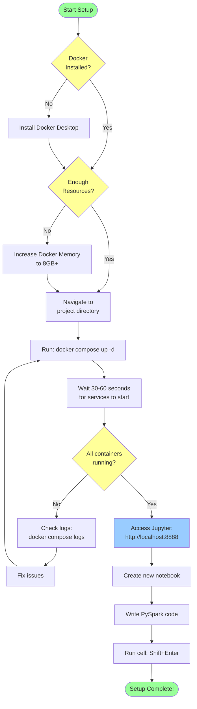
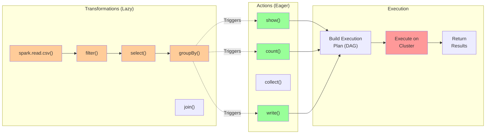
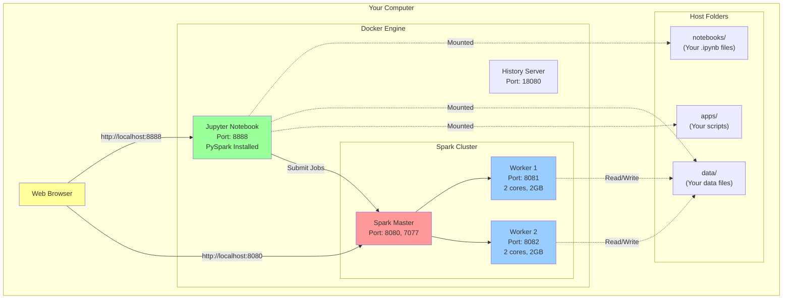
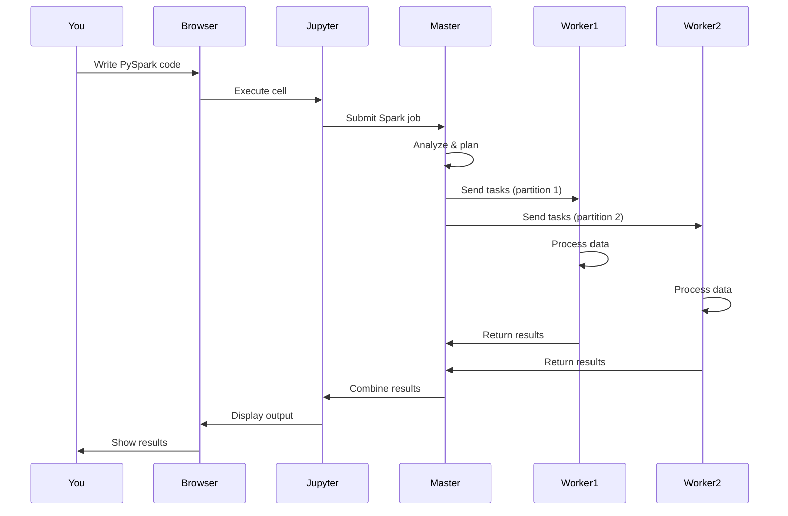

# Getting Started with PySpark and Docker

This guide walks you through setting up and running PySpark with Docker Compose from scratch.

## Prerequisites Check

Before starting, ensure you have:

### 1. Docker Desktop Installed

**macOS:**
```bash
# Check if Docker is installed
docker --version

# Expected output:
# Docker version 24.0.0, build abc123
```

**If not installed:**
1. Download from https://www.docker.com/products/docker-desktop
2. Install Docker Desktop
3. Start Docker Desktop application
4. Wait for Docker to be running (whale icon in menu bar)

**Windows:**
```bash
# Open PowerShell or Command Prompt
docker --version
```

**If not installed:**
1. Download from https://www.docker.com/products/docker-desktop
2. Install Docker Desktop
3. Restart your computer
4. Start Docker Desktop
5. Enable WSL 2 if prompted

### 2. Verify Docker Compose

```bash
docker compose version

# Expected output:
# Docker Compose version v2.20.0 or higher
```

### 3. System Resources

Check you have enough resources:
- **RAM**: 8GB minimum (16GB recommended)
- **Disk Space**: 10GB free
- **CPU**: 4 cores minimum

**On macOS/Linux:**
```bash
# Check available memory (in GB)
free -g

# Check disk space
df -h
```

**On Windows:**
```powershell
# Check memory
systeminfo | findstr "Available Physical Memory"

# Check disk space
Get-PSDrive C
```

---

## Step-by-Step Setup

### Setup Workflow Overview



### Step 1: Navigate to Project Directory

```bash
# Navigate to the project
cd /path/to/class5_pyspark

# Verify you're in the right directory
ls -la

# You should see:
# - docker-compose.yml
# - notebooks/
# - data/
# - apps/
```

### Step 2: Understand the Directory Structure

```
class5_pyspark/
│
├── docker-compose.yml      # Defines all services (master, workers, jupyter)
├── README.md               # Main documentation
│
├── notebooks/              # Your Jupyter notebooks (IMPORTANT!)
│   ├── pyspark_quickstart.ipynb
│   └── test_pyspark.ipynb
│
├── data/                   # Data files (shared with containers)
│   └── (place your CSV, JSON files here)
│
├── apps/                   # Standalone Spark applications
│   └── (place your .py files here)
│
└── docs/                   # Additional documentation
    └── GETTING_STARTED.md  # This file
```

**Key Points:**
- Files in `notebooks/` are accessible in Jupyter
- Files in `data/` are accessible at `/data/` inside containers
- All changes in these folders persist on your computer

### Step 3: Start the Cluster

```bash
# Start all services in detached mode (background)
docker compose up -d
```

**Expected Output:**
```
[+] Running 5/5
 ✔ Container pyspark-master    Started    2.1s
 ✔ Container pyspark-worker-1  Started    3.2s
 ✔ Container pyspark-worker-2  Started    3.3s
 ✔ Container pyspark-jupyter   Started    4.1s
 ✔ Container pyspark-history   Started    2.5s
```

**If you see errors:**
- Check Docker Desktop is running
- Check ports aren't already in use (see Troubleshooting)
- Check you have enough memory allocated to Docker

### Step 4: Verify Containers are Running

```bash
# Check container status
docker compose ps
```

**Expected Output:**
```
NAME                STATUS                   PORTS
pyspark-master      Up 30 seconds (healthy)  0.0.0.0:7077->7077/tcp, 0.0.0.0:8080->8080/tcp
pyspark-worker-1    Up 30 seconds (healthy)  0.0.0.0:8081->8081/tcp
pyspark-worker-2    Up 30 seconds (healthy)  0.0.0.0:8082->8082/tcp
pyspark-jupyter     Up 30 seconds            0.0.0.0:8888->8888/tcp
pyspark-history     Up 30 seconds            0.0.0.0:18080->18080/tcp
```

**All containers should show "Up" status.**

**If containers show "Restarting" or "Exited":**
```bash
# Check logs to see what went wrong
docker compose logs
```

### Step 5: Wait for Services to be Ready

The services need time to initialize (30-60 seconds). You can watch the logs:

```bash
# Watch logs in real-time
docker compose logs -f

# Press Ctrl+C to stop watching (containers keep running)
```

**Look for these success messages:**

**Spark Master:**
```
Starting Spark master
Spark Master running at spark://spark-master:7077
```

**Workers:**
```
Worker successfully registered with master
```

**Jupyter:**
```
Jupyter Notebook is running at:
http://127.0.0.1:8888/tree
```

### Step 6: Access Spark Master UI

1. Open your web browser
2. Go to: **http://localhost:8080**

**What you should see:**
- Spark Master UI
- "Workers (2)" showing 2 alive workers
- URL: spark://spark-master:7077
- Status: ALIVE
- Resources: Shows available cores and memory

**If you can't access it:**
- Wait another 30 seconds
- Check logs: `docker logs pyspark-master`
- Ensure port 8080 isn't used by another application

### Step 7: Access Jupyter Notebook

1. Open your web browser
2. Go to: **http://localhost:8888**

**What you should see:**
- Jupyter Notebook interface
- Directory listing showing your notebooks
- Files from `notebooks/` directory visible

**If you can't access it:**
```bash
# Check if Jupyter is running
docker logs pyspark-jupyter

# Look for this line:
# Jupyter Notebook is running at: http://127.0.0.1:8888/tree

# If not found, restart Jupyter
docker compose restart jupyter
```

### Step 8: Create Your First Notebook

**In Jupyter web interface:**

1. Click "New" button (top right)
2. Select "Python 3"
3. A new notebook opens

**In the first cell, type:**
```python
from pyspark.sql import SparkSession

spark = SparkSession.builder \
    .appName("HelloSpark") \
    .master("spark://spark-master:7077") \
    .config("spark.executor.memory", "1g") \
    .getOrCreate()

print(f"Spark Version: {spark.version}")
print(f"Master: {spark.sparkContext.master}")
print(f"App ID: {spark.sparkContext.applicationId}")
```

4. Press **Shift + Enter** to run the cell

**Expected Output:**
```
Spark Version: 3.4.0
Master: spark://spark-master:7077
App ID: app-20251009010203-0000
```

**If you see an error:**
- Check the master is running: http://localhost:8080
- Verify you're using the web browser (not local Jupyter)
- Check the troubleshooting guide

### Step 9: Run Your First PySpark Code

**In a new cell:**
```python
# Create a simple DataFrame
data = [
    ("Alice", 34),
    ("Bob", 45),
    ("Charlie", 28)
]

df = spark.createDataFrame(data, ["name", "age"])
df.show()
```

**Press Shift + Enter**

**Expected Output:**
```
+-------+---+
|   name|age|
+-------+---+
|  Alice| 34|
|    Bob| 45|
|Charlie| 28|
+-------+---+
```

### Step 10: Monitor Your Application

While your Spark session is running:

1. Go to **http://localhost:8080** (Spark Master UI)
2. Look under "Running Applications"
3. You should see "HelloSpark" listed
4. Click on the application ID
5. You'll be taken to the Application UI showing:
   - Jobs
   - Stages
   - Storage
   - Executors

This is where you monitor your Spark jobs!

---

## Next Steps

### 1. Explore Sample Notebooks

Open the provided sample notebooks:

**pyspark_quickstart.ipynb:**
- Word count example
- DataFrame operations
- File I/O
- SQL queries

**To open:**
1. Go to http://localhost:8888
2. Click on `pyspark_quickstart.ipynb`
3. Run each cell (Shift + Enter)

### 2. Try Different Operations

**Word Count:**
```python
text_data = ["Hello world", "Hello Spark", "Spark is great"]
df = spark.createDataFrame([(line,) for line in text_data], ["line"])

from pyspark.sql.functions import explode, split, lower

words = df.select(explode(split(lower("line"), " ")).alias("word"))
word_count = words.groupBy("word").count()
word_count.show()
```

**Working with CSV:**
```python
# Create sample data
data = [("Alice", 100), ("Bob", 200), ("Charlie", 150)]
df = spark.createDataFrame(data, ["name", "amount"])

# Save to CSV
df.write.mode("overwrite").csv("/data/output.csv", header=True)

# Read it back
loaded = spark.read.csv("/data/output.csv", header=True, inferSchema=True)
loaded.show()
```

### 3. Learn Key Concepts

**DataFrames:**
- Like pandas DataFrames but distributed
- Immutable (transformations create new DataFrames)
- Lazy evaluation (operations not executed until action)

**Transformations (lazy):**
- `select()`, `filter()`, `groupBy()`, `join()`
- Build up a query plan
- Not executed immediately

**Actions (eager):**
- `show()`, `count()`, `collect()`, `write()`
- Trigger computation
- Return results

**Example:**
```python
# Transformations (not executed yet)
df2 = df.filter(df.age > 30)
df3 = df2.select("name")

# Action (now everything executes)
df3.show()
```

### Transformations vs Actions Flow



---

## Common Workflows

### Workflow 1: Data Analysis

```python
# 1. Initialize Spark
from pyspark.sql import SparkSession
spark = SparkSession.builder \
    .appName("DataAnalysis") \
    .master("spark://spark-master:7077") \
    .getOrCreate()

# 2. Load data
df = spark.read.csv("/data/sales.csv", header=True, inferSchema=True)

# 3. Explore
df.show(5)
df.printSchema()
df.describe().show()

# 4. Transform
from pyspark.sql.functions import col, sum, avg

result = df.groupBy("region") \
    .agg(
        sum("sales").alias("total_sales"),
        avg("sales").alias("avg_sales")
    )

# 5. Save results
result.write.mode("overwrite").csv("/data/results.csv", header=True)

# 6. Cleanup
spark.stop()
```

### Workflow 2: Data Cleaning

```python
from pyspark.sql.functions import col, when, trim, regexp_replace

# Load data
df = spark.read.csv("/data/messy_data.csv", header=True)

# Clean data
cleaned = df \
    .dropna(subset=["important_column"]) \
    .withColumn("name", trim(col("name"))) \
    .withColumn("phone", regexp_replace(col("phone"), "[^0-9]", "")) \
    .withColumn("status",
        when(col("status").isNull(), "unknown")
        .otherwise(col("status"))
    )

# Save cleaned data
cleaned.write.mode("overwrite").parquet("/data/cleaned_data.parquet")
```

### Workflow 3: Joining Data

```python
# Load multiple datasets
customers = spark.read.csv("/data/customers.csv", header=True)
orders = spark.read.csv("/data/orders.csv", header=True)

# Join
result = customers.join(orders, "customer_id", "inner")

# Aggregate
from pyspark.sql.functions import count, sum

summary = result.groupBy("customer_id", "customer_name") \
    .agg(
        count("order_id").alias("num_orders"),
        sum("amount").alias("total_spent")
    )

summary.show()
```

---

## Saving Your Work

### Notebooks Auto-Save

Jupyter notebooks auto-save every few minutes. You can also:
- Press `Ctrl+S` to save manually
- Use File → Save and Checkpoint

**Where files are saved:**
All notebooks are saved in the `notebooks/` folder on your host machine, so they persist even when containers are stopped.

### Exporting Notebooks

**Download as Python file:**
1. File → Download as → Python (.py)

**Download as PDF:**
1. File → Print Preview
2. Use browser's print function to save as PDF

### Sharing Notebooks

Just share the `.ipynb` file from the `notebooks/` folder. Others can:
1. Place it in their `notebooks/` folder
2. Open it in Jupyter
3. Run the cells

---

## Stopping and Restarting

### Stop the Cluster

```bash
# Stop all containers (keeps data)
docker compose stop
```

Containers are stopped but not removed. Your notebooks and data remain.

### Start Again

```bash
# Start all stopped containers
docker compose start
```

Everything starts up where you left off.

### Restart Everything

```bash
# Stop and start (useful if things aren't working)
docker compose restart
```

### Remove Everything

```bash
# Stop and remove containers (notebooks/data remain)
docker compose down

# To start fresh
docker compose up -d
```

**Note:** Your files in `notebooks/` and `data/` are never deleted unless you manually delete them.

---

## Understanding What's Running

### Architecture Overview



### How It Works



---

## Tips for Success

### 1. Always Use the Browser

Don't run Jupyter from your terminal. Always use:
- http://localhost:8888

This ensures you're using the containerized environment with PySpark.

### 2. Check Logs When Stuck

```bash
# See all logs
docker compose logs

# See specific service
docker compose logs jupyter
docker compose logs spark-master

# Follow logs in real-time
docker compose logs -f
```

### 3. Monitor Resources

Keep an eye on:
- Docker Desktop → Resources
- Spark Master UI → Workers
- Application UI → Executors

### 4. Start Small

When learning:
- Use small datasets first
- Test on sample data
- Scale up gradually

### 5. Save Frequently

Though auto-save is enabled:
- Press Ctrl+S regularly
- Export important notebooks
- Back up your `notebooks/` folder

---

## Checklist for Each Session

Before starting work:

- [ ] Docker Desktop is running
- [ ] Containers are started: `docker compose up -d`
- [ ] All containers show "Up": `docker compose ps`
- [ ] Spark Master UI accessible: http://localhost:8080
- [ ] Jupyter accessible: http://localhost:8888
- [ ] 2 workers show as alive in Master UI

When finishing:

- [ ] Save all notebooks (Ctrl+S)
- [ ] Stop Spark session: `spark.stop()`
- [ ] Optionally stop containers: `docker compose stop`

---

## Getting Help

1. **Check Status:**
   ```bash
   docker compose ps
   ```

2. **Check Logs:**
   ```bash
   docker compose logs
   ```

3. **Restart Service:**
   ```bash
   docker compose restart jupyter
   ```

4. **Start Fresh:**
   ```bash
   docker compose down
   docker compose up -d
   ```

5. **Check Documentation:**
   - Main README.md
   - Troubleshooting guide
   - Official Spark docs

---

## What's Next?

1. **Complete the quickstart notebook**
   - Open `pyspark_quickstart.ipynb`
   - Run all cells
   - Understand each example

2. **Read the main README**
   - Learn about advanced features
   - Understand configuration options
   - Explore monitoring tools

3. **Build your own analysis**
   - Start with your own data
   - Apply transformations
   - Create visualizations

4. **Learn Spark concepts**
   - DataFrames vs RDDs
   - Transformations vs Actions
   - Lazy evaluation
   - Partitioning

**You're ready to start working with PySpark!**
