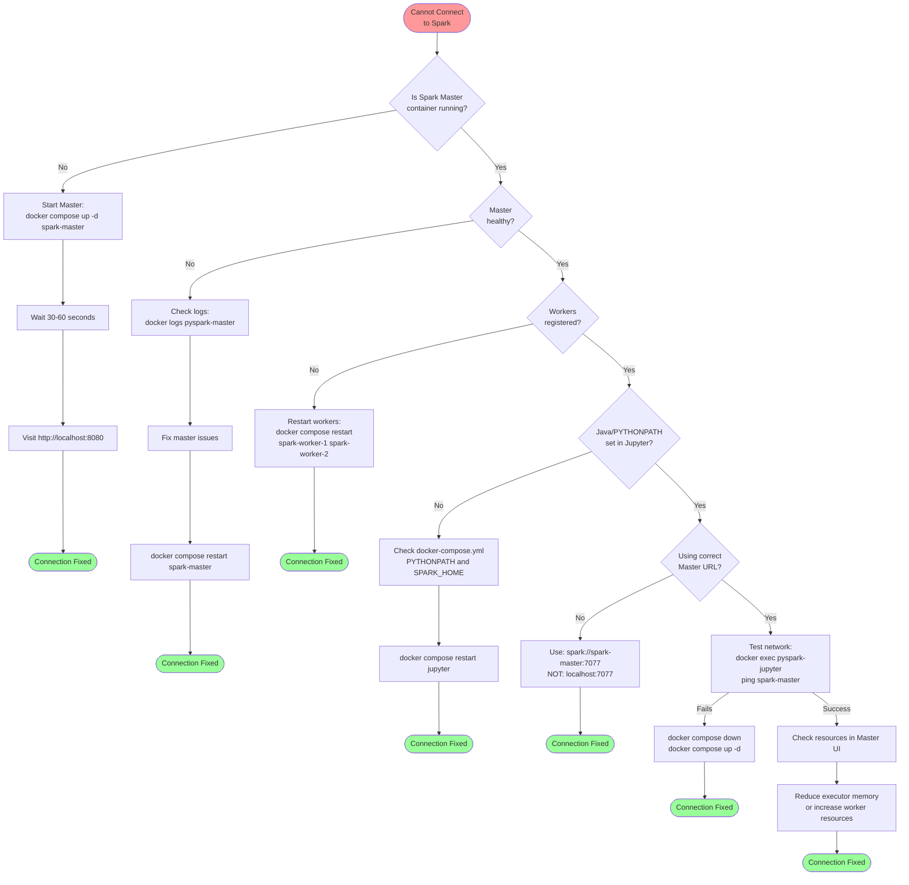
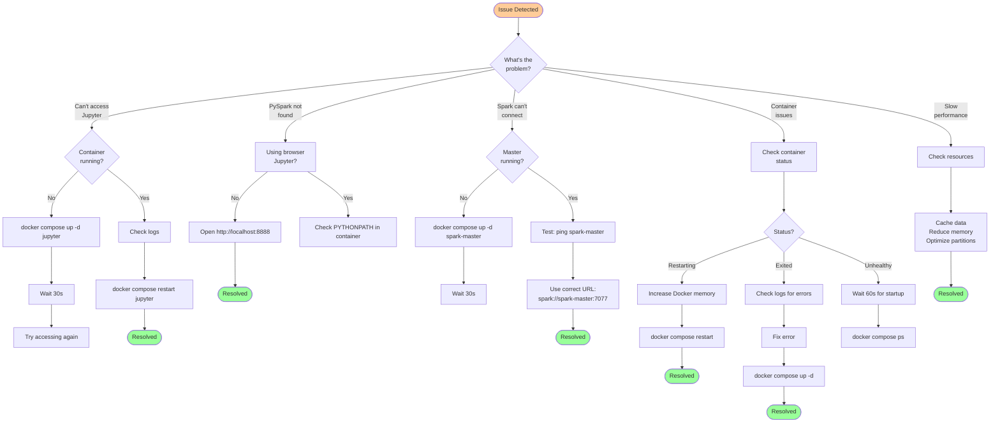

# PySpark Docker Troubleshooting Guide

Comprehensive troubleshooting guide for common issues with PySpark and Docker Compose setup.

## Table of Contents

- [Container Issues](#container-issues)
- [Jupyter Issues](#jupyter-issues)
- [Spark Connection Issues](#spark-connection-issues)
- [Performance Issues](#performance-issues)
- [Data Access Issues](#data-access-issues)
- [Network Issues](#network-issues)
- [General Docker Issues](#general-docker-issues)

---

## Container Issues

### Containers Won't Start

**Symptom:**
```bash
docker compose up -d
Error: port 8080 is already allocated
```

**Diagnosis:**
```bash
# Check what's using the port
lsof -i :8080

# Or check all Docker processes
docker ps -a
```

**Solutions:**

1. **Kill the process using the port:**
```bash
# Find process ID
lsof -i :8080
# Kill it (replace PID with actual process ID)
kill -9 PID
```

2. **Change port in docker-compose.yml:**
```yaml
ports:
  - "8090:8080"  # Use 8090 instead of 8080
```

3. **Stop conflicting containers:**
```bash
# List all containers
docker ps -a

# Stop specific container
docker stop container_name

# Or stop all
docker stop $(docker ps -q)
```

---

### Container Keeps Restarting

**Symptom:**
```bash
docker compose ps
# Shows: STATUS: Restarting
```

**Diagnosis:**
```bash
# Check container logs
docker compose logs spark-master
docker compose logs jupyter

# Look for error messages in the output
```

**Common Causes & Solutions:**

1. **Out of Memory:**

Check Docker Desktop → Settings → Resources

Increase memory allocation:
- Docker Desktop → Resources → Memory → 8GB+

2. **Configuration Error:**

```bash
# Validate docker-compose.yml
docker compose config

# Check for syntax errors
```

3. **Dependency Issues:**

```bash
# Ensure master is running before workers
docker compose up -d spark-master
# Wait 30 seconds
docker compose up -d spark-worker-1 spark-worker-2
```

4. **Permission Issues:**

```bash
# Fix permissions on mounted directories
chmod -R 755 ./notebooks
chmod -R 755 ./data
```

---

### Container Status Shows "Exited"

**Symptom:**
```bash
docker compose ps
# Shows: STATUS: Exited (1)
```

**Diagnosis:**
```bash
# View container logs to see why it exited
docker compose logs container_name

# Check last 50 lines
docker compose logs --tail=50 container_name
```

**Solutions:**

1. **View and fix errors in logs:**
```bash
docker compose logs jupyter
```

2. **Restart the container:**
```bash
docker compose restart jupyter
```

3. **Remove and recreate:**
```bash
docker compose stop jupyter
docker compose rm -f jupyter
docker compose up -d jupyter
```

4. **Check for missing environment variables:**
```bash
docker compose config
```

---

### Healthcheck Failing

**Symptom:**
```bash
docker compose ps
# Shows: STATUS: Up (unhealthy)
```

**Diagnosis:**
```bash
# Check health check logs
docker inspect pyspark-master --format='{{json .State.Health}}' | python -m json.tool

# Check service logs
docker logs pyspark-master
```

**Solutions:**

1. **Wait longer (services take time to start):**
```bash
# Wait 60 seconds then check again
sleep 60
docker compose ps
```

2. **Manually test the health check:**
```bash
# For master (checks port 8080)
curl http://localhost:8080

# For worker (checks port 8081)
curl http://localhost:8081
```

3. **Adjust healthcheck in docker-compose.yml:**
```yaml
healthcheck:
  test: ["CMD", "curl", "-f", "http://localhost:8080"]
  interval: 30s
  timeout: 10s
  retries: 5
  start_period: 60s  # Increase this
```

---

## Jupyter Issues

### Cannot Access Jupyter (Connection Refused)

**Symptom:**
- Browser shows "This site can't be reached" or "Connection refused"
- URL: http://localhost:8888

**Diagnosis:**
```bash
# 1. Check if container is running
docker compose ps jupyter

# 2. Check container logs
docker logs pyspark-jupyter

# 3. Test connection from inside container
docker exec pyspark-jupyter curl http://localhost:8888
```

**Solutions:**

1. **Verify container is running:**
```bash
docker compose ps
# jupyter should show "Up"

# If not, start it
docker compose up -d jupyter
```

2. **Check logs for errors:**
```bash
docker logs pyspark-jupyter

# Look for:
# "Jupyter Notebook is running at: http://127.0.0.1:8888"
```

3. **Restart Jupyter:**
```bash
docker compose restart jupyter

# Wait 30 seconds
sleep 30

# Check logs again
docker logs pyspark-jupyter --tail 20
```

4. **Recreate container:**
```bash
docker compose stop jupyter
docker compose rm -f jupyter
docker compose up -d jupyter
```

5. **Check port forwarding:**
```bash
# Verify port mapping
docker port pyspark-jupyter

# Should show:
# 8888/tcp -> 0.0.0.0:8888
```

---

### Jupyter Kernel Keeps Dying

**Symptom:**
- Error: "Kernel has died, would you like to restart it?"
- Notebooks won't execute

**Diagnosis:**
```bash
# Check memory usage
docker stats pyspark-jupyter

# Check Jupyter logs
docker logs pyspark-jupyter --tail 100
```

**Solutions:**

1. **Increase memory allocation:**

Docker Desktop → Settings → Resources → Memory → 8GB+

2. **Reduce Spark memory requirements:**
```python
spark = SparkSession.builder \
    .appName("MyApp") \
    .master("spark://spark-master:7077") \
    .config("spark.executor.memory", "512m") \  # Reduced
    .config("spark.driver.memory", "512m") \    # Reduced
    .getOrCreate()
```

3. **Restart kernel:**
- In Jupyter: Kernel → Restart Kernel

4. **Clear output and restart:**
- Cell → All Output → Clear
- Kernel → Restart & Clear Output

5. **Check for infinite loops:**
Review your code for loops that might not terminate

---

### ModuleNotFoundError: No module named 'pyspark'

**Symptom:**
```python
from pyspark.sql import SparkSession
# ModuleNotFoundError: No module named 'pyspark'
```

**Common Cause:**
You're running Jupyter locally instead of in the Docker container

**Solution:**

**DO NOT run Jupyter from your terminal!**

Instead:
1. Open browser
2. Go to: http://localhost:8888
3. Use notebooks in the web interface

**Verify you're in the right environment:**
```python
import sys
print(sys.executable)

# Should show: /usr/bin/python3 or similar
# Should NOT show: /Users/yourname/... or C:\Users\...
```

---

### Cannot Save Notebooks

**Symptom:**
- Error when saving: "Permission denied" or "Read-only file system"

**Diagnosis:**
```bash
# Check permissions on host
ls -la notebooks/

# Check inside container
docker exec pyspark-jupyter ls -la /notebooks
```

**Solutions:**

1. **Fix permissions on host:**
```bash
chmod -R 755 notebooks/
```

2. **Fix ownership:**
```bash
# On macOS/Linux
sudo chown -R $USER:$USER notebooks/
```

3. **Check container user:**
```bash
# Container might be running as wrong user
docker exec pyspark-jupyter whoami
```

4. **Mount with correct permissions:**
Update docker-compose.yml:
```yaml
volumes:
  - ./notebooks:/notebooks:rw  # Ensure read-write
```

---

## Spark Connection Issues

### Spark Connection Troubleshooting Flow



### Cannot Connect to Spark Master

**Symptom:**
```
PySparkRuntimeError: [JAVA_GATEWAY_EXITED] Java gateway process exited
```
or
```
Error: Cannot connect to spark://spark-master:7077
```

**Diagnosis:**
```bash
# 1. Check if master is running
docker compose ps spark-master

# 2. Check master logs
docker logs pyspark-master

# 3. Test network connectivity
docker exec pyspark-jupyter ping spark-master

# 4. Check master UI
curl http://localhost:8080
```

**Solutions:**

1. **Ensure master is running:**
```bash
docker compose ps spark-master
# Should show "Up (healthy)"

# If not
docker compose restart spark-master
```

2. **Wait for master to be ready:**
```bash
# Wait 30 seconds after starting
sleep 30

# Check master UI
open http://localhost:8080
```

3. **Verify network:**
```bash
# All containers should be on same network
docker network ls
docker network inspect class5_pyspark_spark-network
```

4. **Check JAVA_HOME in container:**
```bash
docker exec pyspark-jupyter bash -c 'echo $JAVA_HOME'

# Should show: /usr/lib/jvm/... or similar
# If empty, check PYTHONPATH is set correctly
```

5. **Use correct master URL:**
```python
# CORRECT (inside Docker)
.master("spark://spark-master:7077")

# WRONG
.master("spark://localhost:7077")
.master("local[*]")  # Only for testing without cluster
```

---

### Workers Not Connecting to Master

**Symptom:**
- Master UI shows 0 workers
- Applications can't execute

**Diagnosis:**
```bash
# Check worker logs
docker logs pyspark-worker-1
docker logs pyspark-worker-2

# Check master UI
open http://localhost:8080
```

**Solutions:**

1. **Restart workers:**
```bash
docker compose restart spark-worker-1 spark-worker-2
```

2. **Check worker logs for errors:**
```bash
docker logs pyspark-worker-1

# Look for:
# "Successfully registered with master"
```

3. **Verify master URL:**
Check docker-compose.yml:
```yaml
environment:
  - SPARK_MASTER=spark://spark-master:7077  # Must match
```

4. **Recreate workers:**
```bash
docker compose stop spark-worker-1 spark-worker-2
docker compose rm -f spark-worker-1 spark-worker-2
docker compose up -d spark-worker-1 spark-worker-2
```

---

### Application Stuck / Not Running

**Symptom:**
- Spark code hangs indefinitely
- No output, no errors

**Diagnosis:**
```bash
# Check application UI
open http://localhost:4040

# Check master UI
open http://localhost:8080

# Check logs
docker compose logs
```

**Solutions:**

1. **Check resource availability:**
- Open http://localhost:8080
- Verify workers have available cores and memory

2. **Reduce resource requirements:**
```python
spark = SparkSession.builder \
    .appName("MyApp") \
    .master("spark://spark-master:7077") \
    .config("spark.executor.memory", "512m") \
    .config("spark.executor.cores", "1") \
    .config("spark.cores.max", "2") \  # Limit total cores
    .getOrCreate()
```

3. **Check for data issues:**
```python
# Check if data is too large
df = spark.read.csv("/data/file.csv")
print(f"Rows: {df.count()}")  # This might be slow

# Sample data first
df.sample(0.1).show()
```

4. **Enable debug logging:**
```python
spark.sparkContext.setLogLevel("DEBUG")
```

---

## Performance Issues

### Spark Jobs Running Slowly

**Diagnosis:**
```bash
# Check resource usage
docker stats

# Check number of partitions
```

```python
df.rdd.getNumPartitions()
```

**Solutions:**

1. **Increase worker resources:**

Edit docker-compose.yml:
```yaml
environment:
  - SPARK_WORKER_CORES=4  # Increase from 2
  - SPARK_WORKER_MEMORY=4g  # Increase from 2g
```

2. **Optimize partitioning:**
```python
# Too many small partitions
df = df.coalesce(10)  # Reduce partitions

# Too few large partitions
df = df.repartition(100)  # Increase partitions
```

3. **Cache frequently used DataFrames:**
```python
df.cache()
df.count()  # Materialize the cache
```

4. **Use broadcast joins for small tables:**
```python
from pyspark.sql.functions import broadcast
result = large_df.join(broadcast(small_df), "key")
```

5. **Avoid collecting large datasets:**
```python
# BAD
data = df.collect()  # Brings all data to driver

# GOOD
df.write.csv("/data/output.csv")  # Write to disk
```

---

### Out of Memory Errors

**Symptom:**
```
java.lang.OutOfMemoryError: GC overhead limit exceeded
```
or
```
Container killed due to memory limit
```

**Solutions:**

1. **Increase Docker memory:**
- Docker Desktop → Settings → Resources
- Memory → 16GB

2. **Reduce Spark memory usage:**
```python
spark = SparkSession.builder \
    .config("spark.executor.memory", "1g") \  # Reduce
    .config("spark.driver.memory", "1g") \    # Reduce
    .config("spark.memory.fraction", "0.6") \  # Adjust
    .getOrCreate()
```

3. **Process data in batches:**
```python
# Instead of loading all at once
for file in file_list:
    df = spark.read.csv(file)
    # Process df
    df.write.mode("append").parquet("/data/output")
```

4. **Use more partitions:**
```python
df = df.repartition(200)  # Smaller partitions = less memory per task
```

5. **Avoid caching too much:**
```python
# Unpersist when done
df.unpersist()
```

---

## Data Access Issues

### Cannot Read/Write Files

**Symptom:**
```
FileNotFoundError: /data/myfile.csv
```
or
```
AnalysisException: Path does not exist
```

**Solutions:**

1. **Verify file exists on host:**
```bash
ls -la data/
```

2. **Check file path in container:**
```bash
docker exec pyspark-jupyter ls -la /data/
```

3. **Use correct path:**
```python
# CORRECT (inside container)
df = spark.read.csv("/data/myfile.csv")

# WRONG
df = spark.read.csv("./data/myfile.csv")  # Relative path
df = spark.read.csv("/Users/name/data/myfile.csv")  # Host path
```

4. **Check volume mount:**
```bash
# Verify mount
docker inspect pyspark-jupyter | grep -A 5 Mounts
```

5. **Fix permissions:**
```bash
chmod -R 755 data/
```

---

### Permission Denied Writing Files

**Symptom:**
```
PermissionError: [Errno 13] Permission denied
```

**Solutions:**

1. **Fix directory permissions:**
```bash
chmod -R 777 data/
chmod -R 777 notebooks/
```

2. **Run container as correct user:**

Edit docker-compose.yml:
```yaml
jupyter:
  user: root  # Or your user ID
```

3. **Check if directory exists:**
```bash
mkdir -p data/output
chmod 777 data/output
```

---

## Network Issues

### Services Cannot Communicate

**Symptom:**
- Jupyter can't reach Spark master
- Workers can't reach master

**Diagnosis:**
```bash
# Check network
docker network ls
docker network inspect class5_pyspark_spark-network

# Test connectivity
docker exec pyspark-jupyter ping spark-master
docker exec pyspark-worker-1 ping spark-master
```

**Solutions:**

1. **Ensure all on same network:**
```bash
# Check docker-compose.yml
grep -A 5 "networks:" docker-compose.yml
```

2. **Recreate network:**
```bash
docker compose down
docker network prune
docker compose up -d
```

3. **Use service names (not localhost):**
```python
# CORRECT
.master("spark://spark-master:7077")

# WRONG
.master("spark://localhost:7077")
```

---

## General Docker Issues

### Docker Daemon Not Running

**Symptom:**
```
Cannot connect to the Docker daemon
```

**Solution:**
1. Start Docker Desktop application
2. Wait for Docker to be running (icon in system tray)

---

### Disk Space Full

**Symptom:**
```
no space left on device
```

**Solutions:**

1. **Clean up Docker:**
```bash
# Remove unused containers
docker container prune

# Remove unused images
docker image prune -a

# Remove unused volumes
docker volume prune

# Clean everything
docker system prune -a --volumes
```

2. **Check disk space:**
```bash
df -h
```

---

### Commands Not Found

**Symptom:**
```
docker: command not found
```

**Solution:**
1. Ensure Docker Desktop is installed
2. Restart terminal
3. Check PATH includes Docker

---

## Debugging Flowchart

Use this flowchart to diagnose common issues:



## Debugging Checklist

When something goes wrong:

1. **Check container status:**
   ```bash
   docker compose ps
   ```

2. **Check logs:**
   ```bash
   docker compose logs
   docker logs pyspark-jupyter
   ```

3. **Check resource usage:**
   ```bash
   docker stats
   ```

4. **Verify services:**
   - Jupyter: http://localhost:8888
   - Master: http://localhost:8080
   - Workers: http://localhost:8081, http://localhost:8082

5. **Test connectivity:**
   ```bash
   docker exec pyspark-jupyter ping spark-master
   ```

6. **Restart problematic service:**
   ```bash
   docker compose restart service_name
   ```

7. **Recreate if needed:**
   ```bash
   docker compose down
   docker compose up -d
   ```

---

## Getting Additional Help

If issues persist:

1. **Check full logs:**
   ```bash
   docker compose logs > debug.log
   ```

2. **Check Docker logs:**
   - Docker Desktop → Troubleshoot → View logs

3. **Verify configuration:**
   ```bash
   docker compose config
   ```

4. **Check official docs:**
   - [Docker Documentation](https://docs.docker.com/)
   - [Spark Documentation](https://spark.apache.org/docs/latest/)

5. **Search for error messages:**
   - Copy exact error message
   - Search on Stack Overflow
   - Check GitHub issues

---

## Quick Fixes Reference

| Problem | Quick Fix |
|---------|-----------|
| Container won't start | `docker compose restart` |
| Can't access Jupyter | Check logs: `docker logs pyspark-jupyter` |
| PySpark not found | Use browser, not local Jupyter |
| Spark can't connect | Restart master: `docker compose restart spark-master` |
| Out of memory | Increase Docker Desktop memory allocation |
| Permission denied | `chmod -R 777 data/ notebooks/` |
| Port already in use | Change port in docker-compose.yml |
| Slow performance | Cache data: `df.cache()` |

---

## Prevention Tips

1. **Always use browser for Jupyter**
2. **Check logs regularly**: `docker compose logs -f`
3. **Monitor resources**: `docker stats`
4. **Keep Docker updated**
5. **Allocate sufficient resources** (8GB+ RAM)
6. **Stop containers when not in use**: `docker compose stop`
7. **Clean up periodically**: `docker system prune`

---

For additional assistance, refer to the main [README.md](../README.md) and [GETTING_STARTED.md](./GETTING_STARTED.md).
