# PySpark Advanced Concepts Guide

## Table of Contents
1. [Overview](#overview)
2. [Architecture](#architecture)
3. [Core Concepts](#core-concepts)
4. [Setup and Running](#setup-and-running)
5. [Examples Explained](#examples-explained)
6. [Troubleshooting](#troubleshooting)

---

## Overview

This guide covers advanced PySpark concepts demonstrated through a comprehensive Jupyter notebook running on a distributed Spark cluster. The notebook contains 9 elaborate examples across three major categories:

1. **Joining & Grouping Operations** (3 examples)
2. **Multidimensional DataFrames** (3 examples)
3. **Nested Column Structures** (3 examples)

---

## Architecture

### System Architecture

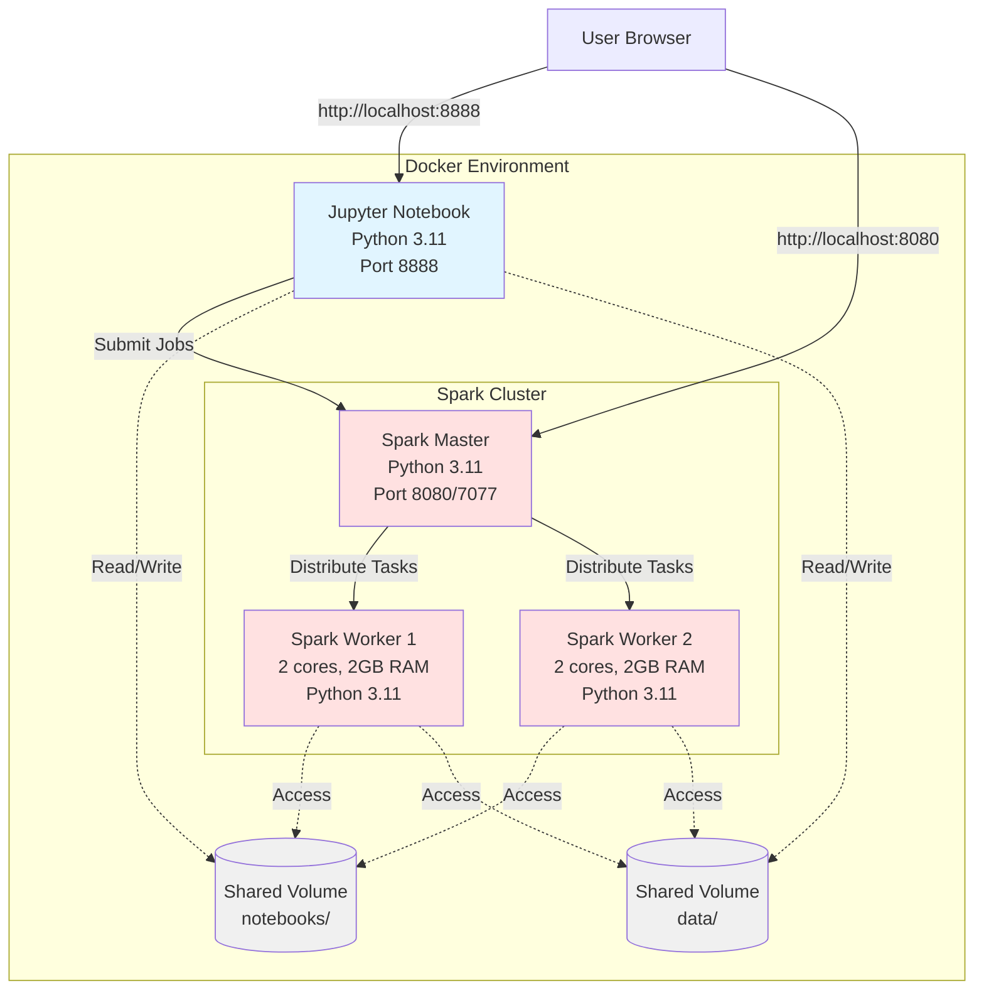

### Key Components

1. **Jupyter Notebook**: Interactive environment for writing and executing PySpark code
2. **Spark Master**: Coordinates job execution and manages cluster resources
3. **Spark Workers**: Execute distributed computations on partitioned data
4. **Shared Volumes**: Allow data sharing between containers

---

## Core Concepts

### 1. Joining & Grouping Operations

#### Concept Overview

Joining and grouping are fundamental operations for combining and aggregating data from multiple sources.

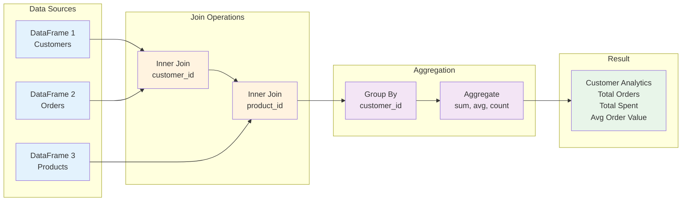

#### Join Types in Spark

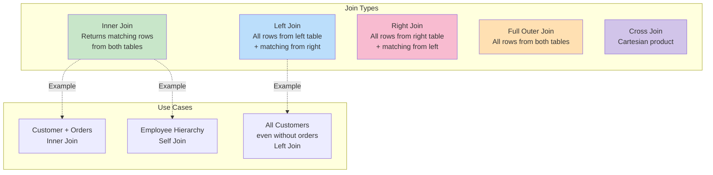

#### Example 1.1: E-Commerce Analysis

**Problem**: Analyze customer purchasing patterns across multiple tables

**Tables Involved**:
- Customers (customer_id, name, membership_tier)
- Orders (order_id, customer_id, order_date)
- Order Items (item_id, order_id, product_id, quantity)
- Products (product_id, product_name, category_id)
- Categories (category_id, category_name)

**Key Operations**:
```python
# Multi-table join
complete_orders = order_items_df \
    .join(orders_df, "order_id") \
    .join(customers_df, "customer_id") \
    .join(products_df, "product_id") \
    .join(categories_df, "category_id")

# Group and aggregate
customer_analytics = complete_orders.groupBy("customer_id", "name", "membership_tier") \
    .agg(
        count("order_id").alias("total_orders"),
        sum(col("quantity") * col("unit_price")).alias("total_spent"),
        avg(col("quantity") * col("unit_price")).alias("avg_order_value"),
        countDistinct("category_name").alias("categories_purchased")
    )
```

#### Example 1.2: Self-Joins

**Concept**: Joining a table with itself to establish relationships

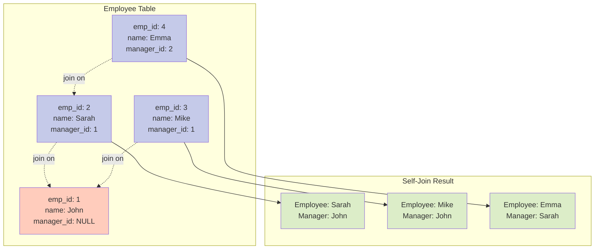

**Implementation**:
```python
# Self-join with aliases to avoid column ambiguity
emp_with_manager = employees_df.alias("emp") \
    .join(
        employees_df.alias("mgr"),
        col("emp.manager_id") == col("mgr.emp_id"),
        "left"
    ) \
    .select(
        col("emp.emp_id"),
        col("emp.emp_name"),
        col("mgr.emp_name").alias("manager_name")
    )
```

#### Example 1.3: Complex Multi-Table Joins with Ambiguous Columns

**Challenge**: When joining tables with duplicate column names (e.g., `department` in both `courses` and `instructors`)

**Solution**: Use DataFrame aliases

```python
# Join with aliases to handle ambiguous columns
complete_enrollments = enrollments_df \
    .join(students_df, "student_id") \
    .join(courses_df.alias("c"), "course_id") \
    .join(instructors_df.alias("i"), col("c.instructor_id") == col("i.instructor_id"))

# Reference specific columns using aliases
student_performance = complete_enrollments.groupBy(...) \
    .agg(
        countDistinct(col("c.department")).alias("departments_explored")  # Course department
    )
```

### 2. Multidimensional DataFrames

#### Concept Overview

Multidimensional analysis allows viewing data from multiple perspectives simultaneously, like a data cube.

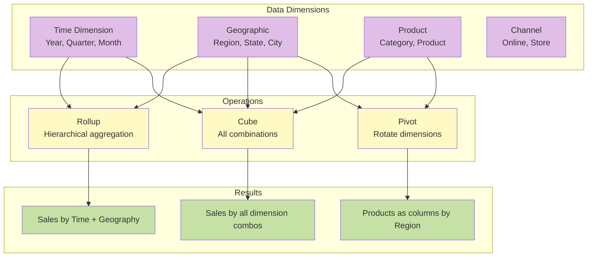

#### Rollup vs Cube vs Pivot

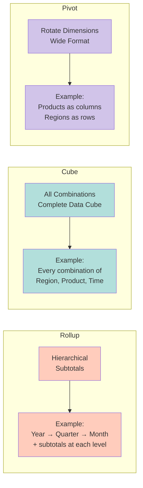

#### Example 2.1: Sales Data Cube

**Rollup Example**:
```python
# Hierarchical aggregation: month -> category -> total
time_rollup = sales_df.rollup("month", "category") \
    .agg(
        sum("revenue").alias("total_revenue"),
        sum("units_sold").alias("total_units")
    )
```

**Result Structure**:
```
month    | category     | total_revenue
---------|--------------|---------------
2024-01  | Electronics  | 470000        # Month + Category
2024-01  | Clothing     | 30000
2024-01  | NULL         | 500000        # Month subtotal
2024-02  | Electronics  | 400000
2024-02  | Clothing     | 80000
2024-02  | NULL         | 480000        # Month subtotal
NULL     | NULL         | 980000        # Grand total
```

**Cube Example**:
```python
# All combinations of region, channel, category
geo_channel_cube = sales_df.cube("region", "channel", "category") \
    .agg(sum("revenue").alias("total_revenue"))
```

**Pivot Example**:
```python
# Products as columns, regions as rows
product_region_pivot = sales_df.groupBy("product", "category") \
    .pivot("region", ["North", "South", "East", "West"]) \
    .agg(sum("revenue").alias("revenue"))
```

#### Example 2.2: Weather Data Analysis

**Use Case**: Analyze weather patterns across multiple dimensions (season, region, condition)

**Key Insight**: Cube operations create aggregates for every possible combination, useful for exploratory analysis.

#### Example 2.3: Financial Portfolio Analysis

**Multi-Level Pivot**: Combining multiple metrics in pivot operations

```python
# Pivot with multiple aggregations
risk_return_pivot = portfolio_df.groupBy("risk_level", "asset_type") \
    .pivot("quarter") \
    .agg(
        round(avg("return_pct"), 2).alias("avg_return"),
        sum("value").alias("total_value")
    )
```

### 3. Nested Column Structures

#### Concept Overview

Nested structures allow hierarchical data representation within a single DataFrame.

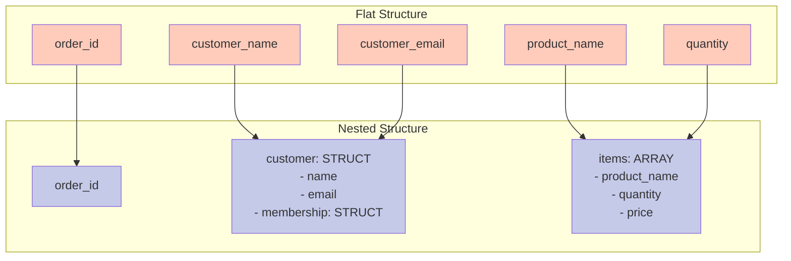

#### Schema Definition

**Critical**: PySpark needs explicit schemas for complex nested structures to avoid type inference errors.

```python
# Define schema for nested data
order_schema = StructType([
    StructField("order_id", IntegerType(), False),
    StructField("customer", StructType([
        StructField("customer_id", IntegerType(), False),
        StructField("name", StringType(), False),
        StructField("membership", StructType([
            StructField("tier", StringType(), False),
            StructField("points", IntegerType(), False)
        ]), False)
    ]), False),
    StructField("items", ArrayType(StructType([
        StructField("product_id", IntegerType(), False),
        StructField("name", StringType(), False),
        StructField("price", DoubleType(), False)
    ])), False)
])

# Create DataFrame with schema
df = spark.createDataFrame(data, schema=order_schema)
```

#### Working with Nested Data

```mermaid
graph LR
    subgraph "Operations on Nested Data"
        O1[Extract<br/>col('customer.name')]
        O2[Explode Arrays<br/>explode('items')]
        O3[Create Nested<br/>struct(...)]
        O4[Collect to Arrays<br/>collect_list(...)]
    end

    subgraph "Examples"
        E1[Flatten nested fields<br/>for analysis]
        E2[One row per array item<br/>for aggregation]
        E3[Build nested structures<br/>from flat data]
        E4[Aggregate into arrays<br/>for nested results]
    end

    O1 -.-> E1
    O2 -.-> E2
    O3 -.-> E3
    O4 -.-> E4

    style O1 fill:#b3e5fc
    style O2 fill:#b3e5fc
    style O3 fill:#c5e1a5
    style O4 fill:#c5e1a5
```

#### Example 3.1: E-Commerce Orders

**Flattening Nested Data**:
```python
# Extract nested fields
orders_flattened = orders_nested_df.select(
    "order_id",
    col("customer.name").alias("customer_name"),
    col("customer.membership.tier").alias("membership_tier"),
    col("shipping_address.city").alias("city")
)
```

**Exploding Arrays**:
```python
# Explode items array to get one row per item
orders_with_items = orders_nested_df.select(
    "order_id",
    explode("items").alias("item")
).select(
    "order_id",
    col("item.product_id"),
    col("item.name"),
    col("item.quantity")
)
```

**Creating Nested Structures**:
```python
# Aggregate flat data into nested structure
order_summary = items_df.groupBy("order_id") \
    .agg(
        struct(
            sum("quantity").alias("total_items"),
            sum("line_total").alias("total_amount")
        ).alias("order_summary"),
        collect_list(
            struct(
                col("product_name"),
                col("quantity")
            )
        ).alias("items")
    )
```

#### Example 3.2: Social Media Posts

**Complex Nested Schema**: Posts with nested author, content, engagement, and comments

**Key Challenge**: Multiple levels of nesting require careful schema definition

#### Example 3.3: IoT Sensor Data

**Use Case**: Device data with nested location, multiple sensors (array), and events

**Pattern**:
1. Define complete schema
2. Explode sensor arrays for analysis
3. Aggregate back to nested format for storage

---

## Setup and Running

### Prerequisites

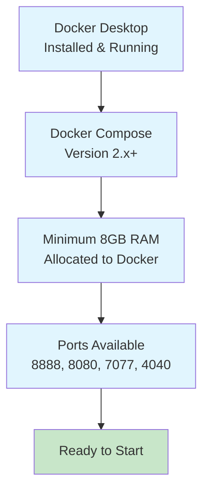

### Step-by-Step Setup

#### Step 1: Build the Custom Docker Images

```bash
cd class6_pyspark
docker compose build
```

**What This Does**:
- Builds custom Spark image with Python 3.11
- Installs Java 21
- Downloads Apache Spark 3.5.0
- Installs PySpark Python package

**Expected Time**: 5-10 minutes (first time only)

#### Step 2: Start the Cluster

```bash
docker compose up -d
```

**What This Does**:
- Starts Spark Master node
- Starts 2 Spark Worker nodes
- Starts Jupyter Notebook server
- Creates shared network and volumes

#### Step 3: Verify Cluster Status

```bash
docker compose ps
```

**Expected Output**:
```
NAME              STATUS
spark-master      Up
spark-worker-1    Up
spark-worker-2    Up
jupyter-pyspark   Up (healthy)
```

#### Step 4: Check Python Versions

```bash
docker exec spark-master python3 --version
docker exec spark-worker-1 python3 --version
docker exec spark-worker-2 python3 --version
docker exec jupyter-pyspark python3 --version
```

**All Should Show**: Python 3.11.x

### Access Points

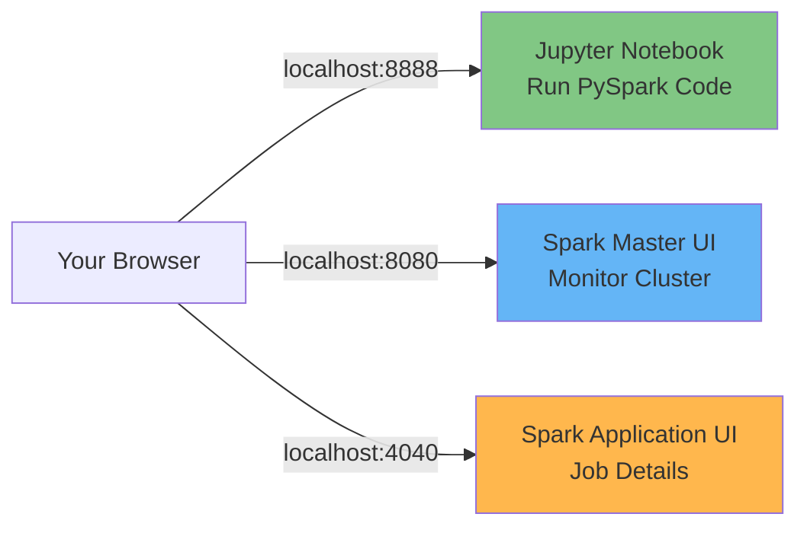

1. **Jupyter Notebook**: http://localhost:8888
   - Write and execute PySpark code
   - View results and visualizations

2. **Spark Master UI**: http://localhost:8080
   - View cluster status
   - See connected workers
   - Monitor resource usage

3. **Spark Application UI**: http://localhost:4040
   - Active when jobs are running
   - View job stages and tasks
   - Monitor performance metrics

### Running the Notebook

#### Step 1: Open Jupyter

1. Navigate to http://localhost:8888
2. Click on `work/pyspark_advanced_examples.ipynb`

#### Step 2: Run Cells in Order

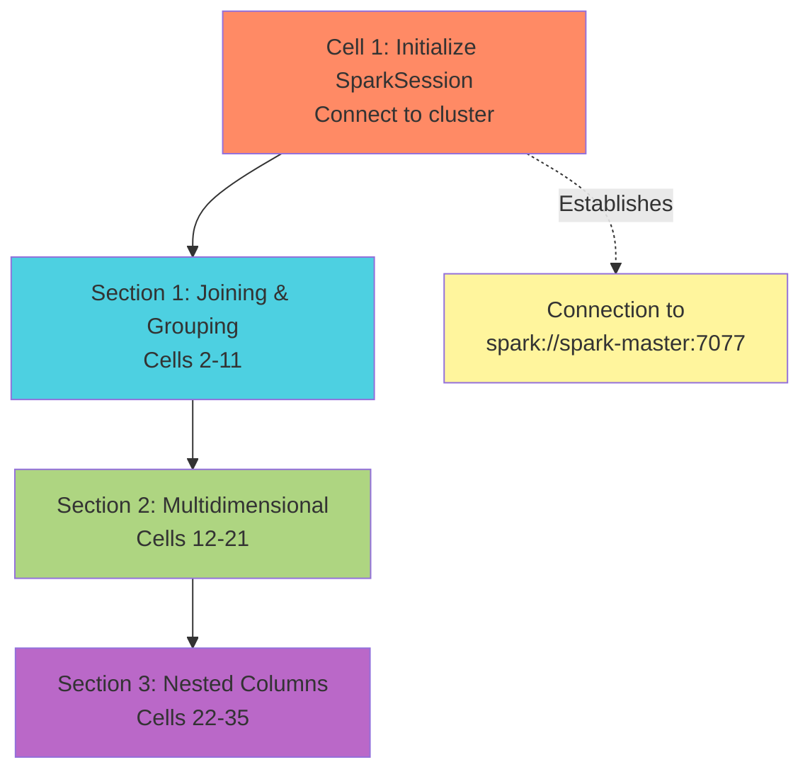

**Important**:
- Always start with Cell 1 to initialize SparkSession
- Run cells sequentially within each section
- Each section creates DataFrames used in subsequent cells

#### Step 3: Monitor Execution

**In Spark Master UI** (http://localhost:8080):
- See active applications
- Monitor worker utilization

**In Spark Application UI** (http://localhost:4040):
- View job progress
- See stage completion
- Monitor task distribution

### Execution Flow

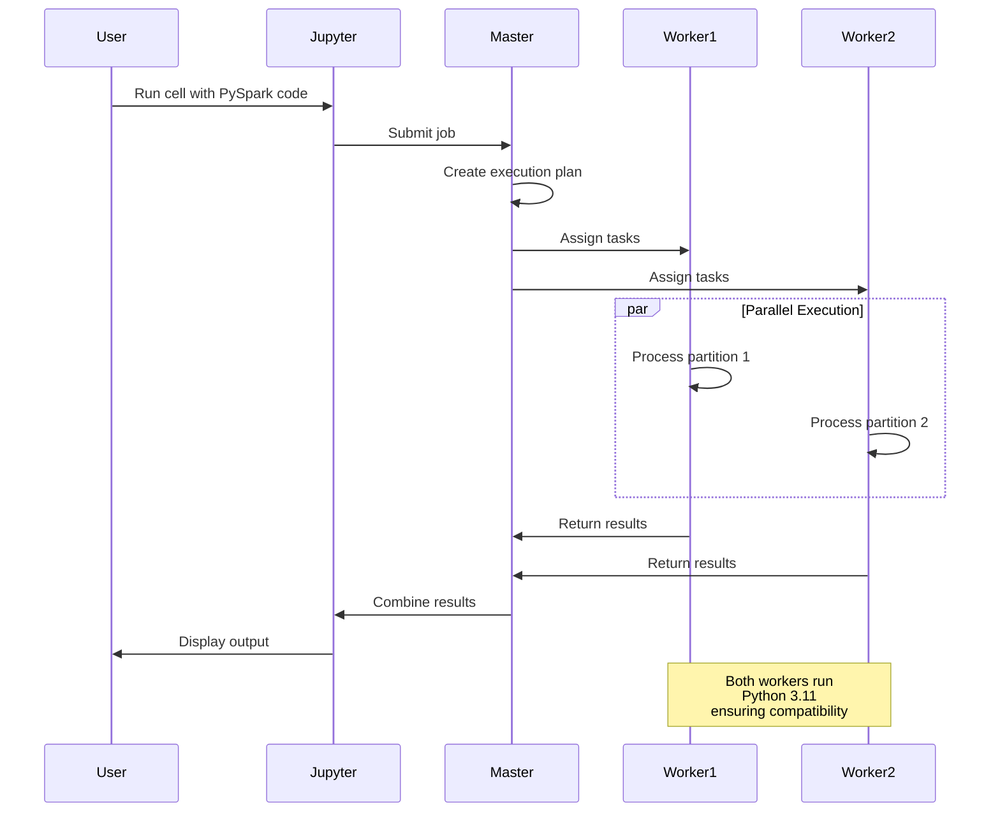

---

## Examples Explained

### Section 1: Joining & Grouping (Cells 2-11)

#### Example 1.1: E-Commerce Analysis
- **Cells**: 4-5
- **Concepts**: Multi-table inner joins, group by with multiple aggregations
- **Learning**: How to combine data from 5 tables and compute customer metrics

#### Example 1.2: Employee Hierarchy
- **Cells**: 7-8
- **Concepts**: Self-joins, window functions, salary rankings
- **Learning**: How to establish hierarchical relationships within a single table

#### Example 1.3: Student Enrollments
- **Cells**: 10-11
- **Concepts**: Handling ambiguous columns with aliases, cross-department analysis
- **Learning**: How to resolve column name conflicts in complex joins

### Section 2: Multidimensional Analysis (Cells 12-21)

#### Example 2.1: Sales Data Cube
- **Cells**: 14-15
- **Concepts**: Rollup, cube, pivot operations
- **Learning**: Different ways to aggregate across multiple dimensions

#### Example 2.2: Weather Data
- **Cells**: 17-18
- **Concepts**: Multi-dimensional cubes with conditions, temperature ranges
- **Learning**: Analyzing data from multiple perspectives simultaneously

#### Example 2.3: Financial Portfolio
- **Cells**: 20-21
- **Concepts**: Complete cube across 4 dimensions, risk-return matrices
- **Learning**: Complex financial analysis with hierarchical aggregations

### Section 3: Nested Structures (Cells 22-35)

#### Example 3.1: E-Commerce Orders
- **Cells**: 24-25
- **Concepts**: Explicit schema definition, flattening, exploding arrays, re-nesting
- **Learning**: Complete workflow for nested data manipulation

#### Example 3.2: Social Media Posts
- **Cells**: 27-29
- **Concepts**: Deep nesting (4+ levels), array operations, nested aggregations
- **Learning**: Handling real-world complex JSON-like structures

#### Example 3.3: IoT Sensor Data
- **Cells**: 31-33
- **Concepts**: Multiple sensor arrays, nested device info, event logs
- **Learning**: Processing hierarchical sensor data for analytics

---

## Troubleshooting

### Common Issues and Solutions

#### Issue 1: Python Version Mismatch

**Error**:
```
RuntimeError: Python in worker has different version 3.8 than that in driver 3.11
```

**Solution**:
- Verify all containers use Python 3.11
- Rebuild custom images: `docker compose build --no-cache`

#### Issue 2: Ambiguous Column Reference

**Error**:
```
AnalysisException: Reference `department` is ambiguous
```

**Solution**: Use DataFrame aliases
```python
.join(courses_df.alias("c"), "course_id")
.join(instructors_df.alias("i"), col("c.instructor_id") == col("i.instructor_id"))
# Then reference: col("c.department") or col("i.department")
```

#### Issue 3: Schema Inference Errors

**Error**:
```
Can't extract a value from "customer[membership]". Got "BIGINT".
```

**Solution**: Define explicit schema
```python
schema = StructType([
    StructField("customer", StructType([
        StructField("membership", StructType([...]), False)
    ]), False)
])
df = spark.createDataFrame(data, schema=schema)
```

#### Issue 4: Cluster Not Starting

**Check**:
1. Docker Desktop is running
2. Ports are not in use: `lsof -i :8888,8080,7077,4040`
3. Sufficient resources allocated to Docker

**Solution**:
```bash
docker compose down
docker compose up -d
docker compose logs
```

### Performance Tips

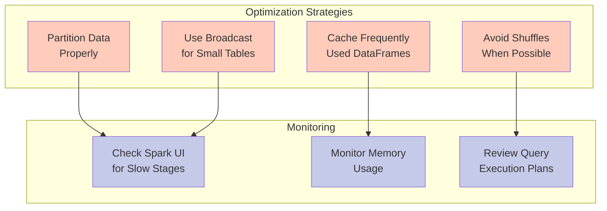

1. **Partition Data**: Ensure data is evenly distributed across workers
2. **Cache DataFrames**: Cache frequently accessed DataFrames with `df.cache()`
3. **Broadcast Small Tables**: Use `broadcast()` for small dimension tables in joins
4. **Monitor Stages**: Use Spark UI to identify bottlenecks

---

## Summary

This notebook demonstrates:

1. ✅ **Distributed Computing**: Code runs on 2-worker cluster
2. ✅ **Data Integration**: Joining data from multiple sources
3. ✅ **Advanced Aggregations**: Rollup, cube, and pivot operations
4. ✅ **Nested Data**: Working with complex hierarchical structures
5. ✅ **Real-World Patterns**: E-commerce, social media, IoT examples

### Key Takeaways

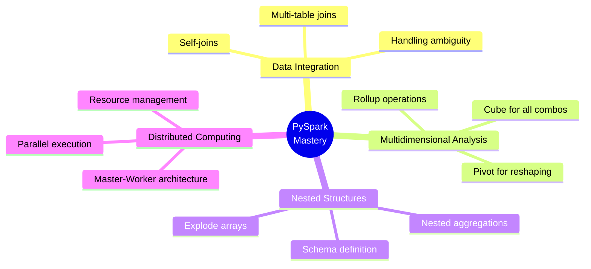

### Next Steps

1. **Experiment**: Modify examples with your own data
2. **Scale**: Increase data volume to see distributed benefits
3. **Optimize**: Use Spark UI to identify performance bottlenecks
4. **Extend**: Add more workers to scale horizontally

---

## Additional Resources

- **Apache Spark Documentation**: https://spark.apache.org/docs/latest/
- **PySpark API Reference**: https://spark.apache.org/docs/latest/api/python/
- **Spark SQL Guide**: https://spark.apache.org/docs/latest/sql-programming-guide.html
- **Docker Compose Reference**: https://docs.docker.com/compose/

---

*Created for Data 430: Big Data Technologies*
