# Service Mesh Architecture

## System Overview

This document provides a comprehensive architectural overview of the implemented service mesh.

## High-Level Architecture

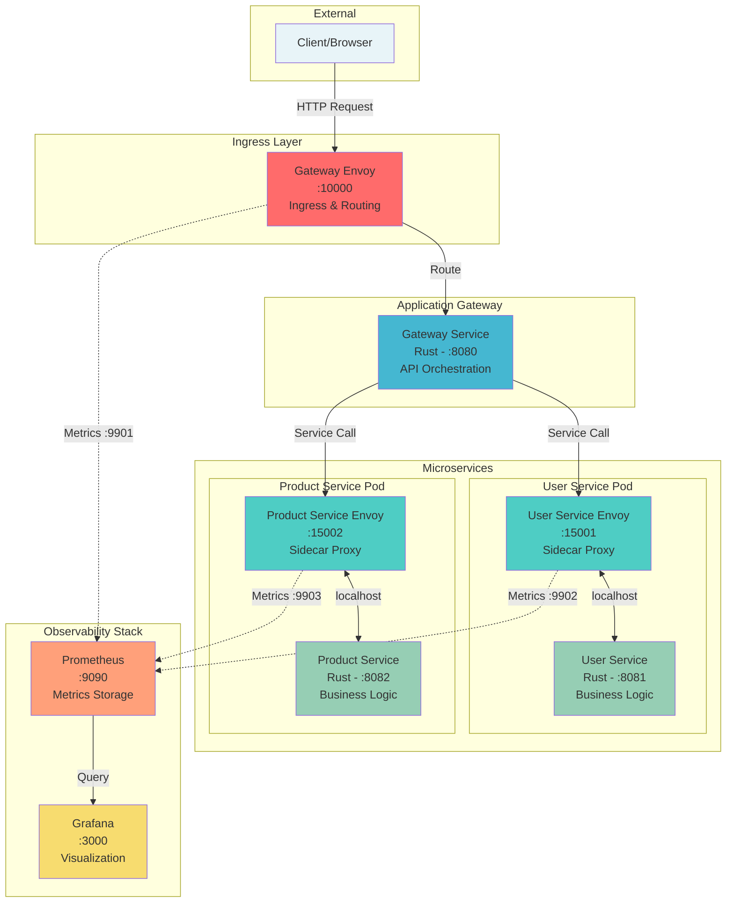
```mermaid
graph TB
    subgraph "External"
        CLIENT[Client/Browser]
    end

    subgraph "Ingress Layer"
        GE[Gateway Envoy<br/>:10000<br/>Ingress & Routing]
    end

    subgraph "Application Gateway"
        GW[Gateway Service<br/>Rust - :8080<br/>API Orchestration]
    end

    subgraph "Microservices"
        subgraph "User Service Pod"
            UE[User Service Envoy<br/>:15001<br/>Sidecar Proxy]
            US[User Service<br/>Rust - :8081<br/>Business Logic]
        end

        subgraph "Product Service Pod"
            PE[Product Service Envoy<br/>:15002<br/>Sidecar Proxy]
            PS[Product Service<br/>Rust - :8082<br/>Business Logic]
        end
    end

    subgraph "Observability Stack"
        PROM[Prometheus<br/>:9090<br/>Metrics Storage]
        GRAF[Grafana<br/>:3000<br/>Visualization]
    end

    CLIENT -->|HTTP Request| GE
    GE -->|Route| GW
    GW -->|Service Call| UE
    GW -->|Service Call| PE
    UE <-->|localhost| US
    PE <-->|localhost| PS

    GE -.->|Metrics :9901| PROM
    UE -.->|Metrics :9902| PROM
    PE -.->|Metrics :9903| PROM
    PROM -->|Query| GRAF

    style CLIENT fill:#E8F4F8
    style GE fill:#FF6B6B
    style GW fill:#45B7D1
    style UE fill:#4ECDC4
    style US fill:#96CEB4
    style PE fill:#4ECDC4
    style PS fill:#96CEB4
    style PROM fill:#FFA07A
    style GRAF fill:#F7DC6F
```

## Network Architecture

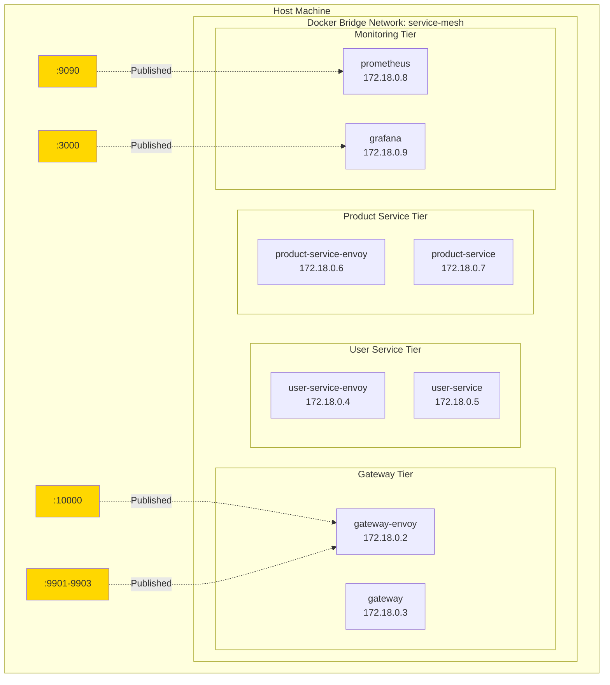
```mermaid
graph TB
    subgraph "Host Machine"
        subgraph "Docker Bridge Network: service-mesh"
            subgraph "Gateway Tier"
                GE[gateway-envoy<br/>172.18.0.2]
                GW[gateway<br/>172.18.0.3]
            end

            subgraph "User Service Tier"
                UE[user-service-envoy<br/>172.18.0.4]
                US[user-service<br/>172.18.0.5]
            end

            subgraph "Product Service Tier"
                PE[product-service-envoy<br/>172.18.0.6]
                PS[product-service<br/>172.18.0.7]
            end

            subgraph "Monitoring Tier"
                PROM[prometheus<br/>172.18.0.8]
                GRAF[grafana<br/>172.18.0.9]
            end
        end

        PORT1[":10000"] -.->|Published| GE
        PORT2[":9090"] -.->|Published| PROM
        PORT3[":3000"] -.->|Published| GRAF
        PORT4[":9901-9903"] -.->|Published| GE
    end

    style PORT1 fill:#FFD700
    style PORT2 fill:#FFD700
    style PORT3 fill:#FFD700
    style PORT4 fill:#FFD700
```

## Data Flow Architecture

### Request Path - User Service

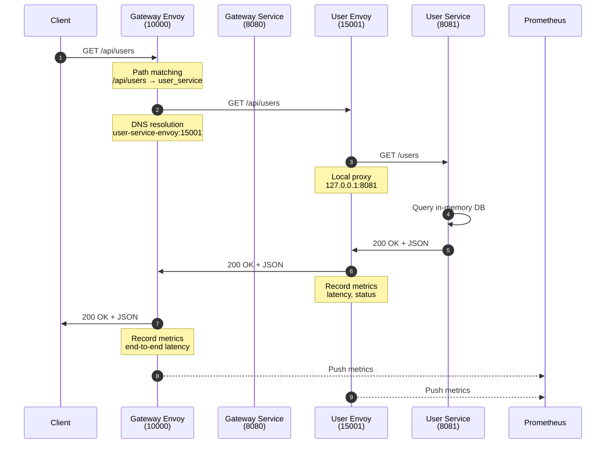
```mermaid
sequenceDiagram
    autonumber
    participant C as Client
    participant GE as Gateway Envoy<br/>(10000)
    participant GW as Gateway Service<br/>(8080)
    participant UE as User Envoy<br/>(15001)
    participant US as User Service<br/>(8081)

    C->>GE: GET /api/users
    Note over GE: Path matching<br/>/api/users → user_service

    GE->>UE: GET /api/users
    Note over GE: DNS resolution<br/>user-service-envoy:15001

    UE->>US: GET /users
    Note over UE: Local proxy<br/>127.0.0.1:8081

    US->>US: Query in-memory DB
    US->>UE: 200 OK + JSON

    UE->>GE: 200 OK + JSON
    Note over UE: Record metrics<br/>latency, status

    GE->>C: 200 OK + JSON
    Note over GE: Record metrics<br/>end-to-end latency

    GE-->>Prometheus: Push metrics
    UE-->>Prometheus: Push metrics
```

### Request Path - Product Service

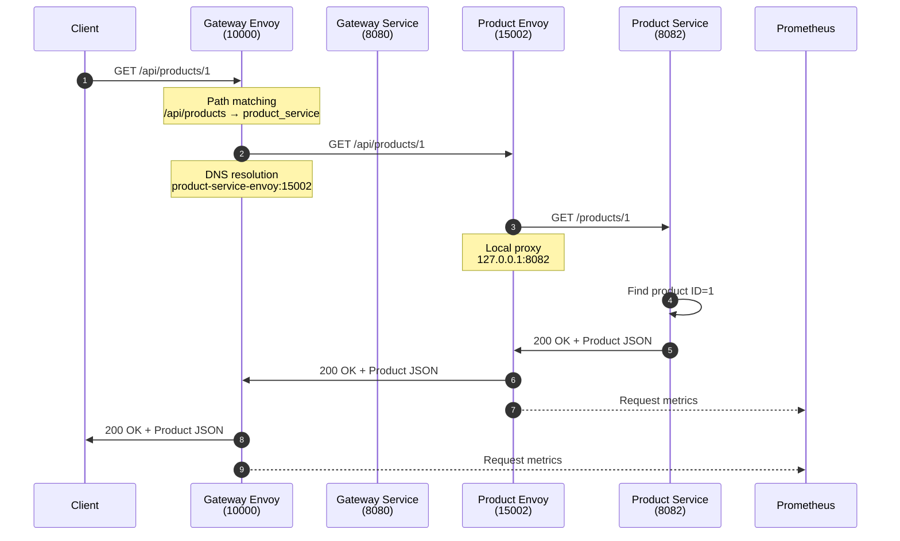
```mermaid
sequenceDiagram
    autonumber
    participant C as Client
    participant GE as Gateway Envoy<br/>(10000)
    participant GW as Gateway Service<br/>(8080)
    participant PE as Product Envoy<br/>(15002)
    participant PS as Product Service<br/>(8082)

    C->>GE: GET /api/products/1
    Note over GE: Path matching<br/>/api/products → product_service

    GE->>PE: GET /api/products/1
    Note over GE: DNS resolution<br/>product-service-envoy:15002

    PE->>PS: GET /products/1
    Note over PE: Local proxy<br/>127.0.0.1:8082

    PS->>PS: Find product ID=1
    PS->>PE: 200 OK + Product JSON

    PE->>GE: 200 OK + Product JSON
    PE-->>Prometheus: Request metrics

    GE->>C: 200 OK + Product JSON
    GE-->>Prometheus: Request metrics
```

## Component Architecture

### Gateway Service

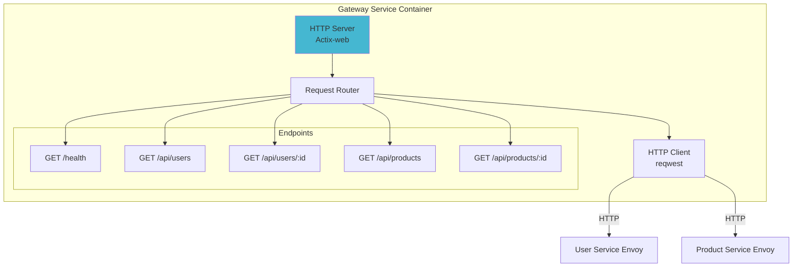
```mermaid
graph TB
    subgraph "Gateway Service Container"
        HTTP[HTTP Server<br/>Actix-web]
        ROUTER[Request Router]
        CLIENT[HTTP Client<br/>reqwest]

        HTTP --> ROUTER
        ROUTER --> CLIENT

        subgraph "Endpoints"
            E1[GET /health]
            E2[GET /api/users]
            E3[GET /api/users/:id]
            E4[GET /api/products]
            E5[GET /api/products/:id]
        end

        ROUTER --> E1
        ROUTER --> E2
        ROUTER --> E3
        ROUTER --> E4
        ROUTER --> E5
    end

    CLIENT -->|HTTP| UENV[User Service Envoy]
    CLIENT -->|HTTP| PENV[Product Service Envoy]

    style HTTP fill:#45B7D1
```

### User/Product Service

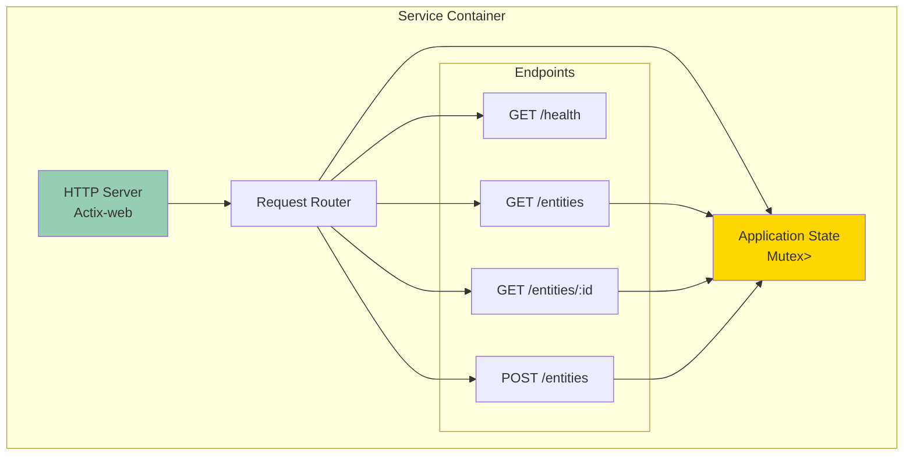
```mermaid
graph TB
    subgraph "Service Container"
        HTTP[HTTP Server<br/>Actix-web]
        ROUTER[Request Router]
        STATE[Application State<br/>Mutex<Vec<Entity>>]

        HTTP --> ROUTER
        ROUTER --> STATE

        subgraph "Endpoints"
            E1[GET /health]
            E2[GET /entities]
            E3[GET /entities/:id]
            E4[POST /entities]
        end

        ROUTER --> E1
        ROUTER --> E2
        ROUTER --> E3
        ROUTER --> E4

        E2 --> STATE
        E3 --> STATE
        E4 --> STATE
    end

    style HTTP fill:#96CEB4
    style STATE fill:#FFD700
```

### Envoy Proxy Architecture

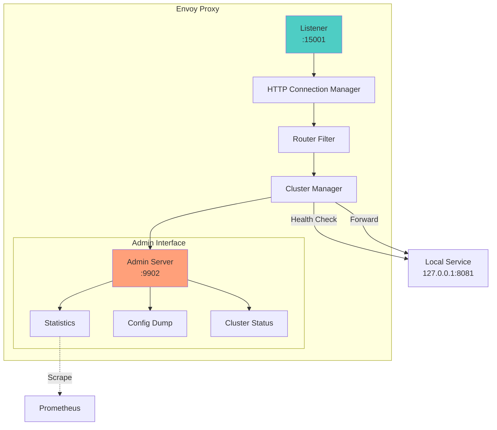
```mermaid
graph TB
    subgraph "Envoy Proxy"
        LISTENER[Listener<br/>:15001]
        FILTER[HTTP Connection Manager]
        ROUTER[Router Filter]
        CLUSTER[Cluster Manager]

        LISTENER --> FILTER
        FILTER --> ROUTER
        ROUTER --> CLUSTER

        subgraph "Admin Interface"
            ADMIN[Admin Server<br/>:9902]
            STATS[Statistics]
            CONFIG[Config Dump]
            CLUSTERS[Cluster Status]
        end

        CLUSTER --> ADMIN
        ADMIN --> STATS
        ADMIN --> CONFIG
        ADMIN --> CLUSTERS
    end

    CLUSTER -->|Health Check| SERVICE[Local Service<br/>127.0.0.1:8081]
    CLUSTER -->|Forward| SERVICE

    STATS -.->|Scrape| PROM[Prometheus]

    style LISTENER fill:#4ECDC4
    style ADMIN fill:#FFA07A
```

## Service Discovery

### DNS-Based Discovery

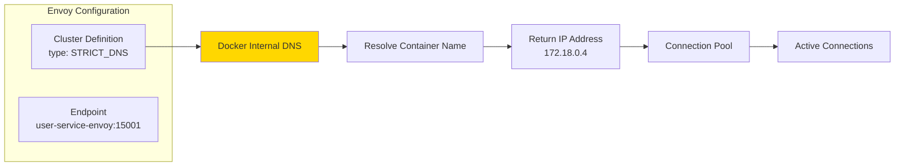
```mermaid
graph LR
    subgraph "Envoy Configuration"
        CLUSTER[Cluster Definition<br/>type: STRICT_DNS]
        ENDPOINT[Endpoint<br/>user-service-envoy:15001]
    end

    CLUSTER --> DOCKER_DNS[Docker Internal DNS]
    DOCKER_DNS --> RESOLVE[Resolve Container Name]
    RESOLVE --> IP[Return IP Address<br/>172.18.0.4]

    IP --> POOL[Connection Pool]
    POOL --> CONN[Active Connections]

    style DOCKER_DNS fill:#FFD700
```

### Service Registration

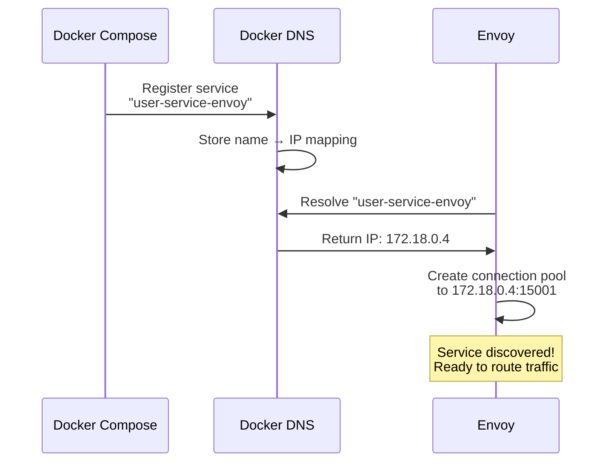
```mermaid
sequenceDiagram
    participant DC as Docker Compose
    participant DNS as Docker DNS
    participant ENV as Envoy

    DC->>DNS: Register service<br/>"user-service-envoy"
    DNS->>DNS: Store name → IP mapping

    ENV->>DNS: Resolve "user-service-envoy"
    DNS->>ENV: Return IP: 172.18.0.4

    ENV->>ENV: Create connection pool<br/>to 172.18.0.4:15001

    Note over ENV: Service discovered!<br/>Ready to route traffic
```

## Health Checking

### Health Check Flow

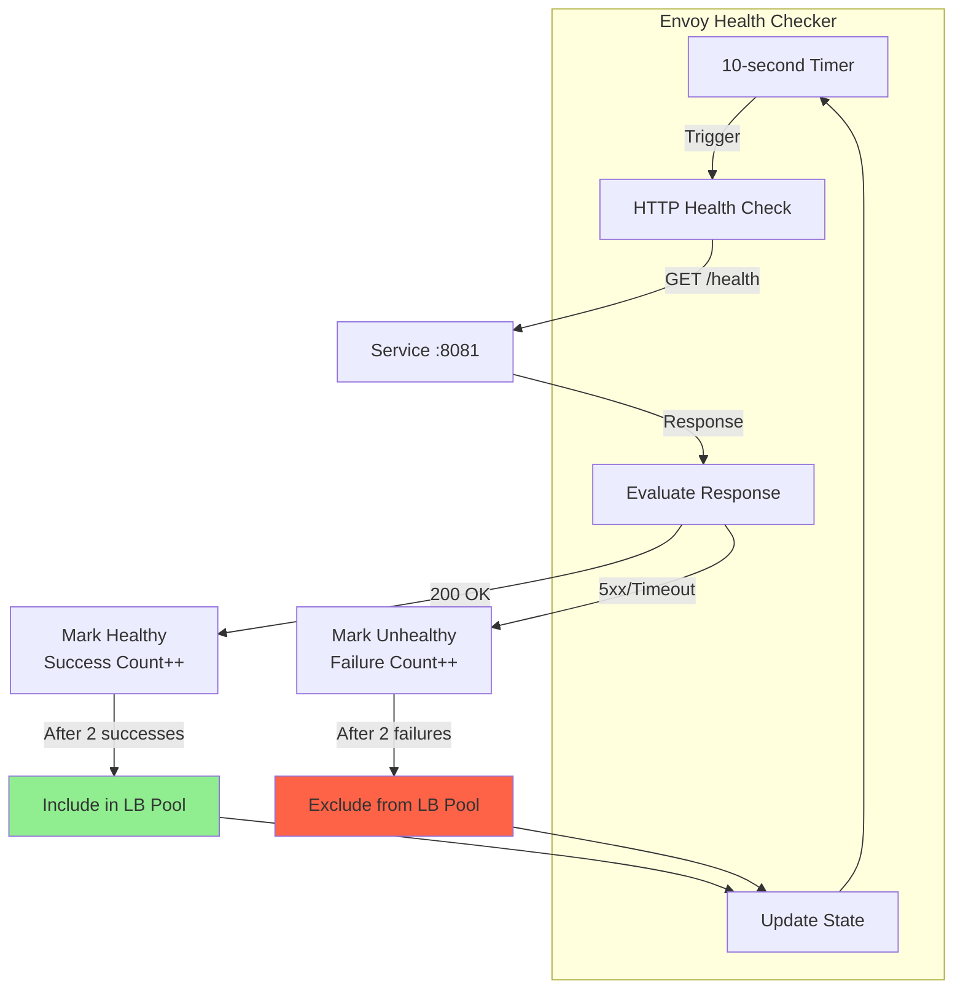
```mermaid
graph TB
    subgraph "Envoy Health Checker"
        TIMER[10-second Timer]
        HC[HTTP Health Check]
        EVAL[Evaluate Response]
        STATE[Update State]
    end

    TIMER -->|Trigger| HC
    HC -->|GET /health| SERVICE[Service :8081]
    SERVICE -->|Response| EVAL

    EVAL -->|200 OK| HEALTHY[Mark Healthy<br/>Success Count++]
    EVAL -->|5xx/Timeout| UNHEALTHY[Mark Unhealthy<br/>Failure Count++]

    HEALTHY -->|After 2 successes| INCLUDE[Include in LB Pool]
    UNHEALTHY -->|After 2 failures| EXCLUDE[Exclude from LB Pool]

    INCLUDE --> STATE
    EXCLUDE --> STATE
    STATE --> TIMER

    style INCLUDE fill:#90EE90
    style EXCLUDE fill:#FF6347
```

### Health State Machine

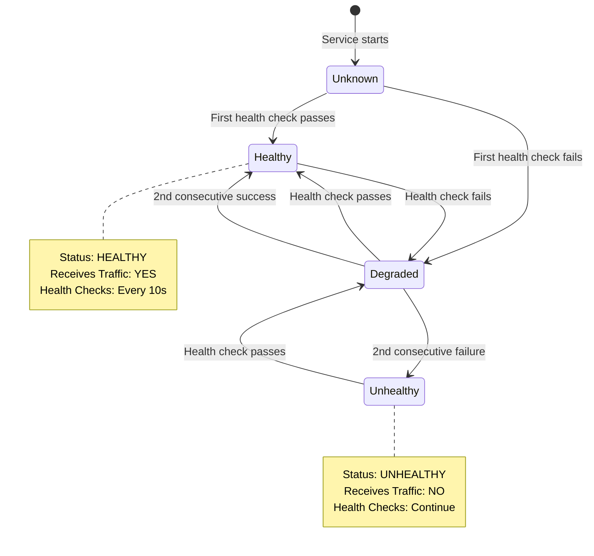
```mermaid
stateDiagram-v2
    [*] --> Unknown: Service starts
    Unknown --> Healthy: First health check passes
    Unknown --> Degraded: First health check fails

    Healthy --> Degraded: Health check fails
    Degraded --> Healthy: Health check passes
    Degraded --> Unhealthy: 2nd consecutive failure

    Unhealthy --> Degraded: Health check passes
    Degraded --> Healthy: 2nd consecutive success

    note right of Healthy
        Status: HEALTHY
        Receives Traffic: YES
        Health Checks: Every 10s
    end note

    note right of Unhealthy
        Status: UNHEALTHY
        Receives Traffic: NO
        Health Checks: Continue
    end note
```

## Load Balancing

### Round Robin Algorithm

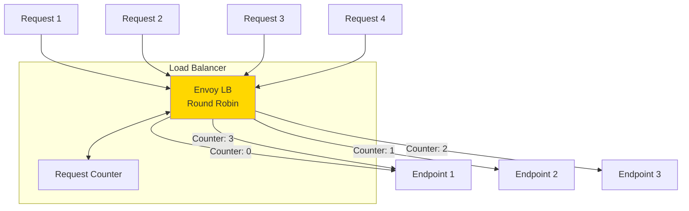
```mermaid
graph TB
    subgraph "Load Balancer"
        LB[Envoy LB<br/>Round Robin]
        COUNTER[Request Counter]
    end

    REQ1[Request 1] --> LB
    REQ2[Request 2] --> LB
    REQ3[Request 3] --> LB
    REQ4[Request 4] --> LB

    LB -->|Counter: 0| E1[Endpoint 1]
    LB -->|Counter: 1| E2[Endpoint 2]
    LB -->|Counter: 2| E3[Endpoint 3]
    LB -->|Counter: 3| E1

    LB <--> COUNTER

    style LB fill:#FFD700
```

### Load Distribution Example

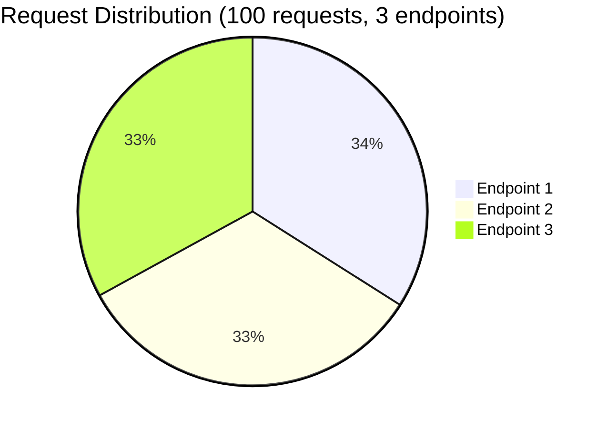
```mermaid
pie title Request Distribution (100 requests, 3 endpoints)
    "Endpoint 1" : 34
    "Endpoint 2" : 33
    "Endpoint 3" : 33
```

## Metrics Collection

### Metrics Pipeline

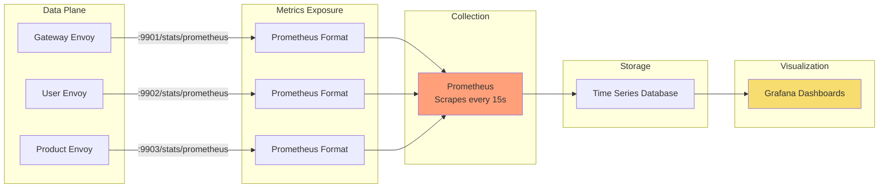
```mermaid
graph LR
    subgraph "Data Plane"
        GE[Gateway Envoy]
        UE[User Envoy]
        PE[Product Envoy]
    end

    subgraph "Metrics Exposure"
        GE -->|:9901/stats/prometheus| STATS1[Prometheus Format]
        UE -->|:9902/stats/prometheus| STATS2[Prometheus Format]
        PE -->|:9903/stats/prometheus| STATS3[Prometheus Format]
    end

    subgraph "Collection"
        PROM[Prometheus<br/>Scrapes every 15s]
    end

    subgraph "Storage"
        TSDB[Time Series Database]
    end

    subgraph "Visualization"
        GRAF[Grafana Dashboards]
    end

    STATS1 --> PROM
    STATS2 --> PROM
    STATS3 --> PROM

    PROM --> TSDB
    TSDB --> GRAF

    style PROM fill:#FFA07A
    style GRAF fill:#F7DC6F
```

### Key Metrics

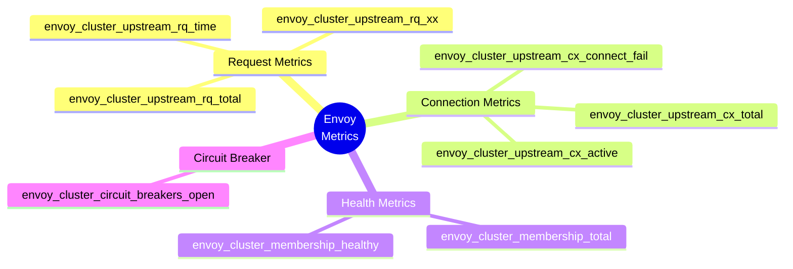
```mermaid
mindmap
  root((Envoy<br/>Metrics))
    Request Metrics
      envoy_cluster_upstream_rq_total
      envoy_cluster_upstream_rq_time
      envoy_cluster_upstream_rq_xx
    Connection Metrics
      envoy_cluster_upstream_cx_active
      envoy_cluster_upstream_cx_total
      envoy_cluster_upstream_cx_connect_fail
    Health Metrics
      envoy_cluster_membership_healthy
      envoy_cluster_membership_total
    Circuit Breaker
      envoy_cluster_circuit_breakers_open
```

## Observability Stack

### Complete Observability Flow

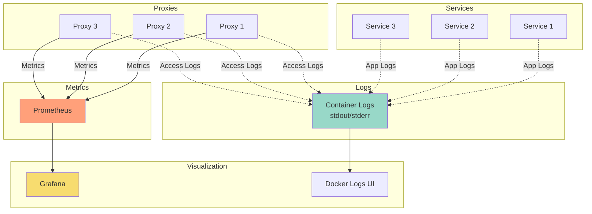
```mermaid
graph TB
    subgraph "Services"
        S1[Service 1]
        S2[Service 2]
        S3[Service 3]
    end

    subgraph "Proxies"
        P1[Proxy 1]
        P2[Proxy 2]
        P3[Proxy 3]
    end

    subgraph "Metrics"
        PROM[Prometheus]
    end

    subgraph "Logs"
        STDOUT[Container Logs<br/>stdout/stderr]
    end

    subgraph "Visualization"
        GRAF[Grafana]
        LOGS_UI[Docker Logs UI]
    end

    S1 -.->|App Logs| STDOUT
    S2 -.->|App Logs| STDOUT
    S3 -.->|App Logs| STDOUT

    P1 -.->|Access Logs| STDOUT
    P2 -.->|Access Logs| STDOUT
    P3 -.->|Access Logs| STDOUT

    P1 -->|Metrics| PROM
    P2 -->|Metrics| PROM
    P3 -->|Metrics| PROM

    PROM --> GRAF
    STDOUT --> LOGS_UI

    style PROM fill:#FFA07A
    style GRAF fill:#F7DC6F
    style STDOUT fill:#98D8C8
```

## Security Model

### Current Security Posture

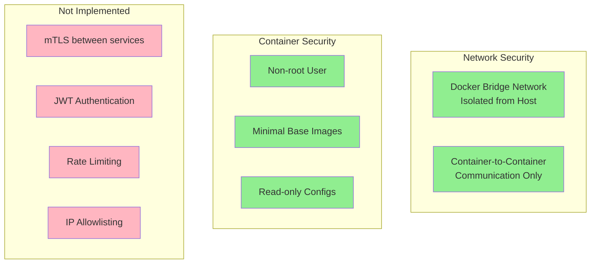
```mermaid
graph TB
    subgraph "Network Security"
        N1[Docker Bridge Network<br/>Isolated from Host]
        N2[Container-to-Container<br/>Communication Only]
    end

    subgraph "Container Security"
        C1[Non-root User]
        C2[Minimal Base Images]
        C3[Read-only Configs]
    end

    subgraph "Not Implemented"
        S1[mTLS between services]
        S2[JWT Authentication]
        S3[Rate Limiting]
        S4[IP Allowlisting]
    end

    style N1 fill:#90EE90
    style N2 fill:#90EE90
    style C1 fill:#90EE90
    style C2 fill:#90EE90
    style C3 fill:#90EE90
    style S1 fill:#FFB6C1
    style S2 fill:#FFB6C1
    style S3 fill:#FFB6C1
    style S4 fill:#FFB6C1
```

### Future: mTLS Architecture

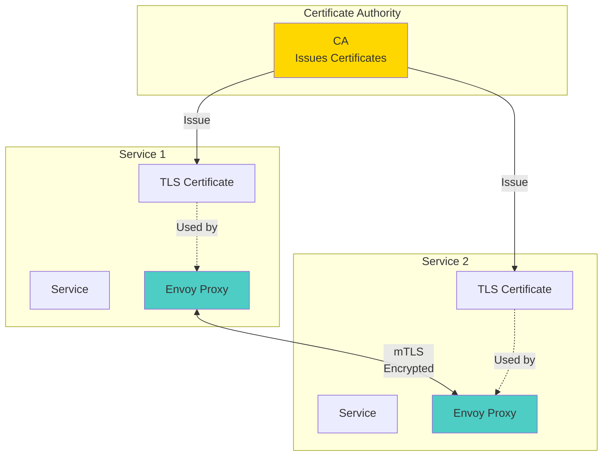
```mermaid
graph TB
    subgraph "Certificate Authority"
        CA[CA<br/>Issues Certificates]
    end

    subgraph "Service 1"
        S1[Service]
        P1[Envoy Proxy]
        CERT1[TLS Certificate]
    end

    subgraph "Service 2"
        S2[Service]
        P2[Envoy Proxy]
        CERT2[TLS Certificate]
    end

    CA -->|Issue| CERT1
    CA -->|Issue| CERT2

    P1 <-->|mTLS<br/>Encrypted| P2

    CERT1 -.->|Used by| P1
    CERT2 -.->|Used by| P2

    style CA fill:#FFD700
    style P1 fill:#4ECDC4
    style P2 fill:#4ECDC4
```

## Deployment Architecture

### Container Orchestration

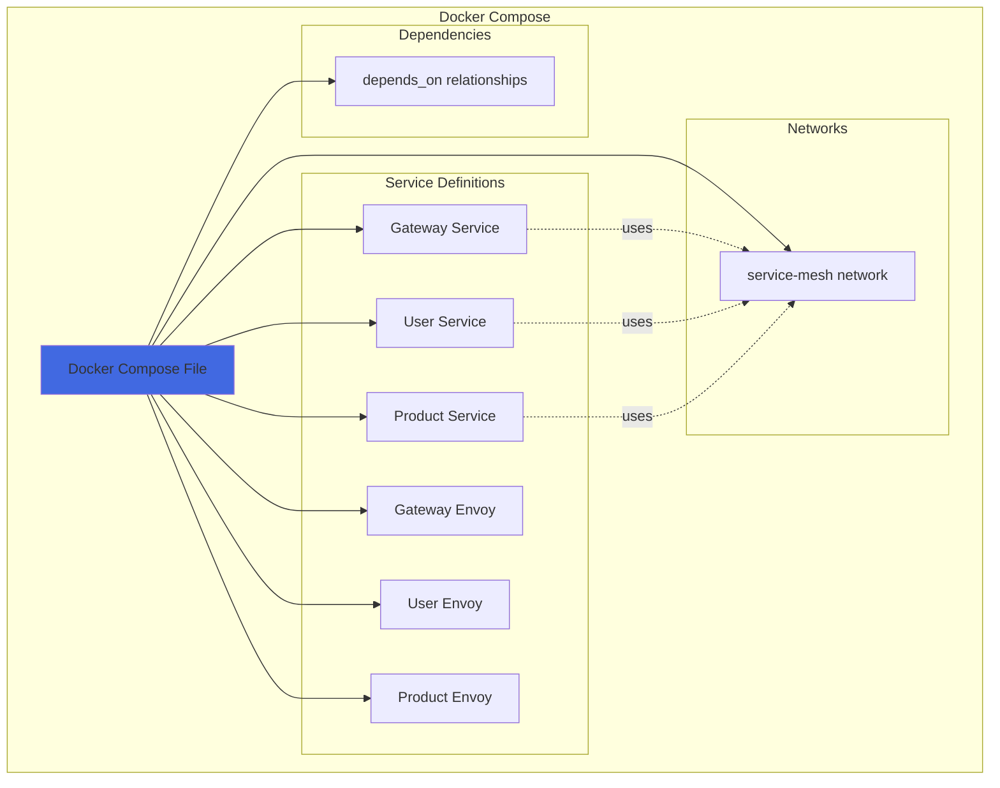
```mermaid
graph TB
    subgraph "Docker Compose"
        DC[Docker Compose File]

        subgraph "Service Definitions"
            GW_DEF[Gateway Service]
            US_DEF[User Service]
            PS_DEF[Product Service]
            GE_DEF[Gateway Envoy]
            UE_DEF[User Envoy]
            PE_DEF[Product Envoy]
        end

        subgraph "Networks"
            NET[service-mesh network]
        end

        subgraph "Dependencies"
            DEP[depends_on relationships]
        end
    end

    DC --> GW_DEF
    DC --> US_DEF
    DC --> PS_DEF
    DC --> GE_DEF
    DC --> UE_DEF
    DC --> PE_DEF

    DC --> NET
    DC --> DEP

    GW_DEF -.->|uses| NET
    US_DEF -.->|uses| NET
    PS_DEF -.->|uses| NET

    style DC fill:#4169E1
```

## Scalability Architecture

### Horizontal Scaling

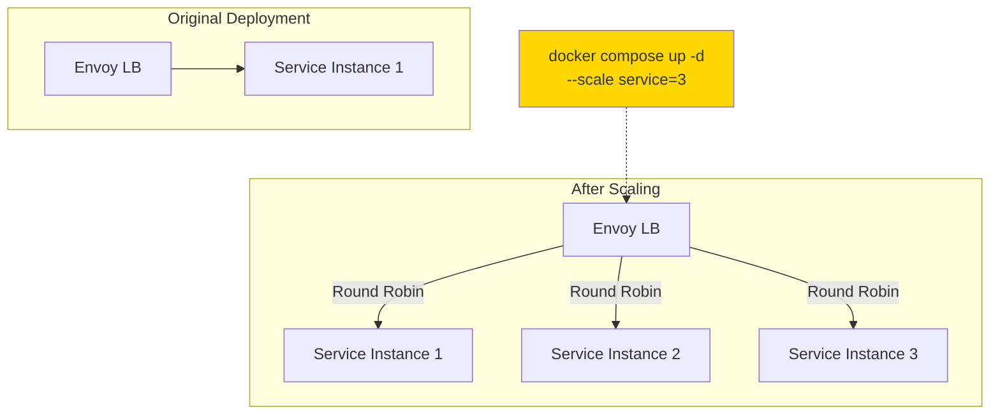
```mermaid
graph TB
    subgraph "Original Deployment"
        ENV1[Envoy LB]
        S1[Service Instance 1]
        ENV1 --> S1
    end

    subgraph "After Scaling"
        ENV2[Envoy LB]
        S2[Service Instance 1]
        S3[Service Instance 2]
        S4[Service Instance 3]

        ENV2 -->|Round Robin| S2
        ENV2 -->|Round Robin| S3
        ENV2 -->|Round Robin| S4
    end

    SCALE[docker compose up -d<br/>--scale service=3]
    SCALE -.-> ENV2

    style SCALE fill:#FFD700
```

## Port Mapping

### External to Internal Port Mapping

| Component | External Port | Internal Port | Purpose |
|-----------|--------------|---------------|---------|
| Gateway Envoy | 10000 | 10000 | Main ingress |
| Gateway Envoy Admin | 9901 | 9901 | Admin interface |
| User Service Envoy | 15001 | 15001 | Service port |
| User Service Envoy Admin | 9902 | 9902 | Admin interface |
| Product Service Envoy | 15002 | 15002 | Service port |
| Product Service Envoy Admin | 9903 | 9903 | Admin interface |
| Prometheus | 9090 | 9090 | Metrics UI |
| Grafana | 3000 | 3000 | Dashboard UI |
| Gateway Service | - | 8080 | Internal only |
| User Service | - | 8081 | Internal only |
| Product Service | - | 8082 | Internal only |

### Port Architecture

```mermaid
graph LR
    subgraph "External World"
        CLIENT[Client]
    end

    subgraph "Published Ports"
        P10000[":10000"]
        P9090[":9090"]
        P3000[":3000"]
        P9901[":9901-9903"]
    end

    subgraph "Docker Network - Internal Only"
        GE[gateway-envoy:10000]
        GW[gateway:8080]
        UE[user-service-envoy:15001]
        US[user-service:8081]
        PE[product-service-envoy:15002]
        PS[product-service:8082]
        PROM[prometheus:9090]
        GRAF[grafana:3000]
    end

    CLIENT --> P10000
    CLIENT --> P9090
    CLIENT --> P3000
    CLIENT --> P9901

    P10000 --> GE
    P9090 --> PROM
    P3000 --> GRAF
    P9901 --> GE

    GE <--> GW
    GW <--> UE
    GW <--> PE
    UE <--> US
    PE <--> PS

    style P10000 fill:#FFD700
    style P9090 fill:#FFD700
    style P3000 fill:#FFD700
    style P9901 fill:#FFD700
```

## Summary

This architecture demonstrates a complete service mesh implementation with:

 **Ingress Gateway**: Single entry point for external traffic
 **Sidecar Proxies**: Transparent proxying for each service
 **Service Discovery**: DNS-based automatic discovery
 **Health Checking**: Active health monitoring
 **Load Balancing**: Round-robin distribution
 **Observability**: Comprehensive metrics and logging
 **Containerization**: Full Docker-based deployment
 **Monitoring Stack**: Prometheus + Grafana integration

### Key Design Decisions

1. **Envoy for Data Plane**: Industry-standard, high-performance proxy
2. **Rust for Services**: Memory-safe, high-performance backend
3. **Sidecar Pattern**: Transparent, language-agnostic approach
4. **Docker Compose**: Simple orchestration for development
5. **DNS Discovery**: Built-in Docker DNS for service discovery
6. **Health-Based LB**: Automatic removal of unhealthy endpoints

### Production Readiness Path

To make this production-ready:

1.  Add mTLS for service-to-service encryption
2.  Implement distributed tracing (Jaeger/Zipkin)
3.  Add rate limiting and circuit breaking
4.  Implement JWT authentication
5.  Deploy to Kubernetes
6.  Add service mesh control plane (Istio/Linkerd)
7.  Implement GitOps deployment
8.  Add comprehensive monitoring and alerting

---

This architecture serves as a solid foundation for understanding and building service mesh solutions.
