# Service Mesh: Technical Documentation

## Table of Contents

1. [Introduction](#introduction)
2. [What is a Service Mesh](#what-is-a-service-mesh)
3. [Core Architecture](#core-architecture)
4. [Key Components](#key-components)
5. [Core Features](#core-features)
6. [Popular Implementations](#popular-implementations)
7. [Traffic Management](#traffic-management)
8. [Security](#security)
9. [Observability](#observability)
10. [Deployment Patterns](#deployment-patterns)
11. [Benefits and Challenges](#benefits-and-challenges)
12. [Best Practices](#best-practices)
13. [Use Cases](#use-cases)
14. [Implementation Guide](#implementation-guide)

---

## Introduction

A service mesh is a dedicated infrastructure layer that provides a transparent way to add capabilities like observability, traffic management, and security to distributed services without requiring changes to application code. It has become a critical component in modern microservices architectures, particularly in cloud-native environments.

### Why Service Mesh?

As organizations move from monolithic applications to microservices architectures, they face new challenges:

- **Service-to-service communication complexity**: In a microservices architecture, services need to discover and communicate with each other reliably
- **Observability gaps**: Understanding the behavior of distributed systems requires sophisticated monitoring and tracing
- **Security concerns**: Securing communication between services, implementing mutual TLS, and managing certificates
- **Traffic management**: Implementing advanced routing, load balancing, circuit breaking, and retry logic
- **Operational overhead**: Managing these cross-cutting concerns across hundreds or thousands of services

A service mesh addresses these challenges by abstracting the network layer and providing a consistent way to handle inter-service communication.

---

## What is a Service Mesh

A service mesh is a configurable, low-latency infrastructure layer designed to handle a high volume of network-based inter-service communication using application programming interfaces (APIs). It ensures that communication among containerized and often ephemeral application infrastructure services is fast, reliable, and secure.

### Key Characteristics

1. **Transparent**: Applications are unaware of the service mesh presence
2. **Language-agnostic**: Works with services written in any programming language
3. **Platform-independent**: Can run on various platforms (Kubernetes, VMs, bare metal)
4. **Policy-driven**: Centralized policy enforcement and configuration
5. **Observable**: Built-in metrics, logs, and traces for all service communications

---

## Core Architecture

A service mesh typically consists of two main components: the **data plane** and the **control plane**.

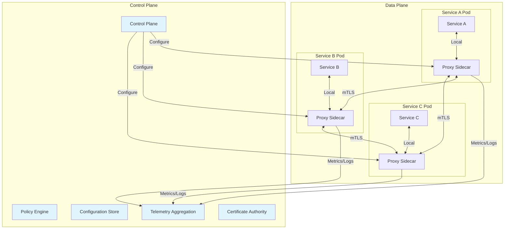

### Architecture Layers

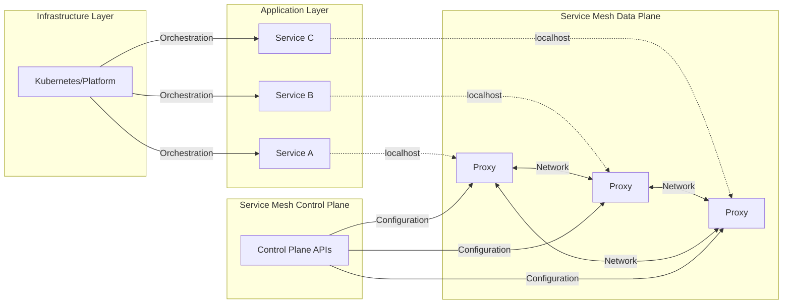

---

## Key Components

### 1. Data Plane

The data plane is responsible for handling all network traffic between services. It consists of lightweight proxies deployed as sidecars alongside each service instance.

**Responsibilities:**
- Request routing and load balancing
- Service discovery
- Health checking
- Authentication and authorization
- Telemetry collection
- Traffic encryption (mTLS)
- Circuit breaking and retry logic
- Rate limiting

**Common Data Plane Proxies:**
- **Envoy**: Most popular, high-performance proxy written in C++
- **Linkerd2-proxy**: Lightweight proxy written in Rust, designed specifically for Linkerd
- **NGINX**: Traditional reverse proxy adapted for service mesh use
- **HAProxy**: High-performance TCP/HTTP load balancer

**Sidecar Pattern:**

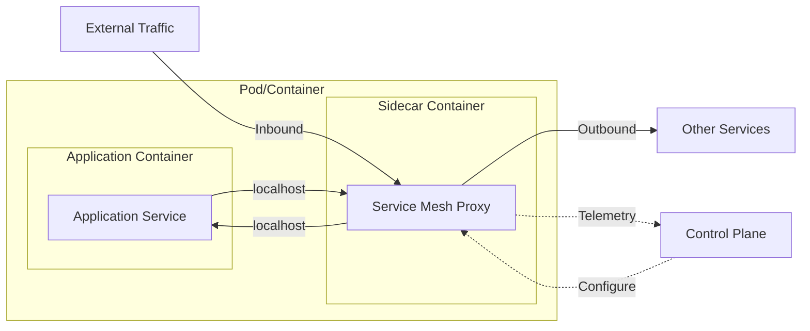

### 2. Control Plane

The control plane manages and configures the data plane proxies. It provides:

**Core Functions:**
- **Configuration Management**: Distributes routing rules, policies, and configurations to proxies
- **Service Discovery**: Maintains a registry of available services
- **Certificate Management**: Issues and rotates certificates for mTLS
- **Telemetry Aggregation**: Collects and processes metrics, logs, and traces
- **Policy Enforcement**: Applies access control, rate limiting, and quota policies

**Control Plane Components:**

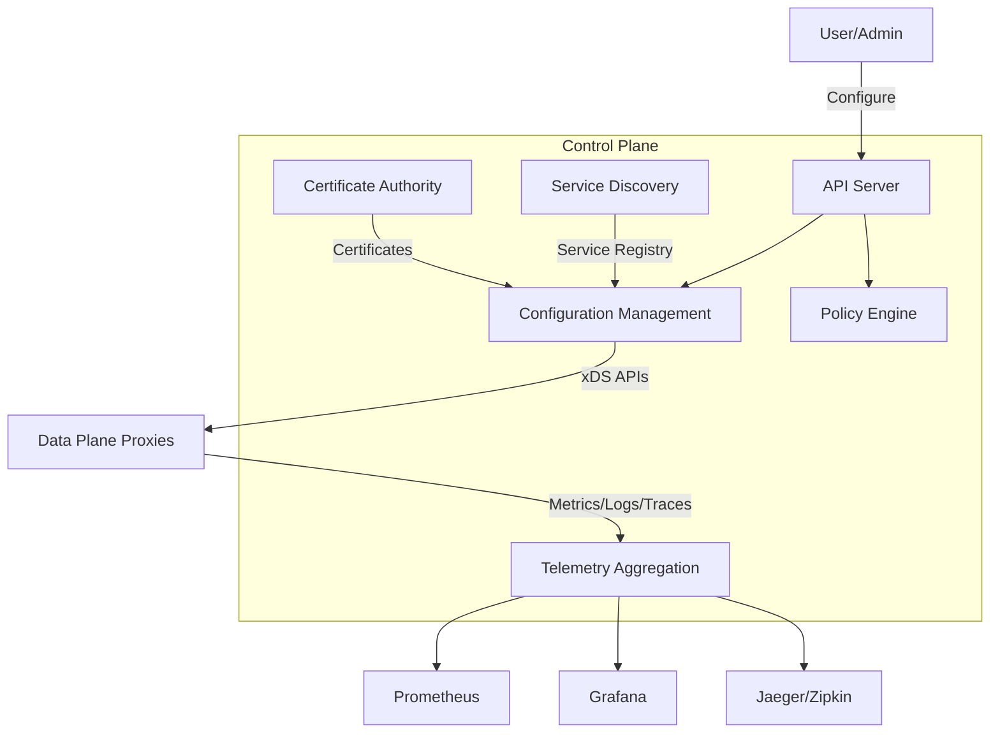

---

## Core Features

### 1. Traffic Management

Service meshes provide sophisticated traffic routing capabilities:

#### Load Balancing Algorithms
- **Round Robin**: Distributes requests evenly across instances
- **Least Request**: Routes to the instance with the fewest active requests
- **Random**: Random selection
- **Consistent Hashing**: Routes based on request attributes for session affinity

#### Advanced Routing

**Traffic Splitting (Canary Deployments):**

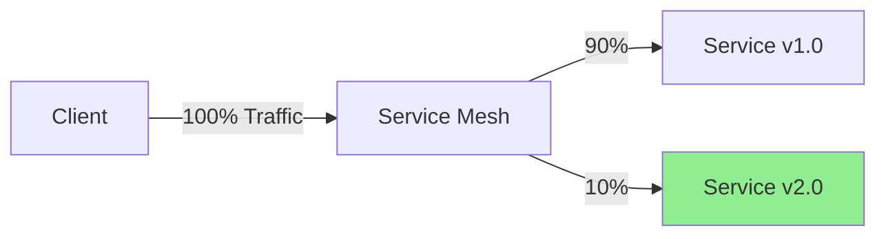

**A/B Testing:**

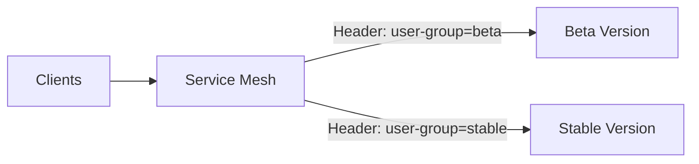

**Blue/Green Deployment:**

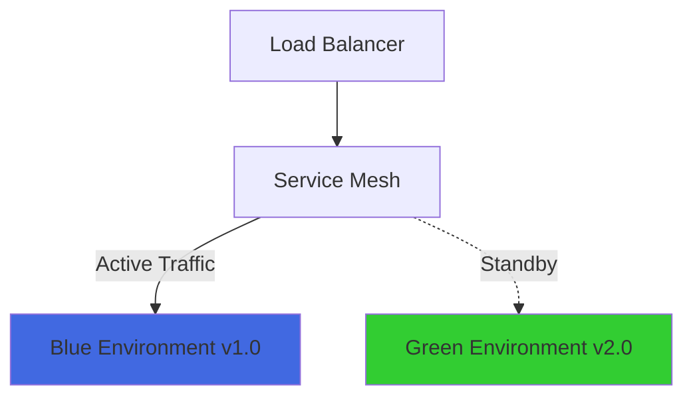

#### Circuit Breaking

Prevents cascading failures by stopping requests to unhealthy services:

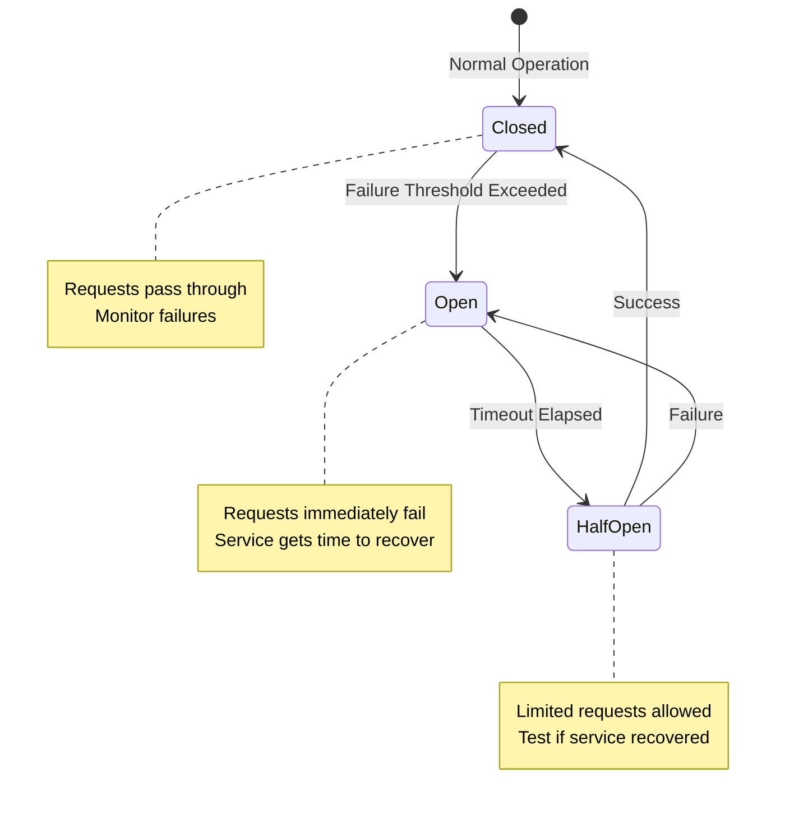

#### Retry and Timeout Policies

- **Exponential Backoff**: Increasing delay between retries
- **Deadline Propagation**: Pass timeout context through call chain
- **Retry Budgets**: Limit retries to prevent overload

### 2. Security

Service meshes provide comprehensive security features:

#### Mutual TLS (mTLS)

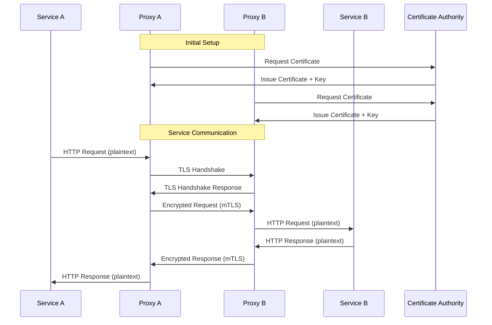

#### Authentication and Authorization

**SPIFFE/SPIRE Integration:**
- **SPIFFE** (Secure Production Identity Framework For Everyone): Standard for service identity
- **SPIRE**: Implementation that issues and manages SPIFFE IDs

**Authorization Policies:**

```yaml
# Example: Allow only service-a to call service-b's /api endpoint
apiVersion: security.istio.io/v1beta1
kind: AuthorizationPolicy
metadata:
  name: service-b-policy
spec:
  selector:
    matchLabels:
      app: service-b
  action: ALLOW
  rules:
  - from:
    - source:
        principals: ["cluster.local/ns/default/sa/service-a"]
    to:
    - operation:
        methods: ["GET", "POST"]
        paths: ["/api/*"]
```

#### Certificate Management

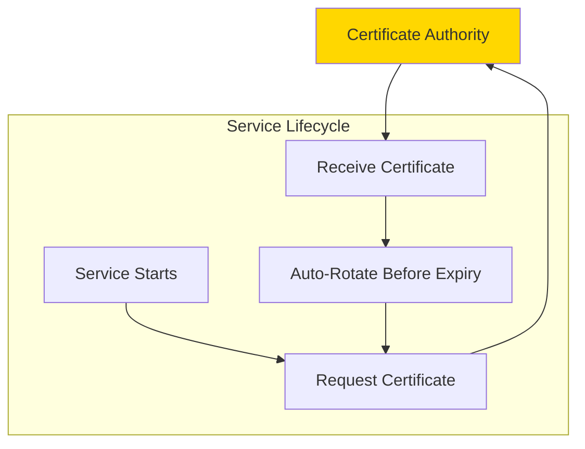

### 3. Observability

Service meshes provide comprehensive visibility into service behavior:

#### Three Pillars of Observability

**1. Metrics**

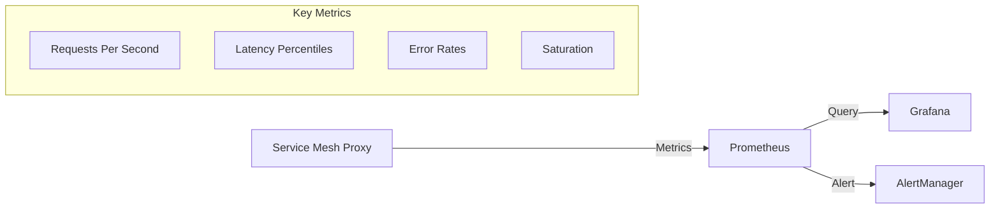

**Golden Signals:**
- **Latency**: Time to process requests (p50, p95, p99)
- **Traffic**: Request volume
- **Errors**: Rate of failed requests
- **Saturation**: Resource utilization

**2. Distributed Tracing**

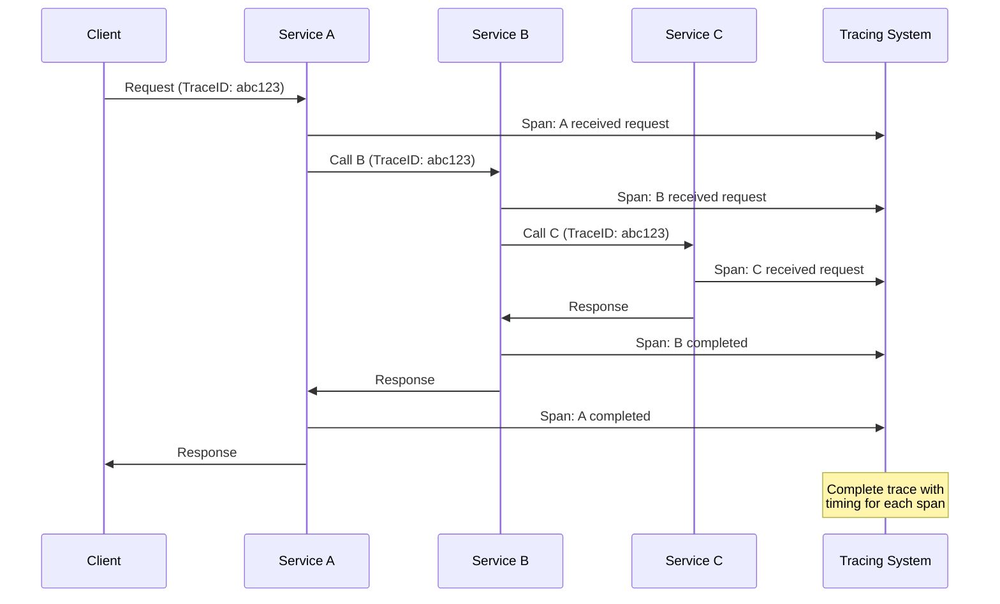

**3. Logging**

- **Access Logs**: All requests/responses with metadata
- **Application Logs**: Service-specific logs
- **Audit Logs**: Security and policy enforcement events

#### Service Topology and Dependencies

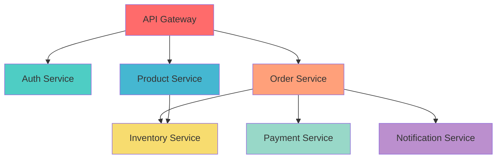

---

## Popular Implementations

### 1. Istio

**Architecture:**

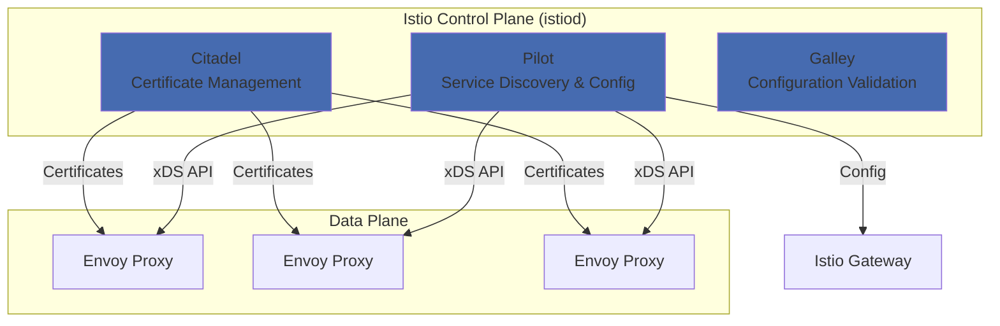

**Key Features:**
- **Mature ecosystem**: Extensive documentation and community support
- **Rich feature set**: Comprehensive traffic management, security, and observability
- **Multi-cluster support**: Federation across multiple Kubernetes clusters
- **Extensibility**: WebAssembly filters for custom logic
- **Platform support**: Kubernetes, VMs, bare metal

**Pros:**
- Feature-rich and highly configurable
- Strong community and enterprise support
- Excellent documentation
- Integration with major cloud providers

**Cons:**
- Complex to configure and operate
- Higher resource overhead
- Steep learning curve

**Use Cases:**
- Large-scale enterprise deployments
- Complex multi-cluster environments
- Organizations requiring extensive customization

### 2. Linkerd

**Architecture:**

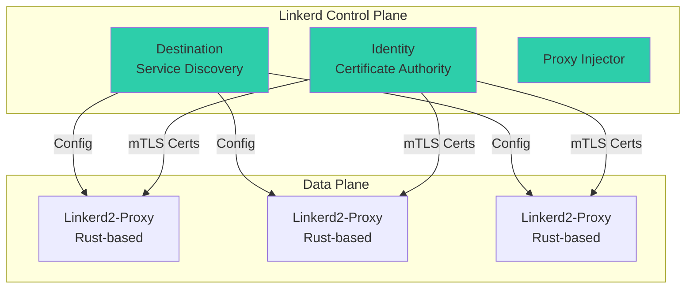

**Key Features:**
- **Lightweight**: Ultra-light Rust-based proxy
- **Simplicity**: Easy to install and configure
- **Performance**: Low latency and resource overhead
- **Security by default**: Automatic mTLS
- **GitOps friendly**: Simple YAML configuration

**Pros:**
- Minimal resource footprint
- Simple to understand and operate
- Fast and reliable
- Excellent performance

**Cons:**
- Fewer features compared to Istio
- Kubernetes-focused (limited multi-platform support)
- Smaller ecosystem

**Use Cases:**
- Organizations prioritizing simplicity and performance
- Kubernetes-native deployments
- Resource-constrained environments

### 3. Consul Connect (by HashiCorp)

**Architecture:**

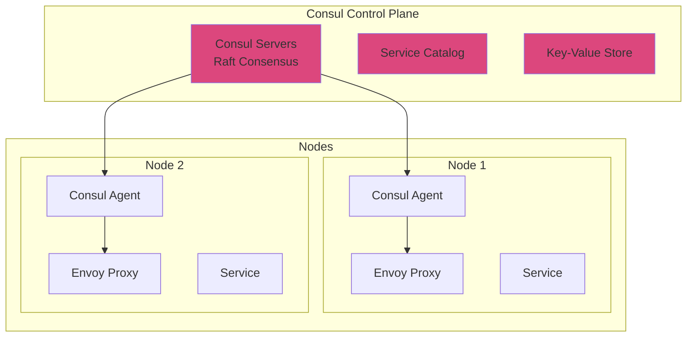

**Key Features:**
- **Multi-platform**: Kubernetes, VMs, bare metal, cloud
- **Service discovery**: Built-in service registry
- **Multi-datacenter**: Native support for multiple datacenters
- **Integrated**: Part of HashiCorp ecosystem (Vault, Nomad)
- **Flexible**: Works with various orchestrators

**Pros:**
- Excellent multi-platform support
- Strong service discovery capabilities
- Integrates well with existing infrastructure
- Good for hybrid cloud environments

**Cons:**
- Less feature-rich than Istio for Kubernetes-specific features
- Requires understanding of Consul concepts
- More complex for simple use cases

**Use Cases:**
- Multi-platform environments (Kubernetes + VMs)
- Organizations using HashiCorp stack
- Hybrid cloud deployments
- Legacy application modernization

### 4. AWS App Mesh

**Architecture:**

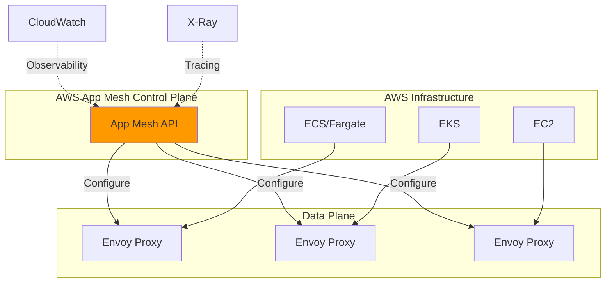

**Key Features:**
- **AWS native**: Deep integration with AWS services
- **Managed service**: AWS handles control plane
- **Multi-compute**: ECS, EKS, EC2, Fargate support
- **AWS observability**: CloudWatch and X-Ray integration

**Pros:**
- No control plane management required
- Seamless AWS integration
- Good for AWS-centric organizations

**Cons:**
- AWS-only (vendor lock-in)
- Limited compared to open-source alternatives
- Less community support

**Use Cases:**
- AWS-native applications
- Organizations fully committed to AWS
- Teams wanting managed service mesh

### 5. Open Service Mesh (OSM)

**Key Features:**
- **Lightweight**: SMI-compliant service mesh
- **Kubernetes-native**: Designed for Kubernetes
- **Simple**: Focused on simplicity
- **SMI**: Service Mesh Interface standard

---

## Traffic Management

### Traffic Routing Patterns

#### 1. Header-Based Routing

Route traffic based on HTTP headers:

```yaml
# Route based on user agent
apiVersion: networking.istio.io/v1alpha3
kind: VirtualService
metadata:
  name: reviews-route
spec:
  hosts:
  - reviews
  http:
  - match:
    - headers:
        user-agent:
          regex: ".*Mobile.*"
    route:
    - destination:
        host: reviews
        subset: mobile
  - route:
    - destination:
        host: reviews
        subset: desktop
```

#### 2. Weighted Traffic Distribution

```yaml
apiVersion: networking.istio.io/v1alpha3
kind: VirtualService
metadata:
  name: reviews
spec:
  hosts:
  - reviews
  http:
  - route:
    - destination:
        host: reviews
        subset: v1
      weight: 80
    - destination:
        host: reviews
        subset: v2
      weight: 20
```

#### 3. Fault Injection

Test resilience by injecting faults:

```yaml
apiVersion: networking.istio.io/v1alpha3
kind: VirtualService
metadata:
  name: ratings-fault
spec:
  hosts:
  - ratings
  http:
  - fault:
      delay:
        percentage:
          value: 10.0
        fixedDelay: 5s
      abort:
        percentage:
          value: 5.0
        httpStatus: 503
    route:
    - destination:
        host: ratings
```

#### 4. Request Mirroring (Shadow Traffic)

```yaml
apiVersion: networking.istio.io/v1alpha3
kind: VirtualService
metadata:
  name: mirror-traffic
spec:
  hosts:
  - service-a
  http:
  - route:
    - destination:
        host: service-a
        subset: v1
      weight: 100
    mirror:
      host: service-a
      subset: v2
    mirrorPercentage:
      value: 100.0
```

### Load Balancing Strategies

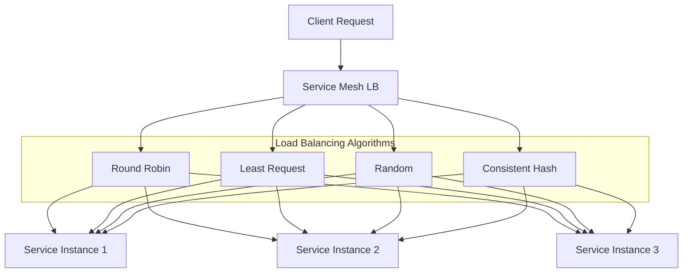

### Timeout and Retry Configuration

```yaml
apiVersion: networking.istio.io/v1alpha3
kind: VirtualService
metadata:
  name: service-timeout-retry
spec:
  hosts:
  - service-a
  http:
  - route:
    - destination:
        host: service-a
    timeout: 10s
    retries:
      attempts: 3
      perTryTimeout: 2s
      retryOn: 5xx,gateway-error,connect-failure,refused-stream
```

---

## Security

### Zero Trust Networking

Service meshes enable zero trust architecture:

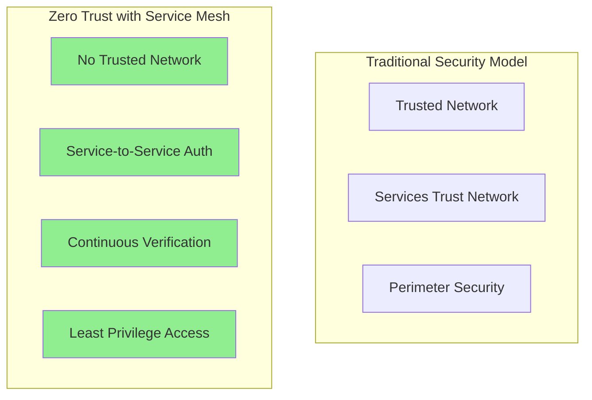

### Authentication Flow

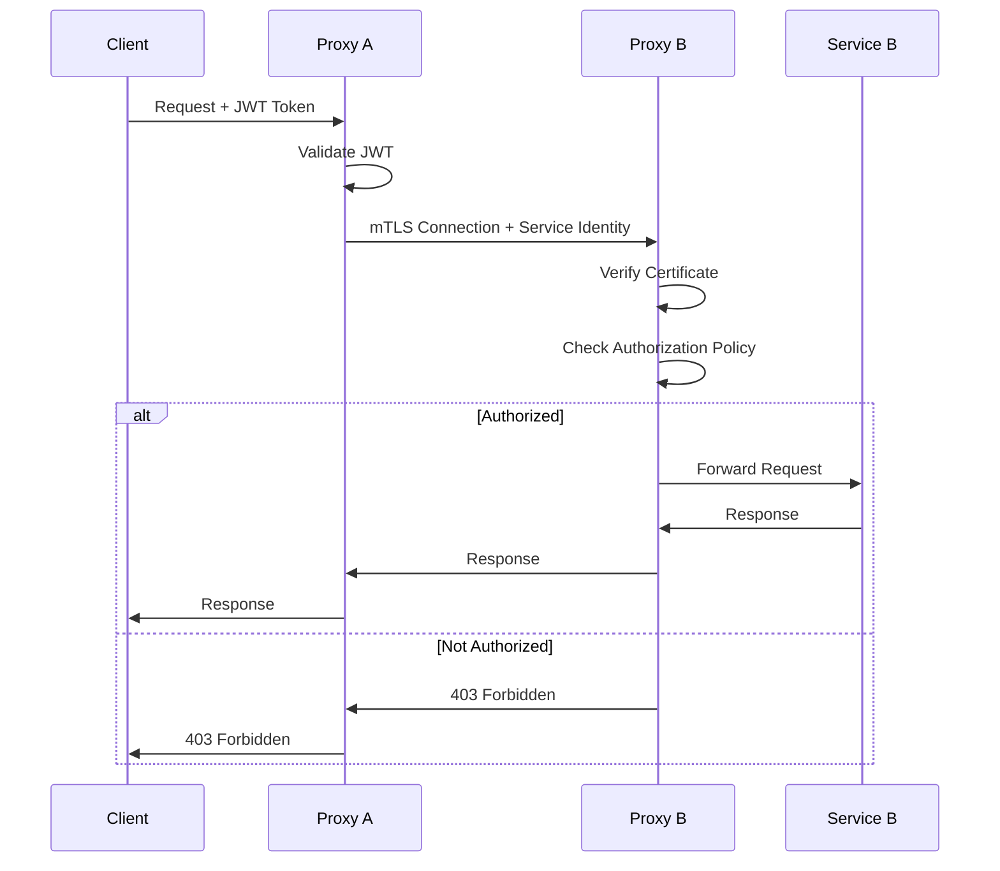

### Authorization Policies

**Namespace-level Isolation:**

```yaml
apiVersion: security.istio.io/v1beta1
kind: AuthorizationPolicy
metadata:
  name: deny-all
  namespace: production
spec:
  {}
---
apiVersion: security.istio.io/v1beta1
kind: AuthorizationPolicy
metadata:
  name: allow-same-namespace
  namespace: production
spec:
  action: ALLOW
  rules:
  - from:
    - source:
        namespaces: ["production"]
```

**Service-level Access Control:**

```yaml
apiVersion: security.istio.io/v1beta1
kind: AuthorizationPolicy
metadata:
  name: payment-service-policy
spec:
  selector:
    matchLabels:
      app: payment-service
  action: ALLOW
  rules:
  - from:
    - source:
        principals:
        - "cluster.local/ns/default/sa/order-service"
    to:
    - operation:
        methods: ["POST"]
        paths: ["/api/v1/payment"]
```

**Custom Claims Authorization:**

```yaml
apiVersion: security.istio.io/v1beta1
kind: AuthorizationPolicy
metadata:
  name: jwt-claims-policy
spec:
  selector:
    matchLabels:
      app: admin-service
  action: ALLOW
  rules:
  - when:
    - key: request.auth.claims[role]
      values: ["admin", "superuser"]
```

### Certificate Rotation

```mermaid
graph LR
    subgraph "Certificate Lifecycle"
        ISSUE[Issue Certificate<br/>TTL: 24h]
        ACTIVE[Active Certificate]
        RENEW[Auto-Renew<br/>Before Expiry]
        ROTATE[Rotate to New Cert]
    end

    ISSUE --> ACTIVE
    ACTIVE --> RENEW
    RENEW --> ROTATE
    ROTATE --> ACTIVE

    style RENEW fill:#FFD700
```

---

## Observability

### Metrics Collection Architecture

```mermaid
graph TB
    subgraph "Service Mesh"
        P1[Proxy 1] -->|Metrics| SCRAPE
        P2[Proxy 2] -->|Metrics| SCRAPE
        P3[Proxy 3] -->|Metrics| SCRAPE
    end

    SCRAPE[Prometheus Scrape] --> PROM[Prometheus]
    PROM --> GRAF[Grafana Dashboards]
    PROM --> ALERT[Alert Manager]

    ALERT --> SLACK[Slack]
    ALERT --> PAGE[PagerDuty]
    ALERT --> EMAIL[Email]

    style PROM fill:#E6522C
    style GRAF fill:#F46800
```

### Key Metrics

**Request Metrics:**
- `istio_requests_total`: Total requests
- `istio_request_duration_milliseconds`: Request latency
- `istio_request_bytes`: Request size
- `istio_response_bytes`: Response size

**TCP Metrics:**
- `istio_tcp_sent_bytes_total`: Bytes sent
- `istio_tcp_received_bytes_total`: Bytes received
- `istio_tcp_connections_opened_total`: New connections

**Example Prometheus Queries:**

```promql
# Request rate
rate(istio_requests_total[5m])

# 95th percentile latency
histogram_quantile(0.95,
  rate(istio_request_duration_milliseconds_bucket[5m])
)

# Error rate
rate(istio_requests_total{response_code=~"5.*"}[5m])
/
rate(istio_requests_total[5m])
```

### Distributed Tracing Integration

**OpenTelemetry Integration:**

```mermaid
graph LR
    APP[Application] --> PROXY[Service Mesh Proxy]
    PROXY --> OTEL[OpenTelemetry Collector]

    OTEL --> JAEGER[Jaeger]
    OTEL --> TEMPO[Grafana Tempo]
    OTEL --> ZIPKIN[Zipkin]
    OTEL --> XRAY[AWS X-Ray]

    style OTEL fill:#425CC7
```

**Trace Context Propagation:**

```yaml
# Headers automatically propagated
x-request-id
x-b3-traceid
x-b3-spanid
x-b3-parentspanid
x-b3-sampled
x-b3-flags
x-ot-span-context
traceparent
tracestate
```

### Service Graph Visualization

```mermaid
graph TB
    MESH[Service Mesh Telemetry]
    KIALI[Kiali]

    MESH --> KIALI

    subgraph "Kiali Features"
        TOPO[Service Topology]
        HEALTH[Health Indicators]
        TRAFFIC[Traffic Flow]
        CONFIG[Configuration Validation]
    end

    KIALI --> TOPO
    KIALI --> HEALTH
    KIALI --> TRAFFIC
    KIALI --> CONFIG

    style KIALI fill:#1c344d
```

---

## Deployment Patterns

### 1. Sidecar Pattern (Standard)

```mermaid
graph TB
    subgraph "Pod"
        subgraph "Init Containers"
            INIT[Init Container<br/>iptables setup]
        end
        subgraph "Containers"
            APP[Application<br/>Container]
            PROXY[Sidecar Proxy<br/>Container]
        end
    end

    INIT -.->|Configure| PROXY
    INIT -.->|Network Rules| APP

    EXT[External Traffic] --> PROXY
    PROXY <--> APP
    PROXY <--> OTHER[Other Services]

    CP[Control Plane] -.->|Config| PROXY
```

**Pros:**
- Transparent to application
- Per-service isolation
- Independent scaling

**Cons:**
- Resource overhead per pod
- Increased complexity
- More moving parts

### 2. Ambient Mesh (Sidecar-less)

```mermaid
graph TB
    subgraph "Node"
        subgraph "Pods"
            P1[Pod 1]
            P2[Pod 2]
            P3[Pod 3]
        end

        ZTUNNEL[ztunnel<br/>Layer 4 Proxy<br/>DaemonSet]
    end

    subgraph "Layer 7"
        WAYPOINT[Waypoint Proxy<br/>Optional L7 Processing]
    end

    P1 <--> ZTUNNEL
    P2 <--> ZTUNNEL
    P3 <--> ZTUNNEL

    ZTUNNEL <--> WAYPOINT
    WAYPOINT <--> EXT[Other Services]

    style ZTUNNEL fill:#FFA500
    style WAYPOINT fill:#FF6347
```

**Pros:**
- Lower resource overhead
- Simpler deployment
- Easier upgrades
- Reduced blast radius

**Cons:**
- Newer pattern (less mature)
- Currently limited support (Istio experimental)
- Shared infrastructure

### 3. Multi-Cluster Mesh

```mermaid
graph TB
    subgraph "Cluster 1 (us-west)"
        CP1[Control Plane 1]
        S1A[Service A]
        S1B[Service B]
    end

    subgraph "Cluster 2 (us-east)"
        CP2[Control Plane 2]
        S2A[Service A]
        S2C[Service C]
    end

    subgraph "Cluster 3 (eu-west)"
        CP3[Control Plane 3]
        S3B[Service B]
        S3C[Service C]
    end

    CP1 <-->|Federation| CP2
    CP2 <-->|Federation| CP3
    CP1 <-->|Federation| CP3

    S1A <-.->|Cross-cluster| S2A
    S1B <-.->|Cross-cluster| S3B

    style CP1 fill:#4169E1
    style CP2 fill:#4169E1
    style CP3 fill:#4169E1
```

**Deployment Models:**

**Primary-Remote:**
- Single control plane
- Multiple remote clusters
- Simpler management

**Multi-Primary:**
- Control plane in each cluster
- Better resilience
- Higher availability

### 4. Gateway Integration

```mermaid
graph TB
    INTERNET[Internet]

    subgraph "Edge Layer"
        IG[Ingress Gateway]
    end

    subgraph "Service Mesh"
        VS[Virtual Services]

        subgraph "Services"
            FRONTEND[Frontend Service]
            API[API Service]
            AUTH[Auth Service]
        end
    end

    INTERNET --> IG
    IG --> VS
    VS --> FRONTEND
    VS --> API
    VS --> AUTH

    FRONTEND <--> API
    API <--> AUTH

    style IG fill:#FF6B6B
    style VS fill:#4ECDC4
```

---

## Benefits and Challenges

### Benefits

#### 1. Operational Benefits

```mermaid
mindmap
  root((Service Mesh<br/>Benefits))
    Observability
      Distributed Tracing
      Metrics Collection
      Service Topology
      Real-time Monitoring
    Security
      Automatic mTLS
      Zero Trust
      Policy Enforcement
      Identity Management
    Reliability
      Circuit Breaking
      Retries & Timeouts
      Load Balancing
      Health Checking
    Traffic Management
      Canary Deployments
      A/B Testing
      Traffic Splitting
      Fault Injection
```

**Detailed Benefits:**

1. **Language-Agnostic**: Works with any programming language
2. **Centralized Configuration**: Single place for policies and routing rules
3. **Progressive Rollouts**: Safe deployment strategies (canary, blue/green)
4. **Enhanced Security**: Encrypted communication by default
5. **Improved Debugging**: Comprehensive observability across services
6. **Reduced Application Code**: Cross-cutting concerns handled by infrastructure
7. **Consistent Policy Enforcement**: Uniform security and traffic policies

#### 2. Developer Benefits

- No need to implement retry/timeout logic in code
- Automatic service discovery
- Built-in load balancing
- Simplified security implementation
- Better testing capabilities (fault injection)

#### 3. Operations Benefits

- Centralized observability
- Consistent policies across services
- Simplified compliance and auditing
- Better incident response
- Gradual migration support

### Challenges

#### 1. Complexity

```mermaid
graph TB
    subgraph "Complexity Layers"
        L1[Application Layer]
        L2[Service Mesh Layer]
        L3[Orchestration Layer]
        L4[Infrastructure Layer]
    end

    L1 --> L2
    L2 --> L3
    L3 --> L4

    NOTE[Each layer adds<br/>configuration complexity<br/>and debugging overhead]

    style NOTE fill:#FFB6C1
```

**Complexity Challenges:**
- Steep learning curve
- More components to manage
- Complex troubleshooting
- YAML configuration overhead
- Understanding distributed systems concepts

#### 2. Performance Overhead

**Latency Addition:**

```mermaid
graph LR
    A[Service A] -->|~1ms| PA[Proxy A]
    PA -->|Network + TLS| PB[Proxy B]
    PB -->|~1ms| B[Service B]

    NOTE[Additional latency:<br/>2-10ms typical]

    style NOTE fill:#FFD700
```

**Resource Overhead:**
- CPU: Proxy processing
- Memory: Per-sidecar overhead (50-200MB typical)
- Network: Additional hops

#### 3. Operational Challenges

```mermaid
graph TB
    subgraph "Operational Concerns"
        UPGRADE[Upgrade Management]
        DEBUG[Debugging Difficulty]
        CONFIG[Configuration Management]
        SCALE[Scaling Considerations]
        MONITOR[Monitoring Complexity]
    end

    MESH[Service Mesh] --> UPGRADE
    MESH --> DEBUG
    MESH --> CONFIG
    MESH --> SCALE
    MESH --> MONITOR

    style MESH fill:#FF6347
```

**Specific Challenges:**
- Control plane availability
- Configuration drift
- Version compatibility
- Certificate management
- Proxy upgrades without downtime

#### 4. Cost Considerations

- Infrastructure costs (additional resources)
- Learning and training costs
- Operational overhead
- Increased complexity in CI/CD
- Monitoring and observability tools

### When to Adopt a Service Mesh

**Good Candidates:**

 Microservices architecture with many services (10+)
 Need for advanced traffic management
 Security and compliance requirements (mTLS, zero trust)
 Observability gaps in current setup
 Multi-team organizations
 Polyglot environments
 Complex deployment strategies needed

**Not Good Candidates:**

 Monolithic applications
 Small number of services (<5)
 Simple architectures
 Limited operational expertise
 Performance-critical applications with strict latency requirements
 Resource-constrained environments

---

## Best Practices

### 1. Start Small and Iterate

```mermaid
graph LR
    PILOT[Pilot Service] -->|Success?| EXPAND[Expand to More Services]
    EXPAND -->|Learn| OPTIMIZE[Optimize Configuration]
    OPTIMIZE -->|Mature| PROD[Production Rollout]

    style PILOT fill:#90EE90
```

**Recommended Approach:**
1. Start with non-critical services
2. Measure baseline performance
3. Gradually add features (mTLS, then observability, then advanced routing)
4. Learn and document
5. Expand to more services

### 2. Observability First

**Implement in This Order:**
1. Basic metrics collection
2. Distributed tracing
3. Service graph visualization
4. Alerting and dashboards
5. Log aggregation

### 3. Security Configuration

**Progressive Security:**

```mermaid
graph TB
    START[Permissive Mode] -->|Verify Traffic| MTLS[Enable mTLS]
    MTLS -->|Test Policies| AUTH[Add Authorization]
    AUTH -->|Refine| STRICT[Strict Mode]

    style START fill:#FFD700
    style STRICT fill:#90EE90
```

**Best Practices:**
- Start with permissive mode
- Enable mTLS gradually
- Use deny-by-default policies
- Implement least privilege access
- Regular certificate rotation
- Audit authorization policies

### 4. Resource Management

```yaml
# Example: Set appropriate resource limits
apiVersion: v1
kind: Pod
metadata:
  name: myapp
spec:
  containers:
  - name: application
    resources:
      requests:
        cpu: 500m
        memory: 512Mi
      limits:
        cpu: 1000m
        memory: 1Gi
  - name: istio-proxy
    resources:
      requests:
        cpu: 100m
        memory: 128Mi
      limits:
        cpu: 500m
        memory: 512Mi
```

### 5. Configuration Management

**Use GitOps:**

```mermaid
graph LR
    GIT[Git Repository] -->|ArgoCD/Flux| K8S[Kubernetes Cluster]
    K8S --> MESH[Service Mesh Config]

    DEV[Developer] -->|PR| GIT
    OPS[Operator] -->|Review| GIT

    style GIT fill:#F05032
```

**Best Practices:**
- Version control all configurations
- Use declarative configuration
- Implement change review process
- Automate validation
- Test in non-production first

### 6. Testing Strategy

```mermaid
graph TB
    subgraph "Testing Pyramid"
        L1[Local Development<br/>with Mesh]
        L2[Integration Tests<br/>with Test Mesh]
        L3[Staging Environment<br/>Full Mesh]
        L4[Canary in Production<br/>Gradual Rollout]
    end

    L1 --> L2
    L2 --> L3
    L3 --> L4
```

**Testing Approaches:**
- Fault injection testing
- Chaos engineering
- Performance testing with mesh overhead
- Security policy validation
- Upgrade testing

### 7. Monitoring and Alerting

**Key Alerts:**

```yaml
# Example: Prometheus alert rules
groups:
- name: service_mesh
  rules:
  - alert: HighErrorRate
    expr: |
      rate(istio_requests_total{response_code=~"5.."}[5m]) > 0.05
    for: 5m
    annotations:
      summary: "High error rate detected"

  - alert: HighLatency
    expr: |
      histogram_quantile(0.99,
        rate(istio_request_duration_milliseconds_bucket[5m])
      ) > 1000
    for: 5m
    annotations:
      summary: "P99 latency exceeds 1s"
```

### 8. Upgrade Strategy

```mermaid
graph TB
    BACKUP[Backup Configuration] --> CP[Upgrade Control Plane]
    CP --> VERIFY[Verify Control Plane]
    VERIFY --> DP[Rolling Update Data Plane]
    DP --> TEST[Test Services]
    TEST -->|Success| COMPLETE[Upgrade Complete]
    TEST -->|Failure| ROLLBACK[Rollback]

    style COMPLETE fill:#90EE90
    style ROLLBACK fill:#FF6347
```

**Upgrade Best Practices:**
- Always backup configurations
- Test upgrades in non-production
- Use canary upgrades for data plane
- Monitor metrics during upgrade
- Have rollback plan ready
- Follow official upgrade guides

---

## Use Cases

### 1. Microservices Migration

**Scenario:** Migrating from monolith to microservices

```mermaid
graph TB
    subgraph "Phase 1: Hybrid"
        MONO[Monolith]
        MS1[Microservice 1]
        MS2[Microservice 2]
        MESH[Service Mesh]

        MESH --> MONO
        MESH --> MS1
        MESH --> MS2
    end

    subgraph "Phase 2: Full Microservices"
        MS3[Microservice 3]
        MS4[Microservice 4]
        MS5[Microservice 5]
        MESH2[Service Mesh]

        MESH2 --> MS3
        MESH2 --> MS4
        MESH2 --> MS5
    end

    style MONO fill:#FFB6C1
    style MESH2 fill:#90EE90
```

**Benefits:**
- Gradual migration support
- Traffic splitting between old and new
- Observability during migration
- Reduced risk

### 2. Multi-Cloud Strategy

**Scenario:** Services across multiple cloud providers

```mermaid
graph TB
    subgraph "AWS"
        AWS_SVC[AWS Services]
    end

    subgraph "GCP"
        GCP_SVC[GCP Services]
    end

    subgraph "On-Premise"
        ONPREM[Legacy Services]
    end

    MESH[Federated Service Mesh]

    AWS_SVC <--> MESH
    GCP_SVC <--> MESH
    ONPREM <--> MESH

    style MESH fill:#4169E1
```

**Benefits:**
- Unified communication layer
- Consistent security policies
- Cross-cloud observability
- Avoid vendor lock-in

### 3. Zero Trust Security

**Scenario:** Implementing zero trust architecture

```mermaid
graph TB
    REQUEST[Request] -->|Identity Verification| MESH[Service Mesh]
    MESH -->|Authorize| POLICY[Policy Check]
    POLICY -->|mTLS| TARGET[Target Service]

    POLICY -.->|Audit Log| SIEM[SIEM System]

    style MESH fill:#FFD700
    style POLICY fill:#FF6347
```

**Implementation:**
- Enforce mTLS everywhere
- Fine-grained authorization policies
- No implicit trust
- Continuous verification

### 4. Multi-Tenancy

**Scenario:** SaaS application with multiple tenants

```mermaid
graph TB
    subgraph "Tenant A"
        TA_SVC[Services]
    end

    subgraph "Tenant B"
        TB_SVC[Services]
    end

    subgraph "Shared Services"
        AUTH[Auth Service]
        DB[Database]
    end

    MESH[Service Mesh]

    MESH -->|Namespace Isolation| TA_SVC
    MESH -->|Namespace Isolation| TB_SVC
    MESH -->|Rate Limiting| AUTH
    MESH -->|Access Control| DB

    style MESH fill:#4ECDC4
```

**Benefits:**
- Namespace-level isolation
- Per-tenant rate limiting
- Tenant-specific routing
- Resource quotas

### 5. Regulated Industries

**Scenario:** Healthcare, finance with compliance requirements

**Requirements Met:**
- End-to-end encryption (mTLS)
- Audit logs for all communications
- Fine-grained access control
- Certificate management
- Network segmentation

### 6. A/B Testing and Experimentation

```mermaid
graph TB
    USERS[Users] --> MESH[Service Mesh]

    MESH -->|50% Control| CONTROL[Version A]
    MESH -->|50% Treatment| TREATMENT[Version B]

    CONTROL --> METRICS[Metrics Collection]
    TREATMENT --> METRICS

    METRICS --> ANALYSIS[Statistical Analysis]

    style ANALYSIS fill:#90EE90
```

---

## Implementation Guide

### Prerequisites

**Infrastructure:**
- Kubernetes cluster (1.24+)
- kubectl configured
- Helm 3.x (optional)
- Sufficient cluster resources

**Knowledge:**
- Kubernetes basics
- Networking concepts
- YAML configuration
- Basic observability concepts

### Step 1: Choose Your Service Mesh

**Decision Matrix:**

| Feature | Istio | Linkerd | Consul | App Mesh |
|---------|-------|---------|---------|----------|
| Complexity | High | Low | Medium | Low |
| Resource Overhead | High | Low | Medium | N/A (managed) |
| Features | Extensive | Core | Extensive | Basic |
| Platform Support | Multi | K8s | Multi | AWS only |
| Learning Curve | Steep | Gentle | Medium | Gentle |
| Production Readiness | Mature | Mature | Mature | Mature |

### Step 2: Installation (Istio Example)

**1. Download Istio:**

```bash
curl -L https://istio.io/downloadIstio | sh -
cd istio-1.20.0
export PATH=$PWD/bin:$PATH
```

**2. Install Istio:**

```bash
# Install with default profile
istioctl install --set profile=default -y

# Verify installation
kubectl get pods -n istio-system
```

**3. Enable automatic sidecar injection:**

```bash
kubectl label namespace default istio-injection=enabled
```

### Step 3: Deploy Sample Application

```yaml
# bookinfo-demo.yaml
apiVersion: v1
kind: Service
metadata:
  name: productpage
spec:
  ports:
  - port: 9080
  selector:
    app: productpage
---
apiVersion: apps/v1
kind: Deployment
metadata:
  name: productpage-v1
spec:
  replicas: 1
  selector:
    matchLabels:
      app: productpage
      version: v1
  template:
    metadata:
      labels:
        app: productpage
        version: v1
    spec:
      containers:
      - name: productpage
        image: docker.io/istio/examples-bookinfo-productpage-v1:1.19.0
        ports:
        - containerPort: 9080
```

```bash
kubectl apply -f bookinfo-demo.yaml
```

### Step 4: Configure Observability

**1. Install Prometheus:**

```bash
kubectl apply -f https://raw.githubusercontent.com/istio/istio/release-1.20/samples/addons/prometheus.yaml
```

**2. Install Grafana:**

```bash
kubectl apply -f https://raw.githubusercontent.com/istio/istio/release-1.20/samples/addons/grafana.yaml
```

**3. Install Jaeger:**

```bash
kubectl apply -f https://raw.githubusercontent.com/istio/istio/release-1.20/samples/addons/jaeger.yaml
```

**4. Install Kiali:**

```bash
kubectl apply -f https://raw.githubusercontent.com/istio/istio/release-1.20/samples/addons/kiali.yaml
```

**5. Access dashboards:**

```bash
# Kiali dashboard
istioctl dashboard kiali

# Grafana
istioctl dashboard grafana

# Jaeger
istioctl dashboard jaeger
```

### Step 5: Configure Traffic Management

**Create Gateway:**

```yaml
apiVersion: networking.istio.io/v1alpha3
kind: Gateway
metadata:
  name: bookinfo-gateway
spec:
  selector:
    istio: ingressgateway
  servers:
  - port:
      number: 80
      name: http
      protocol: HTTP
    hosts:
    - "*"
---
apiVersion: networking.istio.io/v1alpha3
kind: VirtualService
metadata:
  name: bookinfo
spec:
  hosts:
  - "*"
  gateways:
  - bookinfo-gateway
  http:
  - match:
    - uri:
        exact: /productpage
    route:
    - destination:
        host: productpage
        port:
          number: 9080
```

### Step 6: Enable mTLS

**Strict mTLS for namespace:**

```yaml
apiVersion: security.istio.io/v1beta1
kind: PeerAuthentication
metadata:
  name: default
  namespace: default
spec:
  mtls:
    mode: STRICT
```

### Step 7: Configure Authorization

```yaml
apiVersion: security.istio.io/v1beta1
kind: AuthorizationPolicy
metadata:
  name: productpage-viewer
  namespace: default
spec:
  selector:
    matchLabels:
      app: productpage
  action: ALLOW
  rules:
  - from:
    - source:
        principals: ["cluster.local/ns/default/sa/gateway"]
    to:
    - operation:
        methods: ["GET"]
```

### Step 8: Monitoring and Validation

**Verify mTLS:**

```bash
istioctl authn tls-check productpage-v1-xxxxx.default
```

**Check proxy status:**

```bash
istioctl proxy-status
```

**View configuration:**

```bash
istioctl proxy-config cluster productpage-v1-xxxxx.default
```

### Step 9: Production Hardening

**1. Resource Limits:**

```yaml
apiVersion: install.istio.io/v1alpha1
kind: IstioOperator
spec:
  values:
    global:
      proxy:
        resources:
          requests:
            cpu: 100m
            memory: 128Mi
          limits:
            cpu: 2000m
            memory: 1024Mi
```

**2. High Availability:**

```yaml
apiVersion: install.istio.io/v1alpha1
kind: IstioOperator
spec:
  components:
    pilot:
      k8s:
        replicaCount: 3
        hpaSpec:
          minReplicas: 3
          maxReplicas: 5
```

**3. Production Profiles:**

```bash
# Production profile with HA
istioctl install --set profile=production -y
```

### Step 10: Continuous Improvement

```mermaid
graph TB
    DEPLOY[Deploy Mesh] --> MONITOR[Monitor Metrics]
    MONITOR --> ANALYZE[Analyze Performance]
    ANALYZE --> OPTIMIZE[Optimize Configuration]
    OPTIMIZE --> MONITOR

    ANALYZE --> ISSUES[Identify Issues]
    ISSUES --> FIX[Fix & Improve]
    FIX --> MONITOR
```

**Ongoing Tasks:**
- Regular upgrades
- Performance tuning
- Security policy reviews
- Cost optimization
- Team training

---

## Conclusion

Service meshes have become a critical component of modern cloud-native architectures, providing:

 **Reliable communication** between microservices
 **Enhanced security** with mTLS and zero trust
 **Deep observability** into service behavior
 **Advanced traffic management** for safe deployments
 **Operational efficiency** through centralized configuration

### Key Takeaways

1. **Start simple**: Don't enable all features at once
2. **Measure impact**: Baseline performance before and after
3. **Invest in learning**: Service meshes require expertise
4. **Consider alternatives**: Not every architecture needs a mesh
5. **Plan for operations**: Have proper monitoring and incident response

### Next Steps

1. Evaluate if service mesh fits your use case
2. Choose the right implementation for your needs
3. Start with a pilot project
4. Build operational expertise
5. Gradually expand to more services

### Resources

**Documentation:**
- [Istio Documentation](https://istio.io/latest/docs/)
- [Linkerd Documentation](https://linkerd.io/docs/)
- [Consul Documentation](https://www.consul.io/docs)

**Community:**
- CNCF Service Mesh Working Group
- Istio Community
- Linkerd Community

**Learning:**
- Service Mesh Interface (SMI) Specification
- Envoy Proxy Documentation
- SPIFFE/SPIRE Documentation

---

*This documentation provides a comprehensive overview of service mesh technology. For specific implementation details, always refer to the official documentation of your chosen service mesh solution.*
