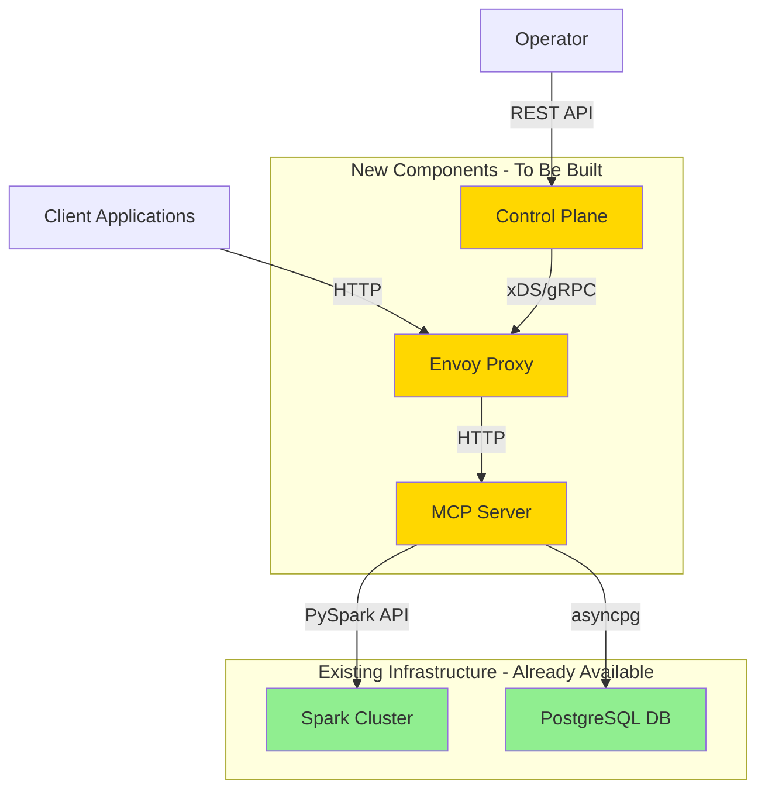
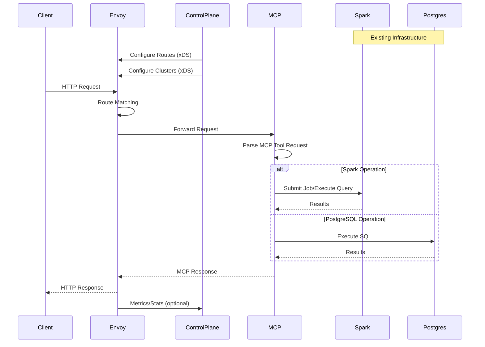
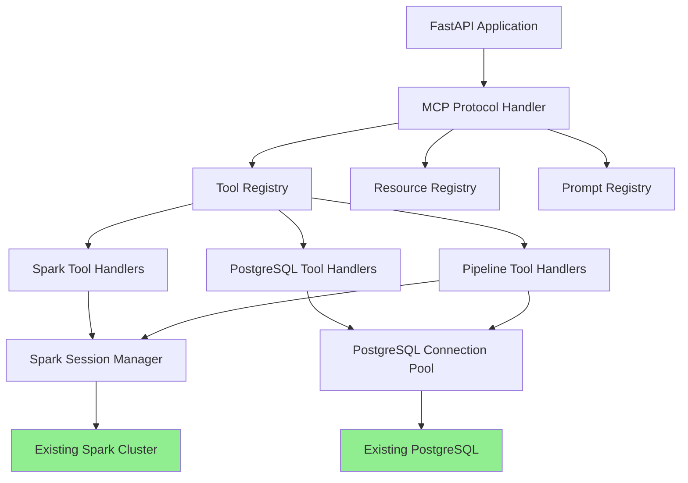
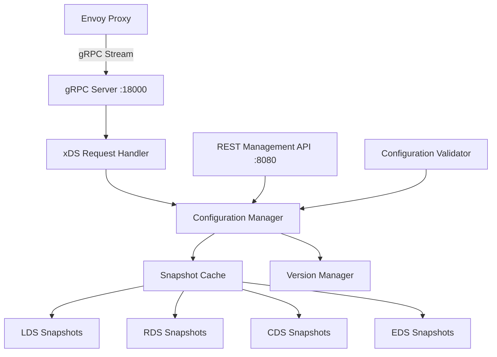
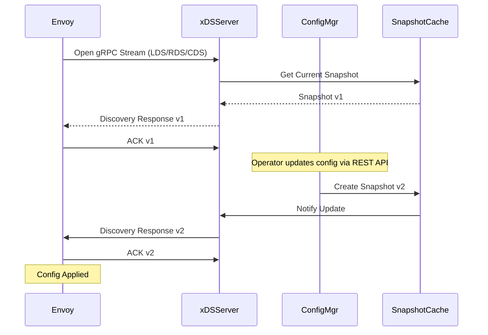

# MCP Server Project: API Gateway and Control Plane for Spark and PostgreSQL

## Project Overview

This project focuses on developing a Model Context Protocol (MCP) server in Python that exposes Apache Spark and PostgreSQL capabilities through a API gateway architecture. Students will gain deep understanding of MCP server implementation, Envoy proxy configuration, and control plane development for dynamic service management.

## Critical Assumptions

### Existing Infrastructure
This project explicitly assumes that the following infrastructure components are already available and functional from previous coursework:

1. **Apache Spark Cluster**: A running Spark cluster (standalone or cluster mode) is available and accessible
2. **PostgreSQL Database**: A running PostgreSQL instance with appropriate databases and schemas is configured
3. **Network Connectivity**: The MCP server can connect to both Spark and PostgreSQL via their respective connection strings
4. **No Infrastructure Setup Required**: Students will NOT set up, configure, or manage Spark or PostgreSQL infrastructure

### Scope Limitations
Due to time constraints, the following are explicitly excluded from project scope:

1. **No Authentication/Authorization**: API gateway will not implement security features (JWT, API keys, etc.)
2. **No TLS/HTTPS**: All communication will be over HTTP (not secure)
3. **No Docker Compose**: Services will run natively on local machines or existing containers
4. **No Container Orchestration**: Each component runs independently
5. **No Production Security**: This is a learning project focused on MCP, Envoy, and control plane concepts

### Focus Areas
Students will concentrate exclusively on:

1. MCP server implementation and protocol understanding
2. Envoy proxy configuration and routing
3. Control plane development with xDS protocol
4. Integration between these three components

## Project Duration

3 weeks (21 days)

## Team Size

3 students

## Project Objectives

1. Develop a comprehensive understanding of the Model Context Protocol (MCP) specification
2. Implement a fully-featured MCP server exposing Spark and PostgreSQL tools, resources, and prompts
3. Deploy and configure Envoy proxy as an API gateway
4. Build a control plane for dynamic Envoy configuration using xDS protocol
5. Understand modern API gateway patterns and dynamic configuration management
6. Learn service mesh concepts through hands-on implementation

## Core Learning Focus

### 1. MCP Server Deep Dive
- Understanding MCP protocol architecture and transport mechanisms
- Implementing tools, resources, and prompts
- Handling async operations and long-running tasks
- Error handling and state management
- MCP server lifecycle and connection management

### 2. API Gateway (Envoy Proxy)
- Envoy architecture and filter chain concepts
- Listener, cluster, and route configuration
- HTTP/2 and gRPC support
- Rate limiting and circuit breaking
- Health checking and load balancing
- Observability (metrics, logging)

### 3. Control Plane Development
- xDS (Discovery Service) protocol implementation
- Dynamic configuration management
- Snapshot-based configuration updates
- Service discovery mechanisms
- Configuration versioning
- gRPC server implementation for xDS APIs

## Technical Architecture

### High-Level Architecture



### Component Interaction Flow



## Technology Stack

### MCP Server
- **Language**: Python 3.10+
- **MCP SDK**: Model Context Protocol Python SDK
- **Web Framework**: FastAPI (for HTTP/SSE transport)
- **Async Runtime**: asyncio, aiohttp
- **Database Client**: asyncpg (async PostgreSQL driver)
- **Spark Client**: PySpark
- **Deployment**: Local process or standalone container

### API Gateway
- **Proxy**: Envoy Proxy 1.28+
- **Configuration**: YAML-based bootstrap + dynamic xDS
- **Protocols**: HTTP/1.1, HTTP/2
- **Observability**: Prometheus metrics, access logs
- **Deployment**: Local binary or standalone container

### Control Plane
- **Language**: Python 3.10+
- **RPC Framework**: gRPC + Protocol Buffers
- **xDS Implementation**: Custom Python xDS server
- **Management API**: FastAPI REST endpoints
- **Storage**: In-memory configuration
- **Deployment**: Local process

### Existing Infrastructure (Provided)
- **Apache Spark**: Version 3.x (already running)
- **PostgreSQL**: Version 16.x (already running)
- **Connection Details**: Provided by instructor/environment

## MCP Server Implementation Details

### MCP Protocol Components

#### 1. Tools (Actions/Operations)

**Spark Tools:**
- `submit_spark_job`: Submit PySpark job for execution
  - Input: job script path, configuration parameters
  - Output: job ID, submission status
- `get_job_status`: Monitor job progress and retrieve status
  - Input: job ID
  - Output: status, progress percentage, execution metrics
- `cancel_job`: Cancel running Spark job
  - Input: job ID
  - Output: cancellation confirmation
- `execute_spark_sql`: Execute Spark SQL query
  - Input: SQL query string, output format
  - Output: query results as JSON/CSV
- `list_spark_jobs`: List all jobs with filtering
  - Input: status filter, date range
  - Output: list of jobs with metadata
- `get_job_logs`: Retrieve job execution logs
  - Input: job ID
  - Output: log entries

**PostgreSQL Tools:**
- `execute_query`: Execute SELECT queries
  - Input: SQL query, parameters
  - Output: result rows as JSON
- `execute_dml`: Execute INSERT/UPDATE/DELETE operations
  - Input: SQL statement, parameters
  - Output: affected row count
- `get_table_schema`: Retrieve table structure
  - Input: table name
  - Output: column definitions, data types, constraints
- `list_tables`: List all tables in database
  - Input: schema name (optional)
  - Output: table names and metadata
- `create_table`: Create new table with schema
  - Input: table name, column definitions
  - Output: creation confirmation
- `bulk_load_from_spark`: Transfer data from Spark to PostgreSQL
  - Input: Spark DataFrame reference, target table
  - Output: row count, load statistics

**Data Pipeline Tools:**
- `create_etl_pipeline`: Define ETL workflow
  - Input: source, transformations, destination
  - Output: pipeline ID
- `execute_pipeline`: Run defined pipeline
  - Input: pipeline ID, parameters
  - Output: execution ID, status
- `get_pipeline_status`: Monitor pipeline execution
  - Input: execution ID
  - Output: status, progress, errors

#### 2. Resources (Data Access)

Resources provide read-only access to system information:

- `spark://cluster/info`: Spark cluster configuration and status
  - Returns: master URL, worker count, available cores, memory
- `spark://jobs/{job_id}`: Individual job details
  - Returns: job configuration, stages, tasks, metrics
- `postgres://schema/{schema_name}`: Database schema information
  - Returns: tables, views, functions in schema
- `postgres://tables/{table_name}/data`: Table data preview
  - Returns: sample rows (limited to 100)
- `pipelines://active`: Currently running pipelines
  - Returns: list of active pipeline executions
- `metrics://system`: System performance metrics
  - Returns: CPU, memory, connection counts

#### 3. Prompts (Templates/Guidance)

Prompts provide reusable templates and guidance:

- `data_pipeline_template`: Common ETL patterns and examples
  - Provides: Sample code for read-transform-write patterns
- `spark_optimization`: Performance tuning suggestions
  - Provides: Tips for partitioning, caching, broadcast joins
- `sql_best_practices`: PostgreSQL query optimization guidance
  - Provides: Indexing strategies, query patterns
- `error_troubleshooting`: Common error resolution steps
  - Provides: Error code meanings, resolution steps

### MCP Server Architecture



## Envoy Proxy Configuration

### Key Concepts to Implement

#### 1. Listeners
- Define port 10000 for incoming HTTP traffic
- Configure HTTP connection manager
- Set up filter chains for request processing
- Configure connection timeouts and limits

#### 2. Routes
- Path-based routing to MCP server backend
- Default route for all MCP endpoints
- Timeout configuration for long-running operations
- Retry policies for transient failures

#### 3. Clusters
- MCP server backend cluster configuration
- Health check configuration (HTTP endpoint)
- Connection pool settings
- Load balancing strategy (for future scalability)

#### 4. Filters
- **Router Filter**: Core routing logic (required)
- **Health Check Filter**: Health endpoint handling
- **Rate Limit Filter**: Request throttling (basic, no external rate limit service)
- **CORS Filter**: Cross-origin support (if needed)
- **Access Log Filter**: Request/response logging

#### 5. Observability
- Access logging to stdout/file
- Prometheus metrics endpoint on admin port 9901
- Basic statistics collection

### Envoy Configuration Structure

#### Bootstrap Configuration (envoy-bootstrap.yaml)

```yaml
admin:
  address:
    socket_address:
      address: 0.0.0.0
      port_value: 9901

node:
  id: envoy-node-1
  cluster: mcp-gateway

static_resources:
  listeners:
    - name: main_listener
      address:
        socket_address:
          address: 0.0.0.0
          port_value: 10000
      filter_chains:
        - filters:
            - name: envoy.filters.network.http_connection_manager
              typed_config:
                "@type": type.googleapis.com/envoy.extensions.filters.network.http_connection_manager.v3.HttpConnectionManager
                stat_prefix: ingress_http
                codec_type: AUTO
                access_log:
                  - name: envoy.access_loggers.stdout
                    typed_config:
                      "@type": type.googleapis.com/envoy.extensions.access_loggers.stream.v3.StdoutAccessLog
                http_filters:
                  - name: envoy.filters.http.router
                    typed_config:
                      "@type": type.googleapis.com/envoy.extensions.filters.http.router.v3.Router
                route_config:
                  name: local_route
                  virtual_hosts:
                    - name: mcp_backend
                      domains: ["*"]
                      routes:
                        - match:
                            prefix: "/"
                          route:
                            cluster: mcp_server_cluster
                            timeout: 300s

  clusters:
    - name: mcp_server_cluster
      connect_timeout: 5s
      type: STRICT_DNS
      lb_policy: ROUND_ROBIN
      load_assignment:
        cluster_name: mcp_server_cluster
        endpoints:
          - lb_endpoints:
              - endpoint:
                  address:
                    socket_address:
                      address: localhost
                      port_value: 8000
      health_checks:
        - timeout: 1s
          interval: 10s
          unhealthy_threshold: 3
          healthy_threshold: 2
          http_health_check:
            path: /health

    - name: xds_cluster
      connect_timeout: 1s
      type: STRICT_DNS
      lb_policy: ROUND_ROBIN
      http2_protocol_options: {}
      load_assignment:
        cluster_name: xds_cluster
        endpoints:
          - lb_endpoints:
              - endpoint:
                  address:
                    socket_address:
                      address: localhost
                      port_value: 18000

dynamic_resources:
  lds_config:
    resource_api_version: V3
    api_config_source:
      api_type: GRPC
      transport_api_version: V3
      grpc_services:
        - envoy_grpc:
            cluster_name: xds_cluster
  rds_config:
    resource_api_version: V3
    api_config_source:
      api_type: GRPC
      transport_api_version: V3
      grpc_services:
        - envoy_grpc:
            cluster_name: xds_cluster
  cds_config:
    resource_api_version: V3
    api_config_source:
      api_type: GRPC
      transport_api_version: V3
      grpc_services:
        - envoy_grpc:
            cluster_name: xds_cluster
```

## Control Plane Implementation

### xDS Protocol Overview

The control plane implements the following xDS APIs to dynamically configure Envoy:

1. **LDS (Listener Discovery Service)**: Dynamic listener configuration
   - Manages listener creation, modification, deletion
   - Updates filter chains and connection settings

2. **RDS (Route Discovery Service)**: Dynamic route configuration
   - Manages virtual hosts and route rules
   - Updates path matching and routing logic

3. **CDS (Cluster Discovery Service)**: Dynamic cluster configuration
   - Manages backend cluster definitions
   - Updates health check and load balancing settings

4. **EDS (Endpoint Discovery Service)**: Dynamic endpoint configuration
   - Manages backend endpoint addresses
   - Updates endpoint health and weight

### Control Plane Architecture



### Control Plane Core Components

#### 1. gRPC xDS Server
Implements xDS streaming APIs:
- Accepts connections from Envoy proxies
- Maintains bidirectional gRPC streams
- Pushes configuration updates to Envoy
- Handles ACK/NACK responses from Envoy

#### 2. Snapshot Cache
Stores versioned configuration snapshots:
- Maintains current configuration state
- Tracks version numbers for each resource type
- Provides atomic configuration updates
- Supports rollback to previous versions

#### 3. Configuration Manager
Manages configuration lifecycle:
- Creates and updates configuration snapshots
- Validates configuration before deployment
- Handles configuration versioning
- Coordinates updates across resource types

#### 4. Management REST API
Provides operator interface:
- Endpoints for creating/updating routes
- Endpoints for managing clusters
- Endpoints for viewing current configuration
- Endpoints for triggering configuration updates

### xDS Implementation Flow



### Control Plane Features to Implement

1. **Dynamic Route Management**
   - Add/remove routes without Envoy restart
   - Update path matching rules
   - Modify timeout and retry policies

2. **Dynamic Cluster Management**
   - Add/remove backend clusters
   - Update health check parameters
   - Modify load balancing strategies

3. **Configuration Validation**
   - Validate YAML/JSON configuration syntax
   - Check for configuration conflicts
   - Ensure required fields are present

4. **Version Control**
   - Track configuration version history
   - Support rollback to previous versions
   - Maintain audit log of changes

5. **Management API Endpoints**
   - `GET /api/v1/config/snapshot`: Get current configuration
   - `POST /api/v1/routes`: Create new route
   - `PUT /api/v1/routes/{name}`: Update existing route
   - `DELETE /api/v1/routes/{name}`: Delete route
   - `POST /api/v1/clusters`: Create new cluster
   - `GET /api/v1/version`: Get current version
   - `POST /api/v1/rollback`: Rollback to previous version

## Project Tasks and Timeline

### Week 1: Core Infrastructure and Fundamentals

#### Student 1: MCP Server Foundation
**Focus: Understanding MCP Protocol and Core Tool Implementation**

**Tasks:**
1. Study MCP specification thoroughly
   - Read protocol documentation
   - Understand transport mechanisms (stdio, HTTP, SSE)
   - Study tool, resource, and prompt concepts

2. Set up Python project structure
   - Create virtual environment
   - Install MCP SDK and dependencies
   - Set up project directory structure

3. Implement MCP server skeleton
   - Initialize MCP server with FastAPI
   - Configure HTTP transport on port 8000
   - Implement health check endpoint
   - Set up logging framework

4. Connect to existing infrastructure
   - Establish connection to existing Spark cluster
   - Establish connection to existing PostgreSQL database
   - Implement connection pooling for PostgreSQL
   - Test connectivity to both systems

5. Implement basic Spark tools
   - `submit_spark_job`: Submit simple PySpark job
   - `get_job_status`: Retrieve job status from Spark
   - `list_spark_jobs`: List recent jobs

6. Implement basic PostgreSQL tools
   - `execute_query`: Run SELECT queries
   - `get_table_schema`: Retrieve table structure
   - `list_tables`: List available tables

7. Testing and documentation
   - Write unit tests for implemented tools
   - Document connection configuration
   - Create tool usage examples

**Deliverables:**
- Working MCP server with 6 basic tools
- Connection to existing Spark and PostgreSQL
- Test suite for tools
- Configuration documentation

**Learning Outcomes:**
- Deep understanding of MCP protocol
- Tool implementation patterns
- Async Python programming
- Database and Spark connectivity

#### Student 2: Envoy Proxy Setup and Configuration
**Focus: API Gateway Concepts and Envoy Architecture**

**Tasks:**
1. Study Envoy proxy architecture
   - Understand Envoy components (listeners, filters, clusters, routes)
   - Learn about filter chain execution order
   - Study HTTP connection manager
   - Understand health checking mechanisms

2. Install and run Envoy
   - Download Envoy binary or use container
   - Verify Envoy installation
   - Run Envoy with minimal configuration
   - Access admin interface on port 9901

3. Create static Envoy configuration
   - Write bootstrap configuration file
   - Configure listener on port 10000
   - Set up HTTP connection manager
   - Configure static route to MCP server (localhost:8000)

4. Configure MCP server cluster
   - Define cluster for MCP backend
   - Configure health checks pointing to MCP /health endpoint
   - Set connection timeout and retry policies
   - Configure load balancing (for future expansion)

5. Implement observability
   - Configure access logging to stdout
   - Set up Prometheus metrics endpoint
   - Configure stat sinks for metrics collection
   - Test admin interface endpoints

6. Test basic routing
   - Send HTTP requests through Envoy (port 10000)
   - Verify requests reach MCP server (port 8000)
   - Test health check functionality
   - Verify access logs are generated

7. Documentation
   - Document Envoy configuration structure
   - Create routing test procedures
   - Document troubleshooting steps

**Deliverables:**
- Working Envoy proxy routing to MCP server
- Bootstrap configuration file
- Access logs and metrics working
- Configuration documentation

**Learning Outcomes:**
- Envoy architecture and components
- Listener and filter chain concepts
- Routing and cluster configuration
- Health checking and observability

#### Student 3: Control Plane Foundation
**Focus: xDS Protocol and Dynamic Configuration**

**Tasks:**
1. Study xDS protocol specification
   - Understand xDS APIs (LDS, RDS, CDS, EDS)
   - Learn about discovery request/response flow
   - Study version control and ACK/NACK mechanism
   - Understand snapshot-based configuration

2. Set up control plane project
   - Create Python project structure
   - Install gRPC and protobuf dependencies
   - Generate Python code from Envoy proto files
   - Set up project directory structure

3. Implement gRPC xDS server skeleton
   - Create gRPC server on port 18000
   - Implement streaming endpoints for LDS, RDS, CDS
   - Set up connection handling
   - Implement basic request logging

4. Implement snapshot cache
   - Create in-memory snapshot storage
   - Implement version management
   - Create snapshot creation logic
   - Implement snapshot retrieval

5. Implement basic RDS (Route Discovery Service)
   - Create initial route configuration
   - Implement route discovery response
   - Handle Envoy ACK/NACK responses
   - Test dynamic route updates

6. Create management REST API skeleton
   - Set up FastAPI application on port 8080
   - Create endpoints for viewing configuration
   - Implement endpoint to trigger configuration updates
   - Set up API documentation

7. Testing and integration
   - Test xDS server with Envoy connection
   - Verify configuration updates are received by Envoy
   - Document xDS flow
   - Create API usage examples

**Deliverables:**
- Working xDS gRPC server
- Basic RDS implementation
- Snapshot cache mechanism
- Management REST API
- Integration with Envoy

**Learning Outcomes:**
- xDS protocol deep understanding
- gRPC server implementation in Python
- Configuration management patterns
- Dynamic service configuration

### Week 2: Advanced Features and Enhanced Integration

#### Student 1: Advanced MCP Features
**Focus: Resources, Prompts, and Complex Operations**

**Tasks:**
1. Implement remaining Spark tools
   - `cancel_job`: Cancel running jobs
   - `execute_spark_sql`: Execute SQL queries
   - `get_job_logs`: Retrieve job logs

2. Implement remaining PostgreSQL tools
   - `execute_dml`: INSERT/UPDATE/DELETE operations
   - `create_table`: Table creation
   - `bulk_load_from_spark`: Spark to PostgreSQL data transfer

3. Implement data pipeline tools
   - `create_etl_pipeline`: Define ETL workflows
   - `execute_pipeline`: Execute pipelines
   - `get_pipeline_status`: Monitor pipeline execution

4. Implement MCP resources
   - `spark://cluster/info`: Cluster information
   - `spark://jobs/{job_id}`: Job details
   - `postgres://schema/{schema_name}`: Schema information
   - `postgres://tables/{table_name}/data`: Table data preview
   - `pipelines://active`: Active pipelines
   - `metrics://system`: System metrics

5. Implement MCP prompts
   - `data_pipeline_template`: ETL templates
   - `spark_optimization`: Performance tips
   - `sql_best_practices`: Query optimization
   - `error_troubleshooting`: Error resolution

6. Implement long-running task management
   - Background task execution for Spark jobs
   - Progress tracking for long operations
   - Task cancellation support

7. Testing and optimization
   - Write comprehensive test suite
   - Performance testing with multiple concurrent requests
   - Optimize connection pooling
   - Load testing

**Deliverables:**
- Complete MCP server with all tools, resources, prompts
- Long-running task support
- Comprehensive test suite
- Performance test results

**Learning Outcomes:**
- Complete MCP server implementation
- Resource and prompt patterns
- Async task management
- Performance optimization

#### Student 2: Advanced Envoy Features
**Focus: Advanced Routing, Resilience, and Observability**

**Tasks:**
1. Implement advanced routing
   - Header-based routing rules
   - Query parameter routing
   - Route-specific timeout configuration
   - Weighted routing (for testing)

2. Configure resilience features
   - Retry policies for transient failures
   - Circuit breaker configuration
   - Timeout policies for long-running operations
   - Connection pool limits

3. Implement rate limiting
   - Local rate limiting filter
   - Per-route rate limit configuration
   - Test rate limit behavior

4. Enhance observability
   - Custom access log format with detailed fields
   - Configure additional metrics
   - Set up health check monitoring
   - Create monitoring dashboard concepts

5. Configure CORS
   - CORS filter for cross-origin requests
   - Configure allowed origins and methods
   - Test CORS behavior

6. Performance testing
   - Load test Envoy proxy
   - Measure latency and throughput
   - Test under various load conditions
   - Document performance characteristics

7. Create operational procedures
   - Startup/shutdown procedures
   - Configuration reload process
   - Troubleshooting guide
   - Monitoring checklist

**Deliverables:**
- Advanced Envoy configuration
- Resilience features configured
- Enhanced observability
- Performance test results
- Operational documentation

**Learning Outcomes:**
- Advanced routing patterns
- Resilience configuration (circuit breaker, retry)
- Rate limiting implementation
- Production-grade observability

#### Student 3: Complete Control Plane Implementation
**Focus: Full xDS Implementation and Management API**

**Tasks:**
1. Implement LDS (Listener Discovery Service)
   - Create listener configuration snapshots
   - Implement listener discovery responses
   - Handle dynamic listener updates
   - Test listener configuration changes

2. Implement complete CDS (Cluster Discovery Service)
   - Create cluster configuration snapshots
   - Implement cluster discovery responses
   - Support dynamic cluster addition/removal
   - Test cluster configuration updates

3. Implement EDS (Endpoint Discovery Service)
   - Create endpoint configuration snapshots
   - Implement endpoint discovery responses
   - Support dynamic endpoint updates
   - Test endpoint health management

4. Enhance management REST API
   - `POST /api/v1/routes`: Create routes
   - `PUT /api/v1/routes/{name}`: Update routes
   - `DELETE /api/v1/routes/{name}`: Delete routes
   - `POST /api/v1/clusters`: Create clusters
   - `PUT /api/v1/clusters/{name}`: Update clusters
   - `GET /api/v1/config/snapshot`: View configuration
   - `POST /api/v1/rollback`: Rollback configuration

5. Implement configuration validation
   - Validate route configurations
   - Validate cluster configurations
   - Check for conflicts and errors
   - Provide meaningful error messages

6. Implement version management
   - Track configuration version history
   - Support configuration rollback
   - Maintain audit log of changes
   - Implement version comparison

7. Testing and documentation
   - Test all xDS APIs
   - Test configuration updates end-to-end
   - Create API documentation
   - Write operator guide

**Deliverables:**
- Complete xDS implementation (LDS, RDS, CDS, EDS)
- Full management REST API
- Configuration validation
- Version management and rollback
- Comprehensive API documentation

**Learning Outcomes:**
- Complete xDS protocol implementation
- Configuration lifecycle management
- API design and implementation
- Validation and safety mechanisms

### Week 3: Integration, Testing, and Documentation

#### Days 15-17: System Integration (All Students)

**Collaborative Tasks:**
1. Integration testing
   - Test complete request flow: Client -> Envoy -> MCP -> Spark/Postgres
   - Verify all MCP tools work through Envoy
   - Test dynamic configuration updates via control plane
   - Test resource and prompt access

2. End-to-end workflows
   - Create sample data pipeline workflow
   - Test Spark job submission and monitoring
   - Test PostgreSQL operations
   - Test bulk data transfer from Spark to PostgreSQL

3. Dynamic configuration scenarios
   - Test route updates via control plane
   - Test cluster updates
   - Test configuration rollback
   - Verify Envoy applies updates correctly

4. Load and performance testing
   - Concurrent request testing
   - Long-running operation testing
   - Configuration update performance
   - Identify and fix bottlenecks

5. Bug fixes and polish
   - Fix integration issues
   - Improve error handling
   - Enhance logging
   - Code cleanup and refactoring

#### Days 18-21: Documentation and Finalization

**Student 1: MCP Server Documentation**

**Tasks:**
1. Write MCP_SERVER_GUIDE.md
   - MCP protocol overview
   - Tool implementation details
   - Resource and prompt documentation
   - Configuration guide
   - Connection setup for Spark and PostgreSQL

2. Write API_REFERENCE.md
   - Complete tool reference with examples
   - Resource URI documentation
   - Prompt template documentation
   - Error codes and handling

3. Create USER_GUIDE.md
   - Getting started guide
   - Common use cases and examples
   - Sample client code
   - Troubleshooting section

4. Write test documentation
   - Test coverage report
   - Integration test guide
   - Performance test results

5. Create sample applications
   - Python client examples
   - Common workflow scripts
   - Data pipeline examples

**Student 2: Envoy Documentation**

**Tasks:**
1. Write ENVOY_CONFIGURATION.md
   - Envoy architecture overview
   - Configuration file structure
   - Listener configuration explained
   - Cluster configuration explained
   - Route configuration explained
   - Filter chain documentation

2. Write ENVOY_OPERATIONS.md
   - Installation and setup
   - Starting and stopping Envoy
   - Configuration reload procedures
   - Monitoring and metrics
   - Log analysis
   - Troubleshooting guide

3. Document resilience features
   - Retry policy configuration
   - Circuit breaker setup
   - Timeout configuration
   - Rate limiting setup

4. Create operational runbook
   - Common operational tasks
   - Emergency procedures
   - Performance tuning guide
   - Monitoring checklist

5. Performance documentation
   - Load test methodology
   - Performance test results
   - Capacity planning guide
   - Optimization recommendations

**Student 3: Control Plane Documentation**

**Tasks:**
1. Write CONTROL_PLANE_GUIDE.md
   - Control plane architecture
   - xDS protocol explanation
   - Snapshot mechanism
   - Version management
   - Configuration flow

2. Write CONTROL_PLANE_API.md
   - Complete REST API reference
   - API endpoint documentation
   - Request/response examples
   - Error codes and handling

3. Write OPERATOR_GUIDE.md
   - Control plane operations
   - Configuration management workflows
   - Dynamic updates procedures
   - Rollback procedures
   - Troubleshooting guide

4. Create xDS implementation guide
   - xDS API implementation details
   - Snapshot creation process
   - Version control mechanism
   - Integration with Envoy

5. Write deployment guide
   - Installation and setup
   - Configuration management
   - Monitoring and logging
   - Best practices

#### All Students: Final Documentation

**Collaborative Tasks:**
1. Write ARCHITECTURE.md
   - System architecture overview
   - Component interaction diagrams
   - Design decisions and rationale
   - Technology choices

2. Write DEPLOYMENT.md
   - Complete deployment guide
   - Component startup sequence
   - Configuration checklist
   - Verification procedures

3. Write README.md
   - Project overview
   - Quick start guide
   - Component descriptions
   - Links to detailed documentation

4. Write TROUBLESHOOTING.md
   - Common issues and solutions
   - Debugging procedures
   - Log analysis guide
   - FAQ section

5. Prepare final presentation
   - Architecture overview slides
   - Live demonstration plan
   - Code walkthrough preparation
   - Q&A preparation

## Deliverables

### 1. Source Code

**MCP Server:**
- Complete Python MCP server implementation
- All tools, resources, and prompts
- Connection management for Spark and PostgreSQL
- Configuration files
- Test suite

**Control Plane:**
- Complete Python xDS server implementation
- All xDS APIs (LDS, RDS, CDS, EDS)
- Management REST API
- Snapshot cache and version management
- Configuration validation

**Envoy Configuration:**
- Bootstrap configuration file
- Static configuration examples
- Dynamic configuration templates

### 2. Documentation

**Architecture and Design:**
- ARCHITECTURE.md: System architecture and design
- PROJECT_DESCRIPTION.md: This document

**Component Documentation:**
- MCP_SERVER_GUIDE.md: MCP server implementation guide
- ENVOY_CONFIGURATION.md: Envoy setup and configuration
- CONTROL_PLANE_GUIDE.md: Control plane implementation

**API Documentation:**
- API_REFERENCE.md: Complete MCP tool reference
- CONTROL_PLANE_API.md: Control plane REST API reference

**Operational Documentation:**
- DEPLOYMENT.md: Deployment guide
- ENVOY_OPERATIONS.md: Envoy operations guide
- OPERATOR_GUIDE.md: Control plane operations guide
- TROUBLESHOOTING.md: Troubleshooting guide

**User Documentation:**
- README.md: Project overview and quick start
- USER_GUIDE.md: End-user guide with examples

### 3. Tests and Examples

- Unit tests for MCP tools
- Integration tests for complete stack
- Load testing scripts and results
- Sample client applications
- Example workflows
- Performance test results

### 4. Configuration Files

- Envoy bootstrap configuration
- Control plane configuration
- Environment variable templates
- Sample xDS configurations

## Development Setup

### Prerequisites

- Python 3.10 or higher
- pip and virtualenv
- Envoy Proxy 1.28+ (binary or container)
- Access to existing Spark cluster (connection details required)
- Access to existing PostgreSQL database (connection details required)
- Git for version control

### Environment Setup

#### MCP Server Setup

```bash
# Create project directory
mkdir mcp-spark-postgres-gateway
cd mcp-spark-postgres-gateway

# Create MCP server directory
mkdir mcp_server
cd mcp_server

# Create virtual environment
python3 -m venv venv
source venv/bin/activate  # On Windows: venv\Scripts\activate

# Install dependencies
pip install mcp fastapi uvicorn asyncpg pyspark aiohttp pydantic python-dotenv pytest pytest-asyncio

# Create requirements.txt
pip freeze > requirements.txt
```

#### Control Plane Setup

```bash
# Create control plane directory
cd ..
mkdir control_plane
cd control_plane

# Create virtual environment
python3 -m venv venv
source venv/bin/activate

# Install dependencies
pip install grpcio grpcio-tools protobuf pyyaml fastapi uvicorn

# Generate Python code from Envoy proto files
# (Instructions for downloading and compiling proto files)

# Create requirements.txt
pip freeze > requirements.txt
```

#### Envoy Setup

```bash
# Download Envoy binary (macOS example)
brew install envoy

# Or use Docker
docker pull envoyproxy/envoy:v1.28-latest

# Verify installation
envoy --version
```

### Running the Complete Stack

#### Step 1: Verify Existing Infrastructure

```bash
# Test Spark connection
pyspark --master <SPARK_MASTER_URL>

# Test PostgreSQL connection
psql -h <POSTGRES_HOST> -p <POSTGRES_PORT> -U <POSTGRES_USER> -d <POSTGRES_DB>
```

#### Step 2: Start Control Plane

```bash
cd control_plane
source venv/bin/activate
python main.py

# Control plane starts on:
# - gRPC xDS server: port 18000
# - REST API: port 8080
```

#### Step 3: Start MCP Server

```bash
cd mcp_server
source venv/bin/activate

# Set environment variables
export POSTGRES_HOST=<host>
export POSTGRES_PORT=<port>
export POSTGRES_DB=<database>
export POSTGRES_USER=<user>
export POSTGRES_PASSWORD=<password>
export SPARK_MASTER=<spark_master_url>

python main.py

# MCP server starts on port 8000
```

#### Step 4: Start Envoy Proxy

```bash
# Using binary
envoy -c envoy/envoy-bootstrap.yaml

# Using Docker
docker run -p 10000:10000 -p 9901:9901 -v $(pwd)/envoy:/etc/envoy envoyproxy/envoy:v1.28-latest -c /etc/envoy/envoy-bootstrap.yaml

# Envoy starts on:
# - Main listener: port 10000
# - Admin interface: port 9901
```

#### Step 5: Verify Complete Stack

```bash
# Test MCP server directly
curl http://localhost:8000/health

# Test through Envoy
curl http://localhost:10000/health

# Check Envoy admin interface
curl http://localhost:9901/stats

# Test control plane
curl http://localhost:8080/api/v1/config/snapshot
```

## References and Resources

### Model Context Protocol (MCP)

**Essential Reading:**
- **MCP Specification**: https://spec.modelcontextprotocol.io/
  - Read all sections on protocol architecture, transport, tools, resources, prompts
- **MCP Python SDK**: https://github.com/modelcontextprotocol/python-sdk
  - Study example implementations and API documentation
- **MCP Documentation**: https://modelcontextprotocol.io/
- **MCP Quickstart**: https://modelcontextprotocol.io/quickstart
- **Building MCP Servers**: https://modelcontextprotocol.io/docs/building-servers
- **MCP Tools Guide**: https://modelcontextprotocol.io/docs/concepts/tools
- **MCP Resources Guide**: https://modelcontextprotocol.io/docs/concepts/resources
- **MCP Prompts Guide**: https://modelcontextprotocol.io/docs/concepts/prompts

**Key Concepts to Master:**
- Tool definition and implementation patterns
- Resource URIs and template syntax
- Prompt templates and argument handling
- Transport mechanisms (stdio, HTTP, SSE)
- Error handling and status codes
- Async operation management

### Envoy Proxy

**Essential Reading:**
- **Envoy Documentation**: https://www.envoyproxy.io/docs/envoy/latest/
  - Focus on Introduction, Architecture Overview, and Getting Started
- **Envoy Architecture**: https://www.envoyproxy.io/docs/envoy/latest/intro/arch_overview/intro/overview
- **Configuration Overview**: https://www.envoyproxy.io/docs/envoy/latest/configuration/configuration
- **HTTP Connection Manager**: https://www.envoyproxy.io/docs/envoy/latest/configuration/http/http_conn_man/http_conn_man

**Core Concepts:**
- **Listeners**: https://www.envoyproxy.io/docs/envoy/latest/configuration/listeners/listeners
  - Understanding listener configuration and filter chains
- **Clusters**: https://www.envoyproxy.io/docs/envoy/latest/intro/arch_overview/upstream/upstream
  - Backend cluster configuration and management
- **Routes**: https://www.envoyproxy.io/docs/envoy/latest/api-v3/config/route/v3/route.proto
  - Route matching and configuration
- **HTTP Filters**: https://www.envoyproxy.io/docs/envoy/latest/configuration/http/http_filters/http_filters
  - Filter chain concepts and execution order

**Advanced Features:**
- **Health Checking**: https://www.envoyproxy.io/docs/envoy/latest/intro/arch_overview/upstream/health_checking
- **Circuit Breaking**: https://www.envoyproxy.io/docs/envoy/latest/intro/arch_overview/upstream/circuit_breaking
- **Retries**: https://www.envoyproxy.io/docs/envoy/latest/intro/arch_overview/http/http_routing#retry-semantics
- **Timeouts**: https://www.envoyproxy.io/docs/envoy/latest/faq/configuration/timeouts
- **Rate Limiting**: https://www.envoyproxy.io/docs/envoy/latest/intro/arch_overview/other_features/global_rate_limiting
  - Focus on local rate limiting for this project

**Observability:**
- **Access Logging**: https://www.envoyproxy.io/docs/envoy/latest/configuration/observability/access_log/access_log
- **Statistics**: https://www.envoyproxy.io/docs/envoy/latest/configuration/observability/statistics
- **Admin Interface**: https://www.envoyproxy.io/docs/envoy/latest/operations/admin

### Control Plane and xDS Protocol

**Essential Reading:**
- **xDS Protocol**: https://www.envoyproxy.io/docs/envoy/latest/api-docs/xds_protocol
  - Critical for understanding control plane implementation
- **xDS API Overview**: https://www.envoyproxy.io/docs/envoy/latest/intro/arch_overview/operations/dynamic_configuration
- **xDS REST and gRPC**: https://www.envoyproxy.io/docs/envoy/latest/api-docs/xds_protocol#rest-json-polling-subscriptions

**xDS APIs in Detail:**
- **LDS (Listener Discovery)**: https://www.envoyproxy.io/docs/envoy/latest/configuration/listeners/lds
  - Dynamic listener management
- **RDS (Route Discovery)**: https://www.envoyproxy.io/docs/envoy/latest/configuration/http/http_conn_man/rds
  - Dynamic route configuration
- **CDS (Cluster Discovery)**: https://www.envoyproxy.io/docs/envoy/latest/configuration/upstream/cluster_manager/cds
  - Dynamic cluster management
- **EDS (Endpoint Discovery)**: https://www.envoyproxy.io/docs/envoy/latest/intro/arch_overview/upstream/service_discovery#endpoint-discovery-service-eds
  - Dynamic endpoint management

**Implementation Resources:**
- **Go Control Plane**: https://github.com/envoyproxy/go-control-plane
  - Reference implementation in Go (concepts apply to Python)
  - Study snapshot cache implementation
- **xDS API v3 Reference**: https://www.envoyproxy.io/docs/envoy/latest/api/api
- **Control Plane Best Practices**: https://www.envoyproxy.io/docs/envoy/latest/api-docs/xds_protocol#best-practices

### Python Development

**Async Programming:**
- **asyncio Documentation**: https://docs.python.org/3/library/asyncio.html
  - Essential for MCP server implementation
- **Real Python Async IO**: https://realpython.com/async-io-python/
  - Practical async programming guide
- **Async IO Tutorial**: https://docs.python.org/3/library/asyncio-task.html

**Web Frameworks:**
- **FastAPI Documentation**: https://fastapi.tiangolo.com/
  - For MCP server HTTP transport and control plane API
- **FastAPI Advanced User Guide**: https://fastapi.tiangolo.com/advanced/
- **FastAPI WebSockets**: https://fastapi.tiangolo.com/advanced/websockets/
  - For SSE transport

**gRPC and Protobuf:**
- **gRPC Python**: https://grpc.io/docs/languages/python/
  - Critical for control plane implementation
- **gRPC Basics Tutorial**: https://grpc.io/docs/languages/python/basics/
- **gRPC Async API**: https://grpc.io/docs/languages/python/asyncio/
- **Protocol Buffers Python**: https://protobuf.dev/getting-started/pythontutorial/

**Database (PostgreSQL):**
- **asyncpg Documentation**: https://magicstack.github.io/asyncpg/
  - Recommended async PostgreSQL client
- **asyncpg Usage Guide**: https://magicstack.github.io/asyncpg/current/usage.html
- **Connection Pooling**: https://magicstack.github.io/asyncpg/current/api/index.html#connection-pools

**Spark (PySpark):**
- **PySpark API Reference**: https://spark.apache.org/docs/latest/api/python/
- **PySpark Getting Started**: https://spark.apache.org/docs/latest/api/python/getting_started/index.html
- **Spark SQL Guide**: https://spark.apache.org/docs/latest/sql-programming-guide.html
- **PySpark DataFrame**: https://spark.apache.org/docs/latest/api/python/reference/pyspark.sql/dataframe.html

### Testing

- **pytest Documentation**: https://docs.pytest.org/
- **pytest-asyncio**: https://pytest-asyncio.readthedocs.io/
  - For testing async code
- **Load Testing with Locust**: https://locust.io/
  - For performance testing

### Additional Resources

**API Gateway Patterns:**
- **API Gateway Pattern**: https://microservices.io/patterns/apigateway.html
- **Backend for Frontend**: https://microservices.io/patterns/apigateway.html

**Service Mesh Concepts:**
- **What is a Service Mesh**: https://www.envoyproxy.io/docs/envoy/latest/intro/what_is_envoy
- **Service Mesh Architecture**: https://www.nginx.com/blog/what-is-a-service-mesh/

**Python Best Practices:**
- **PEP 8 Style Guide**: https://pep8.org/
- **Type Hints**: https://docs.python.org/3/library/typing.html
- **Python Async Best Practices**: https://realpython.com/async-io-python/#async-io-design-patterns

## Success Criteria

### Functionality (40%)

**MCP Server (15%):**
- All required tools implemented and functional
- Resources provide correct information
- Prompts are useful and well-structured
- Connects successfully to existing Spark and PostgreSQL
- Handles errors gracefully

**Envoy Proxy (10%):**
- Successfully routes requests to MCP server
- Health checks function correctly
- Observability (logs, metrics) is configured
- Resilience features (retry, circuit breaker) work

**Control Plane (15%):**
- xDS APIs (LDS, RDS, CDS) function correctly
- Dynamic configuration updates work
- Management API is complete and functional
- Version management and rollback work

### Code Quality (25%)

- Clean, well-structured Python code
- Follows PEP 8 style guidelines
- Proper error handling and logging
- Async operations implemented correctly
- Configuration management is robust
- Code is modular and maintainable
- Meaningful variable and function names
- Appropriate use of type hints

### Documentation (20%)

- Comprehensive architecture documentation
- Clear API reference with examples
- Detailed setup and deployment guides
- Code comments and docstrings
- Troubleshooting guides
- Well-organized documentation structure
- Diagrams and visual aids
- User-friendly examples

### Understanding (10%)

- Demonstrated understanding of MCP protocol
- Clear grasp of Envoy architecture
- Deep understanding of xDS protocol
- Ability to explain design decisions
- Understanding of API gateway patterns
- Knowledge of async programming concepts

### Testing (5%)

- Unit tests for critical components
- Integration tests for end-to-end flows
- Test documentation
- Load/performance testing results

## Project Structure

```
mcp-spark-postgres-gateway/
│
├── mcp_server/
│   ├── venv/                          # Virtual environment (not in git)
│   ├── __init__.py
│   ├── main.py                        # MCP server entry point
│   ├── server.py                      # MCP server implementation
│   ├── config.py                      # Configuration management
│   │
│   ├── tools/
│   │   ├── __init__.py
│   │   ├── base.py                    # Base tool class
│   │   ├── spark_tools.py             # Spark tool implementations
│   │   ├── postgres_tools.py          # PostgreSQL tool implementations
│   │   └── pipeline_tools.py          # Data pipeline tools
│   │
│   ├── resources/
│   │   ├── __init__.py
│   │   ├── base.py                    # Base resource class
│   │   ├── spark_resources.py         # Spark resources
│   │   └── postgres_resources.py      # PostgreSQL resources
│   │
│   ├── prompts/
│   │   ├── __init__.py
│   │   └── templates.py               # Prompt templates
│   │
│   ├── connections/
│   │   ├── __init__.py
│   │   ├── spark_client.py            # Spark connection management
│   │   └── postgres_client.py         # PostgreSQL connection pooling
│   │
│   ├── requirements.txt               # Python dependencies
│   └── .env.example                   # Environment variables template
│
├── control_plane/
│   ├── venv/                          # Virtual environment (not in git)
│   ├── __init__.py
│   ├── main.py                        # Control plane entry point
│   │
│   ├── xds/
│   │   ├── __init__.py
│   │   ├── server.py                  # gRPC xDS server
│   │   ├── snapshot.py                # Snapshot creation
│   │   ├── cache.py                   # Snapshot cache
│   │   ├── lds.py                     # Listener Discovery Service
│   │   ├── rds.py                     # Route Discovery Service
│   │   ├── cds.py                     # Cluster Discovery Service
│   │   └── eds.py                     # Endpoint Discovery Service
│   │
│   ├── api/
│   │   ├── __init__.py
│   │   ├── app.py                     # FastAPI application
│   │   ├── routes.py                  # API route handlers
│   │   └── models.py                  # Pydantic models
│   │
│   ├── config/
│   │   ├── __init__.py
│   │   ├── manager.py                 # Configuration manager
│   │   ├── validator.py               # Configuration validation
│   │   └── version.py                 # Version management
│   │
│   ├── proto/
│   │   └── [generated files]          # Generated protobuf Python code
│   │
│   ├── requirements.txt               # Python dependencies
│   └── .env.example                   # Environment variables template
│
├── envoy/
│   ├── envoy-bootstrap.yaml           # Bootstrap configuration
│   ├── envoy-static.yaml              # Static configuration example
│   └── README.md                      # Envoy setup instructions
│
├── tests/
│   ├── __init__.py
│   ├── test_mcp_tools.py              # MCP tool tests
│   ├── test_mcp_resources.py          # MCP resource tests
│   ├── test_mcp_prompts.py            # MCP prompt tests
│   ├── test_envoy_routing.py          # Envoy routing tests
│   ├── test_control_plane_xds.py      # xDS tests
│   ├── test_control_plane_api.py      # Control plane API tests
│   ├── test_integration.py            # End-to-end integration tests
│   │
│   └── load_tests/
│       ├── locustfile.py              # Load testing script
│       └── README.md                  # Load testing instructions
│
├── examples/
│   ├── client_examples.py             # MCP client examples
│   ├── pipeline_examples.py           # Data pipeline examples
│   ├── xds_config_examples.py         # xDS configuration examples
│   └── README.md                      # Examples documentation
│
├── docs/
│   ├── PROJECT_DESCRIPTION.md         # This document
│   ├── ARCHITECTURE.md                # Architecture documentation
│   ├── MCP_SERVER_GUIDE.md            # MCP server guide
│   ├── ENVOY_CONFIGURATION.md         # Envoy configuration guide
│   ├── CONTROL_PLANE_GUIDE.md         # Control plane guide
│   ├── CONTROL_PLANE_API.md           # Control plane API reference
│   ├── API_REFERENCE.md               # MCP API reference
│   ├── DEPLOYMENT.md                  # Deployment guide
│   ├── ENVOY_OPERATIONS.md            # Envoy operations guide
│   ├── OPERATOR_GUIDE.md              # Control plane operator guide
│   ├── USER_GUIDE.md                  # User guide
│   ├── TROUBLESHOOTING.md             # Troubleshooting guide
│   └── diagrams/                      # Diagram source files
│
├── .gitignore                         # Git ignore file
├── README.md                          # Project overview
└── Makefile                           # Common commands (optional)
```

## Environment Variables

### MCP Server (.env)

```bash
# PostgreSQL Connection (Existing Infrastructure)
POSTGRES_HOST=your-postgres-host
POSTGRES_PORT=5432
POSTGRES_DB=your-database
POSTGRES_USER=your-username
POSTGRES_PASSWORD=your-password
POSTGRES_POOL_MIN_SIZE=5
POSTGRES_POOL_MAX_SIZE=20

# Spark Connection (Existing Infrastructure)
SPARK_MASTER=spark://your-spark-master:7077
SPARK_APP_NAME=mcp-spark-client

# MCP Server Configuration
MCP_SERVER_HOST=0.0.0.0
MCP_SERVER_PORT=8000
LOG_LEVEL=INFO
```

### Control Plane (.env)

```bash
# xDS Server Configuration
XDS_SERVER_HOST=0.0.0.0
XDS_SERVER_PORT=18000

# Management API Configuration
API_HOST=0.0.0.0
API_PORT=8080


## Assessment and Grading

### Weekly Check-ins

**Week 1 Checkpoint (End of Week 1):**
- Student 1: Demonstrate MCP server with 6 basic tools working
- Student 2: Demonstrate Envoy routing requests to MCP server
- Student 3: Demonstrate basic xDS server with RDS working
- All: Show connectivity to existing Spark and PostgreSQL

**Week 2 Checkpoint (End of Week 2):**
- Student 1: Demonstrate complete MCP server with all tools, resources, prompts
- Student 2: Demonstrate advanced Envoy features (retry, circuit breaker, rate limit)
- Student 3: Demonstrate complete xDS implementation with dynamic updates
- All: Show integration between components

**Week 3 Checkpoint (End of Week 3):**
- All: Demonstrate complete integrated system
- All: Present documentation
- All: Show test results

### Final Presentation (45 minutes)

**Architecture Overview (10 minutes):**
- System architecture diagram
- Component responsibilities
- Design decisions and rationale
- Technology choices

**Live Demonstration (15 minutes):**
- Start all components
- Submit Spark job through Envoy/MCP
- Query PostgreSQL through Envoy/MCP
- Demonstrate dynamic configuration update via control plane
- Show observability (logs, metrics)
- Demonstrate error handling

**Code Walkthrough (10 minutes):**
- MCP tool implementation example
- xDS snapshot creation
- Envoy configuration structure
- Integration points

**Q&A (10 minutes):**
- Technical questions
- Design decision questions
- Learning outcomes discussion

### Grading Rubric

| Component | Excellent (90-100%) | Good (80-89%) | Satisfactory (70-79%) | Needs Improvement (<70%) |
|-----------|-------------------|---------------|---------------------|------------------------|
| **MCP Server (15%)** | All tools, resources, prompts implemented perfectly; excellent error handling; clean code | Most features work well; minor issues; good code quality | Basic functionality works; some bugs; acceptable code | Major functionality missing; poor code quality |
| **Envoy Gateway (10%)** | All features configured correctly; production-ready; excellent observability | Core features work well; good configuration; minor gaps | Basic routing works; configuration acceptable | Incomplete configuration; routing issues |
| **Control Plane (15%)** | Full xDS implementation; excellent management API; robust version control | Most xDS APIs work; good API; version management works | Basic dynamic config works; API functional | Limited xDS implementation; API incomplete |
| **Code Quality (25%)** | Excellent structure; PEP 8 compliant; well-tested; comprehensive error handling | Good structure; mostly PEP 8 compliant; tested; good error handling | Acceptable structure; some style issues; basic tests | Poor structure; style violations; minimal tests |
| **Documentation (20%)** | Comprehensive, clear, well-organized; excellent examples; professional quality | Good coverage; clear explanations; minor gaps | Basic documentation; some unclear areas | Inadequate documentation; major gaps |
| **Understanding (10%)** | Deep understanding of all concepts; can explain all design decisions; insightful | Good understanding; can explain most decisions; thoughtful | Basic understanding; can explain some decisions | Limited understanding; cannot explain decisions |
| **Testing (5%)** | Comprehensive tests; integration tests; load tests; excellent coverage | Good tests; integration tests; adequate coverage | Basic tests; some integration tests | Minimal tests; poor coverage |

### Individual Assessment

Each student will be assessed on:
- Their assigned component implementation
- Code quality and documentation for their component
- Contribution to integration and testing
- Participation in presentations and Q&A
- Understanding demonstrated during checkpoint discussions

### Bonus Points Opportunities (up to 5% extra)

- Implementing SSE transport for MCP server
- Adding distributed tracing support
- Creating interactive dashboard for control plane
- Implementing configuration persistence
- Advanced load testing with detailed analysis
- Contributing improvements to MCP SDK or documentation

## Common Challenges and Tips

### MCP Server Challenges

**Challenge**: Managing long-running Spark jobs asynchronously
**Tip**: Use asyncio background tasks and maintain a job registry to track status

**Challenge**: Connection pool management for PostgreSQL
**Tip**: Use asyncpg's built-in pool with proper min/max size configuration

**Challenge**: Error handling across Spark and PostgreSQL
**Tip**: Create a consistent error response format and map errors appropriately

### Envoy Proxy Challenges

**Challenge**: Understanding filter execution order
**Tip**: Read Envoy documentation carefully; filters execute in the order specified in configuration

**Challenge**: Debugging routing issues
**Tip**: Enable detailed access logs and use Envoy admin interface stats

**Challenge**: Health check configuration
**Tip**: Implement a proper health endpoint in MCP server that checks Spark and PostgreSQL connectivity

### Control Plane Challenges

**Challenge**: Understanding xDS protocol flow
**Tip**: Study the protocol specification and use verbose logging to see request/response flow

**Challenge**: Version management and consistency
**Tip**: Use snapshot-based updates to ensure atomic configuration changes

**Challenge**: gRPC and protobuf setup
**Tip**: Use the exact proto definitions from Envoy repository and generate Python code correctly

**Challenge**: Debugging xDS communication
**Tip**: Use gRPC logging and Envoy debug logs to see what's happening

### Integration Challenges

**Challenge**: Timing and startup order
**Tip**: Start control plane first, then Envoy, then MCP server; implement proper health checks

**Challenge**: Debugging across multiple components
**Tip**: Use consistent logging format and correlation IDs across components

**Challenge**: Configuration inconsistencies
**Tip**: Validate configuration before applying and maintain configuration templates

## Final Notes

This project is designed to provide hands-on experience with modern API gateway architecture and the Model Context Protocol. The focus is on learning these technologies deeply, not on creating a production system.

Remember that security features are intentionally excluded due to time constraints. In a real-world scenario, authentication, authorization, TLS, and other security measures would be essential.

The existing Spark and PostgreSQL infrastructure allows you to focus on the three core components: MCP server, Envoy proxy, and control plane. Use your time wisely to understand these technologies thoroughly.

Good luck with your project!
